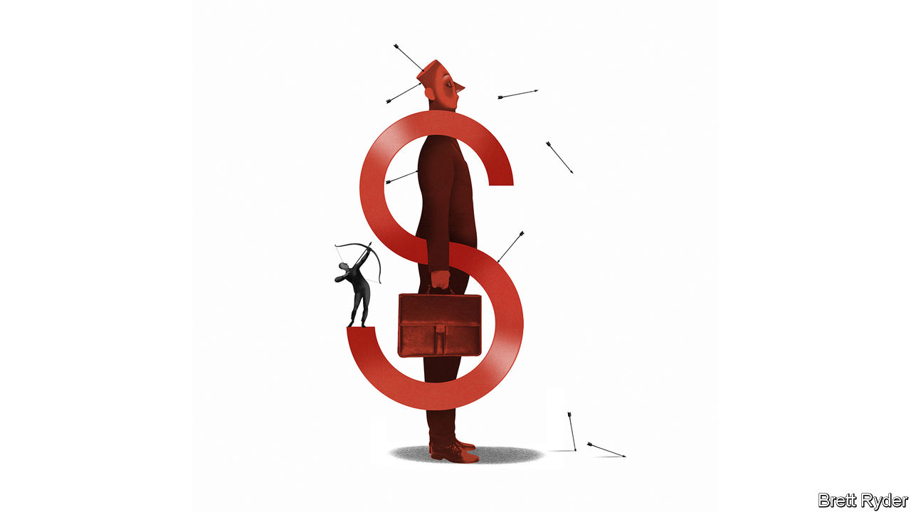

###### Schumpeter

# Are America’s CEOs overpaid? 

##### Unions are taking aim at the soaring compensation of bosses 

 

> Oct 17th 2023 

“We’re fed up with falling behind,” declared Shawn Fain, the boss of America’s United Auto Workers (UAW), last month after the union began a campaign of s at Ford, General Motors (GM) and Stellantis, America’s “big three” carmakers. A month in, the two sides are still at loggerheads. Jim Farley, Ford’s chief executive, has argued that the 36% pay rise over four years demanded by the striking workers would cripple his business. The UAW has countered that the average pay of the big three’s CEOs is 40% higher than it was in 2019, compared with 6% for the union’s members, which is well below inflation. Last year Mr Farley raked in $21m in pay, Carlos Tavares, his counterpart at Stellantis, $25m and Mary Barra of GM, $29m. The average full-time UAW member made less than $60,000. (Exor, the biggest shareholder in Stellantis, part-owns ’s parent company.)

America’s bosses are certainly well compensated. After languishing in the 2000s, median pay for CEOs of big companies in the S&amp;P 500 index has climbed by 18% over the past decade, adjusting for inflation, twice the rise in the median full-time wage in America. The typical S&amp;P 500 boss earned more than $14m last year, according to figures from MyLogIQ, a data provider. That is around 250 times as much as the average worker. It is also more than bosses earn in Britain (where chiefs of FTSE 100 firms took home just shy of $5m), let alone in France and Germany (where CEOs are paid still less). Some American corporate chieftains rake in many times that. In 2022 Sundar Pichai of Alphabet, a , received a $218m stock award, following a similar-sized bounty in 2019. In 2021 David Zaslav of Warner Bros Discovery, a media giant, received stock options worth an estimated $203m (subject to hitting certain performance hurdles).

Investors, for their part, do not seem overly bothered. Last year only 4% of S&amp;P 500 companies failed to win majority support in (non-binding) “say on pay” votes, according to Meridian, an executive-compensation adviser. As Lucian Bebchuk of Harvard Law School explains, America’s big institutional investors pay little attention to the market-wide level of compensation, focusing instead on what share of a CEO’s pay is tied to the firm’s performance, and on how much they earn relative to other bosses. American CEOs’ pay is “so stratospheric we have become numb to it”, says Amy Borrus of the Council of Institutional Investors, which represents pension funds and other asset managers. Ordinary Americans, though, are furious. A survey in 2019 by David Larcker and Brian Tayan of Stanford University found that 86% of them thought bosses were overpaid. Is it time, then, to rein in ceo pay? 

One consideration is what the benchmark should be. CEOs are far from the only group rolling in cash, notes Alex Edmans of the London Business School. Last year LeBron James made $127m throwing balls in hoops and endorsing shoes. Tom Cruise pocketed $100m for acting in “Top Gun: Maverick”. Such celebrities do not seem obviously worthier than bosses steering colossal corporations responsible for many billions of dollars of capital and tens or even hundreds of thousands of jobs. 

And bosses’ pay looks like chump change when compared with the scale of their companies. The total compensation of S&amp;P 500 CEOs last year was equal to 0.5% of net profit of the index’s firms, and 0.03% of their combined market value. Investors seem to believe a good boss is worth many times that. On October 12th Dollar General, an American discount retailer, announced its previous boss would return to the helm after lacklustre results under his successor. Its share price jumped by 9% the next day. As companies have grown bigger—the average S&amp;P 500 firm last year generated more than twice the revenues it did in 1990, after inflation—and more global, the CEO’s job has also become harder, argues Steven Kaplan of the University of Chicago Booth School of Business. 

Judging by the European experience, paying bosses less is not obviously a good idea. The earnings gap between American and European bosses is partly the result of less competition for executives in Europe, which has fewer big firms. It also reflects a more egalitarian attitude to pay that has not translated into better performance. Europe’s firms exhibit lower sales growth, profitability and shareholder returns, and its workers are less productive. All that contributes to the continent’s sluggish economic growth. 

Earlier this year Julia Hoggett, head of the London Stock Exchange, warned that Britain’s companies risked being hamstrung by their inability to attract executive talent. Last year Laxman Narasimhan quadrupled his pay by abandoning the top job at Reckitt Benckiser, a London-listed consumer-goods company, to run Starbucks, an American coffee chain. In Japan, where CEO pay is even lower than in Europe, companies like Toyota have started beefing up compensation packages with stock-based incentives.

Greed is good. Right?

All this sounds like a compelling argument in favour of letting American CEOs off the hook for their rich rewards. In practice, though, shareholders should watch for two things. For one, the American market for CEOs is far from perfectly efficient. Many bosses loom large over their boardrooms, and may cow notionally independent remuneration committees. Two in five S&amp;P 500 CEOs also chair their boards. A recent survey of American company directors by PwC, a consultancy, showed that one in two thought executives were overpaid. Any reservations they may harbour, and express in the comfort of an anonymous survey, dissipate when confronted with a flesh-and-blood chairman. 

A more immediate concern is that paying vast sums to bosses when times are tough for common folk can have unwanted consequences, if it emboldens employees to make demands that their companies cannot afford. This risks happening in Detroit, which must compete globally with lower-cost carmakers. The free market for CEOs, in other words, is also subject to political economy. ■


