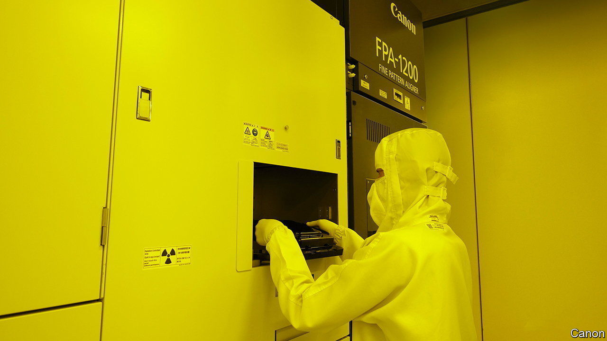

###### Lithography lessons

# Canon tries to break ASML’s grip on chipmaking tools 

##### Good luck with that 

 

> Oct 19th 2023 

Purveyors of chipmaking tools seldom attract attention. Yet many investors’ heads turned on October 13th, when Canon unveiled a new piece of kit. It is easy to see why. The Japanese company, which makes optical equipment, claims that its “nanoimprint” lithography machine can etch the very smallest transistors used in the most advanced microchips. Such feats have hitherto been the preserve of ASML, a Dutch manufacturer of lithographic tools. Canon hopes to eat further into ASML’s business by eventually cranking out two-nanometre chips. 

The possibility of breaking ASML’s stranglehold on the supply chain for cutting-edge chips is intriguing. The firm has long enjoyed the biggest monopoly in the concentrated semiconductor industry. The world’s three biggest chip manufacturers—Intel, Samsung and TSMC—depend entirely on its extreme-ultraviolet (EUV) technology to produce the cutting-edge microprocessors that go into smartphones and the powerful data-centre servers on which the computing cloud lives. 

ASML’s EUV rigs use high-powered lasers to etch electrical blueprints onto circular silicon discs. Canon’s alternative, by contrast, directly stamps chip designs on such wafers using a patterned mould. In theory, this allows it to make more detailed patterns. And because it involves fewer steps and avoids the need for expensive lasers and supersmooth mirrors, it could be much cheaper than EUV lithography. ASML’s share price dipped by more than 2% and Canon’s rose by nearly as much on the nanoimprint news.

In practice, Canon has its work cut out. Dylan Patel of SemiAnalysis, a semiconductor-research firm, points out that nanoimprint lithography is prone to defects because of the precision required to align wafers and moulds. The technique is also not yet effective in dealing with complex chip designs, including for processors used in artificial-intelligence models, that involve many layers of chemical deposits. Mr Patel predicts that Canon’s tool will be used for making parts of memory chips, which have fewer layers, rather than for advanced “logic” chips, which process information rather than store it.

Even if Canon can overcome all these technical hurdles, chipmakers may be loth to replace their EUV kit with its machines. Chip fabrication plants (fabs for short) are highly standardised in order to minimise the share of chips that turn out faulty. Since ASML has long been the only game in town for cutting-edge chips, that standardisation means that fabs are being designed around its machines, which are the size of a double-decker bus. The fabs that chipmakers are currently busy putting up around the world will not suddenly switch to nanoimprint lithography. It may take five years for Canon’s tools to be used in mass production, thinks Gaurav Gupta of Gartner, a research firm, and only once they have proved themselves.

One place where Canon could make headway more quickly is China. Since 2019 Chinese companies have been prevented by  from buying ASML’s EUV machines, since they all rely on bits and bobs of American origin. It has also struggled to develop lithography machines of its own. The current American restrictions do not, however, explicitly cover nanoimprint technology. That leaves Canon free to sell it to customers across the Sea of Japan—at least for the time being and perhaps for longer. It is unclear whether the Japanese firm’s machines include enough American know-how to ever fall under America’s anti-Chinese strictures. Probably no necks craned more at Canon’s announcement than those of national-security hawks in Washington and Beijing. ■


