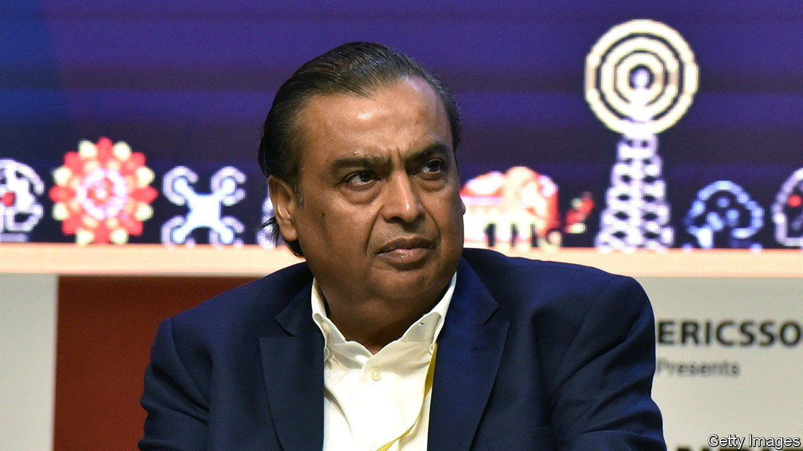

###### Thrivers in India

# Meet India’s mega-wealthy 

##### The ranks of the ultra-rich are swelling 

 

> Oct 19th 2023 

Indian plutocracy can seem set in stone. The top two spots in the annual rich list compiled by Hurun, which tracks such things, invariably go to the Ambani and Adani clans. This year is no different. Mukesh Ambani came in first, with a fortune of $98bn. He displaced Gautam Adani, a rival industrialist and last year’s winner, whose riches clocked in at $58bn. Peer lower down the ranking, though, and the story is one of change. 


First, the ranks of India’s ultra-wealthy are growing. Hurun’s lastest list identifies 1,319 fortunes of $120m or more (its benchmark for inclusion). That is 216 more than last year. The main sources of affluence are not what you might consider the traditional routes to riches, such as industry, finance and information technology. Instead they are consumer goods, materials and health care. Alkem Laboratories, a maker of generic drugs, helped elevate 11 people onto the list, the most of any company. Asian Paints lifted ten, Tube Investments of India, which expanded from producing bicycle parts to various other components, eight, and Pidilite Industries, a maker of adhesives, seven. 

The demography and geography of Indian wealth is broadening, too. The 20-year-old founder of Zepto, a delivery firm, makes an appearance, as does, for the first time, the 94-year-old founder of Precision Wires India, a maker of electrical cabling. Most of India’s rich still hail from Mumbai (328), Delhi (199) and Bangalore (100), India’s commercial, political and tech capitals, respectively. But 21 other cities made the cut this year, bringing the total number of places plutocrats call home to 95. 

And although plenty of rich Indians are still based abroad, most of the new money is at home. Most of it is also the product of the real economy rather than of financial engineering. Only one private-equity baron made the list—Manish Kejriwal, founder of Kedaara Capital, and his family is worth $360m. The biggest rewards in India still accrue to the builders rather than to the moneymen. ■


