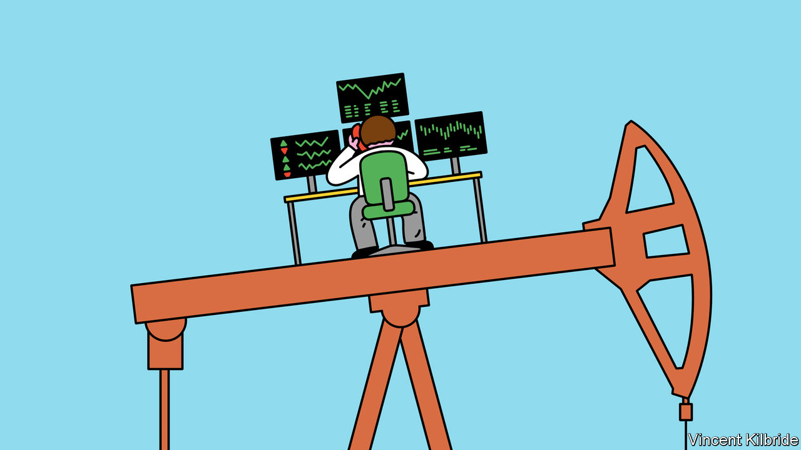
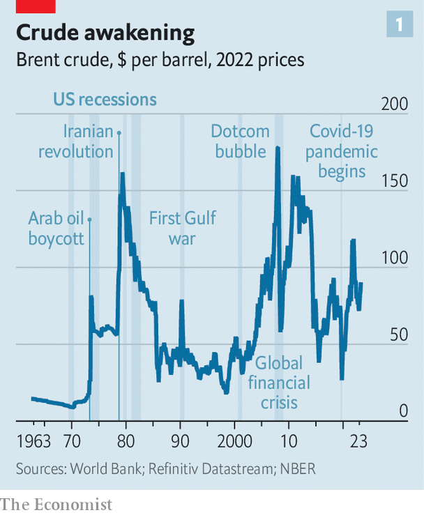
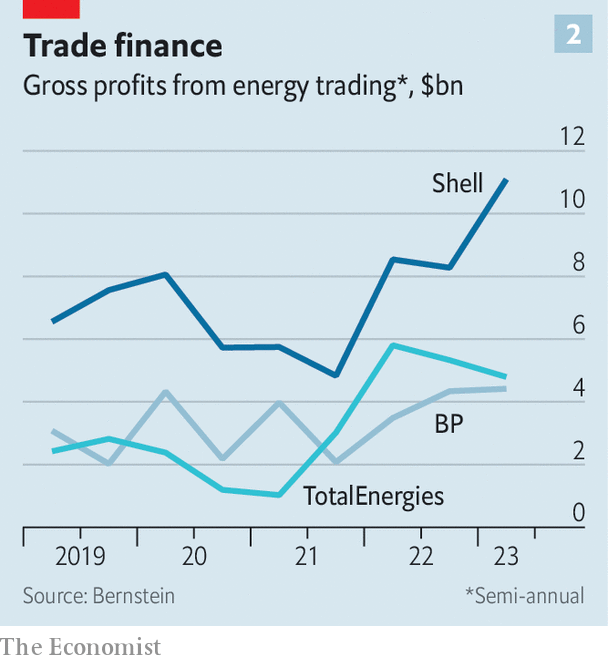

###### Spread bets

# Why big oil is beefing up its trading arms 

##### A volatile world makes for choppy markets, and choppy markets make for rich profits 

 

> Oct 19th 2023 

IN THE 1950s the oil market was in the gift of the “Seven Sisters”. These giant Western firms controlled 85% of global crude reserves, as well as the entire production process, from the well to the pump. They fixed prices and divvied up markets between themselves. Trading oil outside of the clan was virtually impossible. By the 1970s that dominance was cracked wide open. Arab oil embargoes, nationalisation of oil production in the Persian Gulf and the arrival of buccaneering trading houses such as Glencore, Vitol and Trafigura saw the Sisters lose their sway. By 1979, the independent traders were responsible for trading two-fifths of the world’s oil. 

 


The world is in turmoil again—and not only because the conflict between Israel and Hamas is at risk of escalating dangerously. Russia’s war in Ukraine, geopolitical tensions between the West and China, and fitful global efforts to arrest climate change are all injecting volatility into oil markets (see chart 1). Gross profits of commodity traders, which thrive in uncertain times, increased 60% in 2022, to $115bn, according to Oliver Wyman, a consultancy. Yet this time it is not the upstarts that have been muscling in. It is the descendants of the Seven Sisters and their fellow oil giants, which see trading as an ever-bigger part of their future.

The companies do not like to talk about this part of their business. Their traders’ profits are hidden away in other parts of the organisation. Chief executives bat away prying questions. Opening the books, they say, risks giving away too much information to competitors. But conversations with analysts and industry insiders paint a picture of large and sophisticated operations—and ones that are growing, both in size and in sophistication. 

In February ExxonMobil, America’s mightiest supermajor, which abandoned large-scale trading two decades ago, announced it was giving it another go. The Gulf countries’ state-run oil giants are game, too: Saudi Aramco, Abu Dhabi National Oil Company and QatarEnergy are expanding their trading desks in a bid to keep up with the supermajors. But it is Europe’s oil giants whose trading ambitions are the most vaulting. 

 


BP, Shell and TotalEnergies have been silently expanding their trading desks since the early 2000s, says Jorge Léon of Rystad Energy, a consultancy. In the first half of 2023 trading generated a combined $20bn of gross profit for the three companies, estimates Bernstein, a research firm. That was two-thirds more than in the same period in 2019 (see chart 2), and one-fifth of their total gross earnings, up from one-seventh four years ago. Oliver Wyman estimates that the headcount of traders at the world’s largest private-sector oil firms swelled by 46% between 2016 and 2022. Most of that is attributable to Europe’s big three. Each of these traders also generates one and a half times more profit than seven years ago. 

Today BP employs 3,000 traders worldwide. Shell’s traders are also thought to number thousands and TotalEnergies’ perhaps 800. That is almost certainly more than the (equally coy) independent traders such as Trafigura and Vitol, whose head counts are, respectively, estimated at around 1,200 and 450 (judging by the disclosed number of employees who are shareholders in the firms). It is probably no coincidence that BP’s head of trading, Carol Howle, is a frontrunner for the British company’s top job, recently vacated by Bernard Looney.

The supermajors’ trading desks are likely to stay busy for a while, because the world’s energy markets look unlikely to calm down. As Saad Rahim of Trafigura puts it, “We are moving away from a world of commodity cycles to a world of commodity spikes.” And such a world is the trader’s dream. 

One reason for the heightened volatility is intensifying geopolitical strife. The conflict between Israel and the Palestinians is just the latest example. Another is the war in Ukraine. When last year Russia stopped pumping its gas west after the EU imposed sanctions on it in the wake of its aggression, demand for liquefied natural gas (LNG) rocketed. The European supermajors’ trading arms were among those rushing to fill the gap, making a fortune in the process. They raked in a combined $15bn from trading LNG last year, accounting for around two-fifths of their trading profits, according to Bernstein. 

This could be just the beginning. A recent report from McKinsey, a consultancy, models a scenario in which regional trade blocs for hydrocarbons emerge. Russian fuel would flow east to China, India and Turkey rather than west to Europe. At the same time, China is trying to prise the Gulf’s powerful producers away from America and its allies. All that is creating vast arbitrage opportunities for traders.

Another reason to expect persistent volatility is climate change. A combination of increasing temperatures, rising sea levels and extreme weather will disrupt supply of fossil fuels with greater regularity. In 2021 a cold snap in Texas knocked out close to 40% of oil production in America for about two weeks. Around 30% of oil and gas reserves around the world are at a “high risk” of similar climate disruption, according to Verisk Maplecroft, a risk consultancy. 

Then there is the energy transition, which is meant to avert even worse climate extremes. In the long run, a greener energy system will in all likelihood be less volatile than today’s fossil-fuel-based one. It will be more distributed and thus less concentrated in the hands of a few producers in unstable parts of the world. But the path from now to a climate-friendlier future is riven with uncertainty. 

Some governments and activist shareholders are pressing oil companies, especially in Europe, to reduce their fossil-fuel wagers. Rystad Energy reckons that partly as a result, global investment in oil and gas production will reach $540bn this year, down by 35% from its peak in 2014. Demand for oil, meanwhile, continues to rise. “That creates stress in the system,” says Roland Rechtsteiner of McKinsey. 

Future traders

This presents opportunities for traders, and not just in oil. Mr Rechtsteiner notes that heavy investment in renewables without a simultaneous increase in transmission capacity also causes bottlenecks. In Britain, Italy and Spain more than 150-gigawatts’-worth of wind and solar power, equivalent to 83% of the three countries’ total existing renewables capacity, cannot come online because their grids cannot handle it, says BloombergNEF, a research firm. Traders cannot build grids, but they can help ease gridlock by helping channel resources to their most profitable use.

Europe’s three oil supermajors are already dealing in electric power and carbon credits, as well as a lot more gas, which as the least grubby of fossil fuels is considered essential to the energy transition. Last year they had twice as many traders transacting such things than they did in 2016. Ernst Frankl of Oliver Wyman estimates that gross profits they generated rose from $6bn to $30bn over that period. Other green commodities may come next. David Knipe, a former head of trading at BP now at Bain, a consultancy, expects some of the majors to start trading lithium, a metal used in battery-making. If the hydrogen economy takes off, as many oil giants hope, that will offer another thing not just to produce, but also to buy and sell. ■


