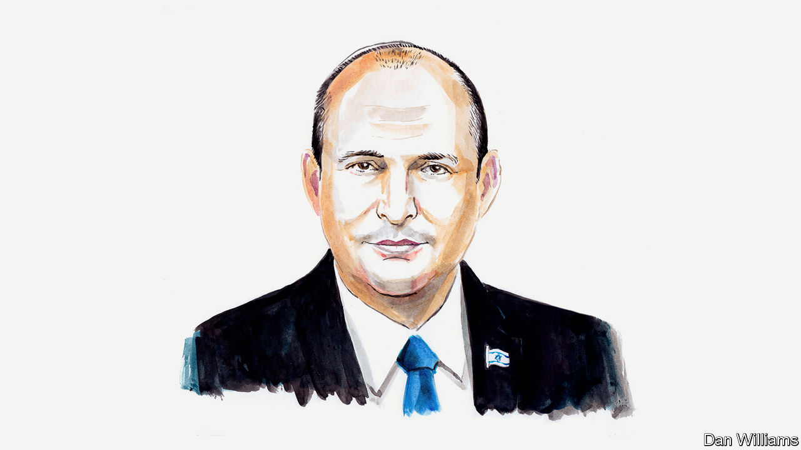

###### The Israel-Hamas conflict

# Naftali Bennett argues that Israel’s future depends on striking fear into its enemies’ hearts 

##### Regional foes must be confronted in new ways, says Israel’s former prime minister 

 

> Oct 17th 2023 

ISRAEL WAS forever changed on the Shabbat morning of October 7th, when at dawn thousands of terrorists from Gaza burst through the border, attacking and slaughtering Israeli communities. Until then, we Israelis mostly felt that we were a Western society, where people worked in tech, planned skiing vacations and went on wellness retreats, with few worries. 

That all ended on that morning with the chilling realisation that we are living next to an enemy that burns babies, rapes girls and wipes entire families off the face of the earth. I served as a soldier and officer in special-forces units, and as Israel’s defence minister and prime minister. I have seen many things. Nothing came close to this. We have been forced to witness sights we haven’t seen since the Holocaust. 

The Israeli public is wounded. There isn’t an Israeli who hasn’t lost a friend or relative. Children of some of my closest friends have been murdered or died heroically while fighting the terrorists. But at the same time we rediscovered a strong Israeli spirit—embodied by the kibbutznik who grappled a terrorist with his bare hands to give time for others to escape alive, and by mothers turning their homes into emergency clinics, saving lives. This shouldn’t be the work of civilians, but when we were called upon, we were there. 

This is a stark reminder that the Jewish state was founded 75 years ago so Jews would no longer be powerless to face their murderers. Which is why the response now has to be one which will ensure that our enemies never contemplate such an attack again. 

But this isn’t just Israel’s fight. Israel’s fight is the fight of the decent nations of the world against bestial terrorism. Israel is physically on the fault-line of an Iranian-led front. Hamas is not the only enemy. It is just one tentacle spreading from a Tehran-based octopus of terrorism. Other tentacles are gripping Syria and Lebanon and are trying to grab hold of the Arab nations in the Gulf. We need to be looking at this foe as a whole and understand that it must be confronted in new, sophisticated and surprising ways. 

The rules have changed. 

We will not allow Hamas to hide behind Palestinian civilians while it murders our civilians. We will never target civilians, as they are not our enemy, but if civilians in Gaza are killed while being used as human shields, Hamas will have murdered them as well. 

Israel is now receiving the sympathy and support of the world, but as prime minister I was clear: Israel’s future depends not on pity from the world, but on fear in the hearts of our enemies. 

In the coming days and weeks, perhaps months, we will have no choice but to launch a war of unprecedented magnitude. All Israelis, right and left, religious and secular, have cast aside the political arguments—not least over the government’s judicial reform—which distracted them over the past nine months, and are fighting in this war. Every reservist military unit I visited over the past week was over-enlisted. 

And while we are grateful for the backing of American power—as well as for President Joe Biden’s supportive words since the Hamas attack and his visit to Israel this week—it must be clear that we will be fighting our own battles. For as long as it takes.

Israel’s priority right now is the de-Hamasisation of Gaza. We can never allow such a threat to exist on a border ever again. The area must be demilitarised. Doing so will take time. No one in Israel is under any illusion that the military operation will be short or easy.

We are fully aware of the impact this will have on the civilian population of Gaza. Israel is not targeting civilians and will not do so as the operation unfolds. That is why the Israel Defence Force has warned them and given them time to leave Gaza City and travel southwards to relative safety. Although Israel certainly will not supply our enemy, we won’t prevent other countries from providing water, food and medicine to civilians, provided, of course, the Red Cross can visit all the Israeli hostages in Hamas’s custody. 

This war is a test not only for Israel, but for the world. Those preaching to Israel about “proportionality” must realise that nothing could be in proportion to the atrocities which Hamas perpetrated. Israel is not going to send thousands of men into Gaza to rape, pillage and wantonly murder families and burn babies in their homes. These have never and will never be our values.

For millennia Jews have been the victims of pogroms, unrestrained murder and pillage. We built our amazing Jewish state with a clear promise of “never again”. It’s up to us now to keep that promise.■


