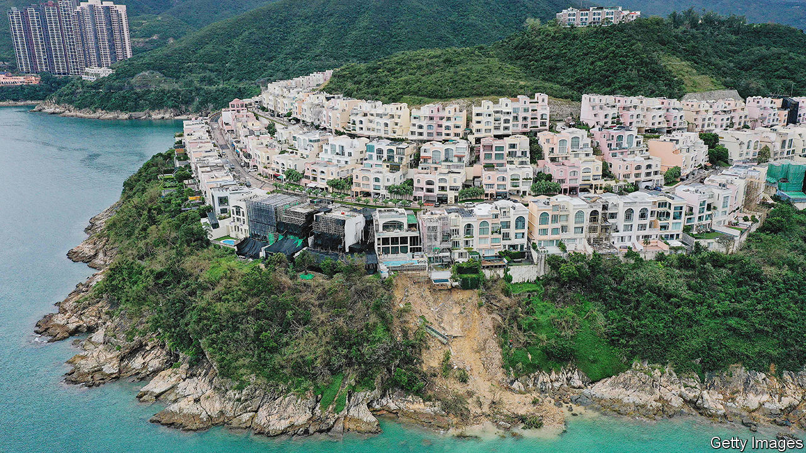

###### Property in Hong Kong

# A landslip in Hong Kong fuels resentment of the rich 

##### Grand houses sprawl beyond their plots 

 

> Oct 19th 2023 

THE MILLIONAIRES of Redhill Peninsula, a posh coastal community in Hong Kong, are a little poorer than they were. Last month a supertyphoon named Saola brought the city rainfalls heavier than any this century. At Redhill, a big chunk of sodden earth slipped into the sea. Though the landslip mostly spared surrounding houses, it exposed basements that had been dug without permission and that may have contributed to the collapse. Prompted by journalists, the government began an investigation, which is still going on. By October 6th it had found a dozen houses in the area that broke rules in some way.

Hong Kong’s systems of planning often look dysfunctional. One guess is that as many as one in four properties in the territory have been altered or extended without the right permissions. Canopies on flat roofs create room for recreation. External balconies are walled in. And landlords have been chopping their buildings into ever-smaller, “subdivided” apartments. Ten years ago a government report said that widespread disregard for planning rules and building regulations could “cause injuries and fatalities”.

 


The liberties taken by Hong Kong’s richest residents are often the largest—and, given the cramped quarters most Hong Kongers put up with, the ones that most often cause a stir. Gardens and swimming pools sometimes sprawl beyond a property’s registered boundaries. Three-story extensions go up without the proper permits. Liber Research Community, an NGO, identifies some 170 homes in eight rich neighbourhoods that it believes have spread into more space than they are entitled to. In some cases, it says, the overspill covers a larger area than the official plot.

The landslip in Redhill has bolstered old complaints about lax and partial policing of rules. In theory rigging up unauthorised structures or encroaching on public spaces can land homeowners in jail. But on some occasions authorities permit them to start paying the government rent for the additional land, reckons Liber. When property owners are forced to reverse alterations or retreat from government-owned land, appeals can hold things up for years.

Hong Kong’s government says it handles things as well as possible, given its resources. Last year it sent out more than 16,000 orders to rectify “illegal structures” and brought 3,600-plus prosecutions. Critics say it is meek when taking on the rich. Activists say the government enforces the laws selectively and sometimes uses them to hassle people it links with the pro-democracy movement. Mount Zero, an independent bookshop, was recently told by government inspectors that its front step was illegally occupying public land.

Things may be coming to a head. China’s leaders worry about Hong Kong’s cramped housing. They think property prices helped stir up big protests in 2019. Local media, though much cowed since the introduction in 2020 of a noxious national-security law, increasingly report on violations of planning. Climate change is increasing the severity of wet and wild weather; this raises the risk that shoddy extensions or overloaded hillsides will collapse. Right now Redhill is “under the spotlight”, says Brian Wong of Liber. But he thinks there are similar risks elsewhere. ■


