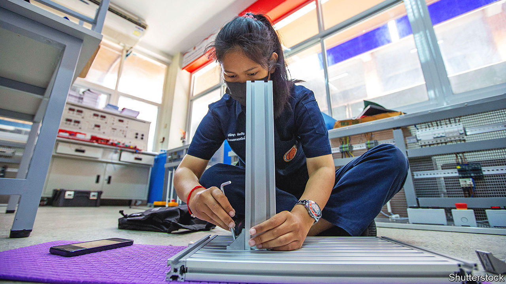

###### Training days

# China is educating engineers around the world 

##### Its technical schools are less controversial than its Confucius Institutes 

 

> Oct 19th 2023 

Chinese officials often talk of the Belt and Road Initiative, a global infrastructure building spree, in hyperbolic terms. On October 17th and 18th Xi Jinping, China’s leader, hosted a big summit in Beijing to celebrate the tenth anniversary of what the government likes to call the “”. Lately this hype has masked an awkward reality. Since 2020 China has scaled back the scheme as governments have found it harder to repay Chinese infrastructure loans. 

Yet in recent years one part of the project has stood out as a quiet success. Since 2016 China has set up some 27 vocational colleges in two dozen countries, mostly poorer ones. These “Luban Workshops” (named after a fabled carpenter from the fifth century BC) have trained thousands of students in fields including artificial intelligence, electric vehicles, railway operations and robotics. One of the newest workshops opened on September 4th at Meru University of Science and Technology in Kenya. 

The purpose is not charity. Luban workshops promote technology and standards that China wants to export to developing countries. Gear for the new workshop in Kenya will come from Huawei, a Chinese telecoms giant America would like to see excluded from its allies’ mobile networks, for fear its kit could assist Chinese spying. Huawei (which denies America’s allegations) helped build Kenya’s mobile network and is now working with its biggest telecoms provider to roll out 5G services. 

The workshops also help assuage worries about the Belt and Road. Participating governments sometimes complain that the companies which win its infrastructure projects rely too much on labour and supplies from China. Several Luban workshops now provide training directly related to Belt and Road projects. One in Djibouti has trained employees of a new rail line to Ethiopia. That $4bn railway was built and financed by China but struggled to make a profit after opening in 2018. 

The Luban programme has echoes of China’s earlier drive to expand its influence by opening more than 500 “Confucius Institutes” to teach Mandarin in universities around the world. Yet so far it has avoided the controversies that have dogged those institutes, many of which closed after being accused of promoting propaganda and stifling dissent. This is in part because the Luban workshops focus on technical skills and in part because China has spent more time consulting host governments before setting them up. “Unlike Confucius Institutes, Luban workshops are actually different in each country, because of the different skills that are demanded by host countries,” says Niva Yau of the Atlantic Council, an American think-tank. She sees them as evidence that China is responding to criticism of Belt and Road without abandoning core goals, such as exporting its technology. 

The workshops compete with training that America, Japan and other rich countries offer countries in the global south. Germany, for example, has given more than 100 countries guidance on how to copy its famed system of vocational education. The Luban workshops are unusual, though, in providing equipment as well as teaching, and in having their own brand. 

When the Luban programme began it was led by the local government in Tianjin, a big city near Beijing that was known for technical training (local authorities have been encouraged to support and profit from Belt and Road). The first workshop (pictured) opened in Thailand in 2016; it used equipment sent by a Tianjin chemical company. For a time Luban workshops cropped up in rich countries as well as poor ones. Between 2018 and 2020 a workshop at Crawley College, near London, taught Chinese cuisine; one in Portugal still offers training in electrical automation and industrial robots. The programme was not always restricted to Belt and Road participants: India (a sceptic) has a Luban workshop in Chennai. 

More recently, however, the programme appears to have been co-opted by China’s central government. It has grown to involve training providers and companies from outside Tianjin, and been linked more explicitly to Mr Xi’s foreign policy. In 2018 Mr Xi pledged to open ten workshops in Africa; a dozen have since opened there. In May he promised leaders of Central Asian countries that China would set up more workshops in their region (the first opened in Tajikistan last December). 

It remains to be seen how long China will subsidise Luban workshops, and how far they will live up to their promise. Some are questionable, such as one in war-torn Mali that teaches traditional Chinese medicine. But for the moment they represent a refreshing example of China’s government listening to critics—and learning from its mistakes. ■


