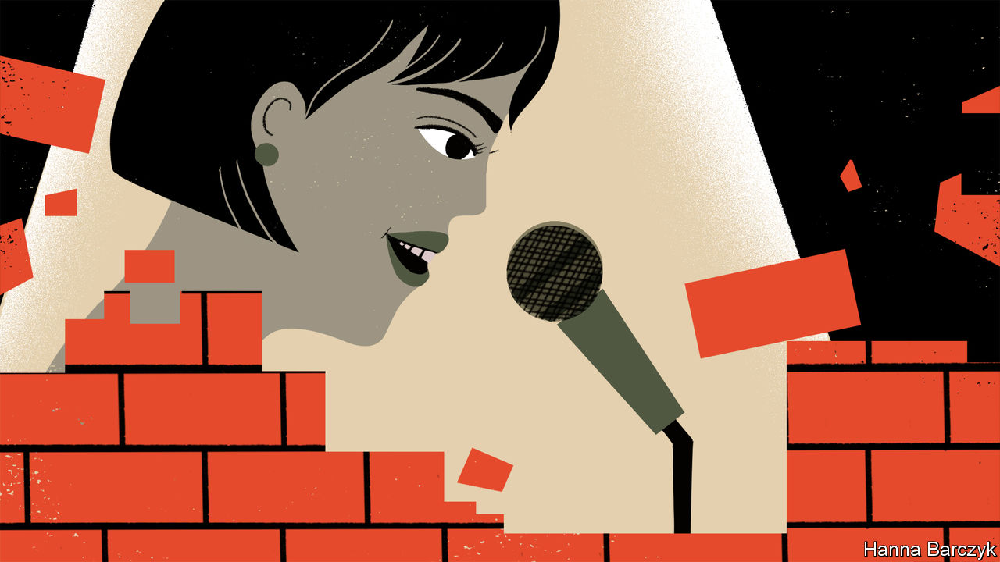

###### Women’s rights

# Chinese feminists are rebuilding their movement abroad 

##### Stand-up comedy is one means of resistance 

 

> Oct 19th 2023 

Two Chinese women sit on the stage of a basement comedy club in Manhattan. They wear matching blazers and speak highly formal Mandarin, just like presenters on Chinese state television. But their “news commentary” is acid. Chinese youths who have recently been making nuisance phone calls to Japan—in protest at the release of waste water from the wrecked Fukushima nuclear plant—have shown “commendable spirit” insists one of the newsreaders, to a guffawing crowd. Despite having “no jobs or incomes” these nationalistic youngsters have “spent their own money on long-distance calls”.

The pair are performers at a Chinese feminist stand-up show called “Nvzizhuyi” (a play on words that can be read either as “Women’s Ideas” or “Good Ideas”). It is part of a new, irreverent form of diaspora activism led by young Chinese women. Each month “Nvzizhuyi” invites Chinese citizens, mostly women, onto the stage in New York to say things that they could never utter in public back home. Their routines incorporate stories about coming out to their conservative parents; complaints about sexual harassment or immigrant hardships; and even accounts of detention and abuse by Chinese police. Most of their stories are funny. Many are bittersweet. 

These are not good times for Chinese who consider themselves feminists. In the early 2010s women’s rights activists were able to mount frequent public protests in China. They occupied men’s toilets and marched through the streets in red-stained wedding dresses to protest gender inequality and domestic violence. Activity of this sort ended abruptly in 2015. That year five prominent feminists were detained just before International Women’s Day, for planning a campaign against sexual harassment on public transport.

In the aftermath of those arrests, Chinese feminism largely moved online. It was from the internet that China’s #MeToo movement emerged in 2018. Women accused prominent professors, businessmen and television personalities of sexual assault, and in some cases launched lawsuits. But most of these failed, and accusers were sometimes sued for defamation. 

One of the most high-profile #MeToo cases was brought by a woman named Zhou Xiaoxuan who had accused Zhu Jun, a television presenter, of forcibly kissing her when she was an intern. Mr Zhu denies the accusation; Chinese courts dismissed the case in 2021. Ms Zhou and her supporters were censored online, while nationalists were permitted to spread videos calling #MeToo a plot to destabilise China. That same year Huang Xueqin, one of the first Chinese journalists to report on #MeToo cases, was arrested and charged with “inciting subversion of state power”.

As it cracks down on feminists the Communist Party has also ramped up promotion of traditional gender roles. Xi Jinping, China’s leader, has called for a revival of Confucian ideas that encourage women to be good wives and mothers, and to teach their families to love the country. Since he came to power, China has restricted access to divorce by implementing a 30-day mandatory “cooling-off period”, banned effeminate men from appearing on television, and encouraged regional governments to experiment with schemes that might prompt people to procreate. 

All this has silenced many feminist activists or forced them to flee overseas. Several of the people who are involved in the New York comedy nights have seen the sharp end of the party’s paranoia. One of the event’s organisers, Liang Xiaowen, left China in 2016 but remained active in feminist groups until 2021, when her WeChat and Weibo accounts were shut down. A state-run tabloid accused Ms Liang of receiving payments from abroad to help America foment unrest in China. (China’s propagandists have been doubling down on their claim that feminism is a tool of “hostile foreign forces”; the Communist Youth League has called radical feminism a “poisonous online tumour” that provokes “gender antagonism”.) 

Li Maizi, one of the “Feminist Five” detained in the crackdown in 2015, decided to leave China last year, not long after police came into her apartment and arrested her flatmate for putting up posters protesting against draconian covid lockdowns. Ms Li had been under heavy surveillance and had also lost her social media accounts; she felt voiceless and powerless. “This was my bottom line: if I cannot do any useful activities in mainland China, it’s time to leave.” 

For the feminists who have found their way to New York, comedy is one way to rebuild their movement. The stage at the “Nvzizhuyi” open-mic night in early October was decorated with slogans, including one calling Mr Xi a “dictator” and “#notmypresident”. The event serves two purposes, says Ms Liang. She argues that years of choosing to censor oneself online and in public—as many Chinese are forced to—eventually leads to self-censored thinking. Participating in stand-up is an antidote, of sorts. And it is important to hold the events in Chinese, says Ms Liang, because it is the language they were censored in. It is very easy to be funny when talking about politics, she adds, because China’s version of it has become so absurd.

The show also aims to encourage more people to get involved in feminist activism. Momo, in her twenties, says she sought out independent reporting about the crackdowns on Xinjiang and Hong Kong when she was still living in China, and also followed many online feminist groups before they were censored. But only after coming to America as a graduate student in 2021 did she finally meet like-minded Chinese women in person. Momo was shocked when she attended her first open mic last year and heard someone on the stage say, “I love to have sex.” She felt a twinge of concern when the speakers started joking about politics, but also a thrill. Within a few months she was on stage making her own jokes.

Women’s rights in China have made some progress despite the shrinking space for organising. In 2022 the government amended a women’s protection law to add stronger language against sexual harassment and discrimination at work. A carefully managed consultation on the amendment drew more than 700,000 comments online, making it one of the most widely-discussed legal changes in recent years. Reproductive rights have also grabbed the public’s attention. A woman who sued a hospital for the right to freeze her eggs—illegal for unmarried women in China—recently sparked a debate about widening access to in vitro fertilisation.

Women in China will continue to demand better treatment, says Ms Li, even if they cannot band together in action. The feminist movement will just become increasingly “decentralised and individualised”, she thinks. “The government feels very helpless about this: they think there must be an organiser. But in this era, there is no organiser. There are just individuals who disagree with you.” Chinese women who object to Mr Xi’s big push for family values have been showing their displeasure by simply opting out. Many are delaying or rejecting marriage and childbirth. China had 6.8m marriages in 2022, roughly half the number in 2013. China’s population shrank last year for the first time in six decades.

The people who run “Nvzizhuyi” have no delusions that they can transform Chinese politics from afar. “If you fantasise about some kind of overnight, earth-shaking change, it’s not really possible,” says Ms Liang. Their goal, instead, is to “quietly keep some seeds alive” within the space they have created abroad, she says. One day they may bring those seeds back home. ■


