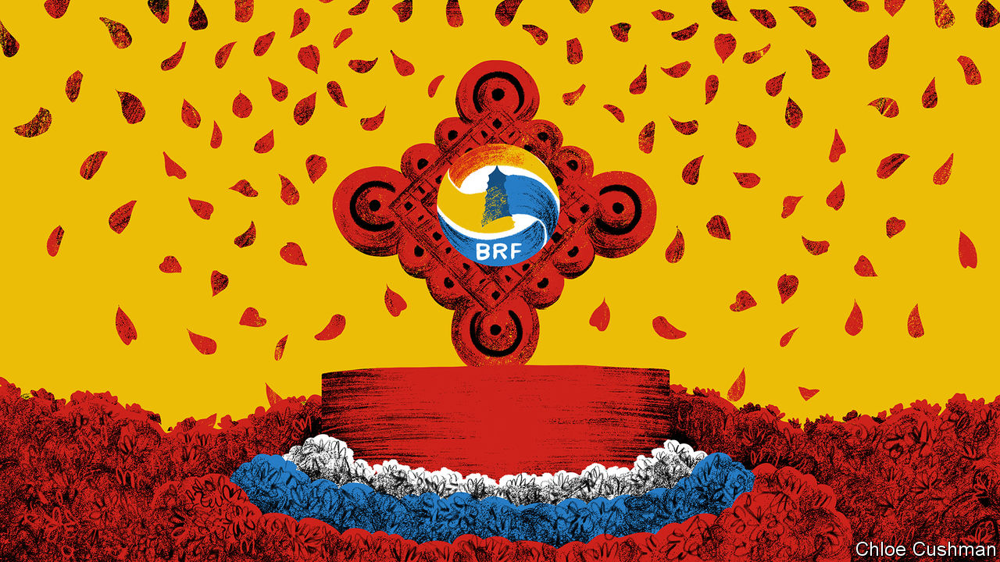

###### Chaguan

# Xi Jinping wants to be loved by the global south 

##### China presented the Belt and Road Forum as an oasis of peace in a dangerous world 

 

> Oct 19th 2023 

“Very few Chinese” know about the ruthless side of Zheng He, the Ming-dynasty explorer and eunuch admiral, a scholar once observed to Chaguan, unexpectedly, over tea in a Beijing courtyard house. Pouring fresh cups, the scholar—a member of China’s national-security establishment—warmed to his theme. In China, he explained, Zheng He is seen as a 15th-century “Santa Claus”, leading his fleet to Africa, Arabia and Asia to hand out porcelain and silks on behalf of his mighty, far-off emperor. But in such places as Sri Lanka, Zheng He is remembered as a terror, who punished local rulers for defying his imperial writ and shipped some of them back to China as captives. The Chinese public is “blissfully ignorant” about that history, sighed the scholar, blaming his country’s desire “to be loved”.

Much the same desire suffused the Third Belt and Road Forum, held in Beijing on October 17th and 18th. The forum commemorated the first ten years of the Belt and Road Initiative (BRI), a lending and infrastructure scheme that has seen China build dams, bridges, ports and more on four continents. In part, the opening speech by Xi Jinping, the Communist Party chief, was a guide to how the BRI is changing. With China’s growth slowing, and many existing BRI projects mired in debt, there is less emphasis now on billion-dollar loans and on pouring concrete, and more on promoting Chinese standards and technologies, notably in green and digital infrastructure, and on “small yet smart” grassroots projects. In larger part, though, Mr Xi’s speech was a call for China to be loved.

Addressing foreign dignitaries in the Great Hall of the People, Mr Xi made a case for Chinese exceptionalism. He presented his country as a peace-loving giant, guided by the centuries-old spirit of the Silk Road. In this telling, China’s Silk Road spirit is not a charitable impulse, but something more dependable: namely, a pragmatic pursuit of prosperity via mutually profitable trade. Though Mr Xi did not mention Zheng He by name, his government’s white paper on the BRI, published on the forum’s eve, cites the navigator as an inspiration, hailing his seven maritime expeditions that “boosted trade along the maritime silk routes”.

The admiral’s ghost hung over the speech as Mr Xi repeated one of his favourite claims about China’s past. “The pioneers of the ancient silk routes won their place in history not as conquerors with warships, guns, horses or swords,” he declared. “Rather, they are remembered as friendly emissaries leading camel caravans and sailing ships loaded with goods.” Without mentioning the conflicts raging in the Middle East and Ukraine, Mr Xi contrasted this Chinese focus on trade and development with the selfishness of world powers that are bent on “ideological confrontation”. He announced a Global Initiative for Artificial Intelligence Governance. Though global in name, this promotes a very Chinese worldview. It would defer to the laws (and censors) of sovereign states, and prohibit America’s current export controls on chips that enable AI. In a volatile world, Mr Xi said, the BRI is “on the right side of history”. He added a rebuke for countries that practise “economic coercion”. Foreign leaders in the hall were polite enough not to snigger or gasp, though China routinely uses trade as a weapon.

As ever in China, much of this propaganda is aimed at domestic audiences. Chinese state media offered blanket coverage of the forum, asserting that over 140 countries sent representatives. They did not mention that just 21 heads of state and government turned up, fewer than attended the first and second forums, held in 2017 and 2019—not least because few Western governments wished to share a stage with President Vladimir Putin of Russia, Mr Xi’s guest of honour. Only one leader from the European Union attended, the Kremlin-friendly Viktor Orban of Hungary.

Mr Putin gave a speech directly after Mr Xi’s. To a striking extent it reflected his growing dependence on China. As a result of Western sanctions imposed after his invasion of Ukraine, China is now the largest buyer of Russian energy, and Chinese exports to Russia have soared. Thanking his “dear friend” Mr Xi for the invitation to Beijing, Mr Putin played dutiful cheerleader for the BRI. Sounding at times like his own transport minister, Mr Putin reeled off lists of BRI-compatible railway lines and logistics corridors that Russia plans to build. He praised the opening last year of a bridge across the Amur river between China and Russia, not mentioning that Russian officials dragged their feet on that project for years before rushing to finish it once the Ukraine war broke out. Forgetting Russia’s long-standing wariness of Chinese investment in the Arctic, he invited “interested states” to take part in the development of a Northern Sea Route opening up as sea ice retreats.

Putin as a character witness

In interviews with Chinese state media, Mr Putin offered still more praise. When offering economic opportunities to other countries, Mr Xi’s China never imposes or enforces its will, he said. This, he averred, makes the BRI different from policies pushed by countries with a heavy colonial legacy. Once more, that language echoes Chinese talking points. China’s white paper casts the BRI’s model of development as a challenge to “the exploitative colonialism of the past”. It is the spirit of the Belt and Road to advocate equality, it argues, in contrast to those who push “the superiority of Western civilisation”.

Attacks on Western arrogance resonate with many developing countries. If the BRI offers useful technologies, skills or investments, many governments will take that deal. Some countries support China’s proposals for global governance, especially if that means fewer questions about their political systems, or human rights. But those leaders in the Great Hall of the People are not dupes. For one thing, many remember their history, and how Chinese naval fleets and armies brought their countries much more than trade over the centuries. Mr Xi’s China is taken seriously, especially by its neighbours. Love has nothing to do with it.■


