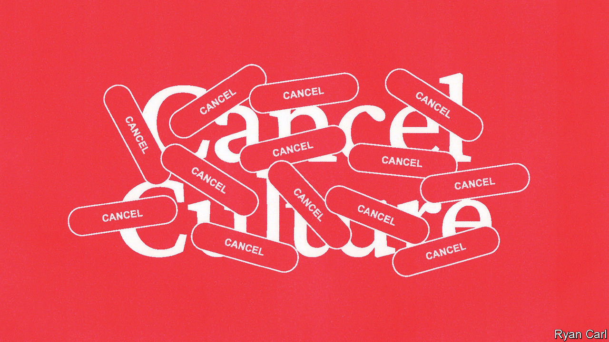

###### Ill liberals

# How to cancel “cancel culture” 

##### Two new books examine the brokenness of wokeness 

 

> Oct 19th 2023 

By Yascha Mounk. 

By Greg Lukianoff and Rikki Schlott.

Yascha Mounk’s book contains several jolting stories, which encapsulate the extreme thinking of some on the American left. When  vaccines became available, most countries dispensed them first to health workers and the elderly (who are much more vulnerable to the disease than young people). Yet America’s Centres for Disease Control and Prevention urged states to offer priority to 87m “essential workers”, which included package-delivery drivers and film crews. Its rationale was “racial equity”, because old people were more likely to be white, even though such a policy would probably cause thousands 

In another story, an African-American mother tried to get her seven-year-old into a class at school. The principal said no: “That’s not the black class.” This was not a scene from the Jim Crow South of the 1950s, but from present-day America, where a growing number of “progressive” schools group children by race and teach them to think of themselves as “racial beings”, all in the name of “antiracism”.

Mr Mounk, a political scientist at Johns Hopkins University, is a man of the left. (“Barack Obama is the American politician I most admire.”) He grew up believing that “humans matter equally irrespective of the group to which they belong.” His book, “The Identity Trap”, explains why many on the left abandoned “universalism”. He summarises the “woke” left’s logic as follows: “to ensure that each ethnic, religious or sexual community enjoys a proportionate share of income and wealth…both private actors and public institutions must make the way they treat people depend on the groups to which they belong.”

Most of the people who espouse this view aspire to improve the world, and many of the injustices they rail against are real. But the policies they advocate “are likely to create a society…of warring tribes rather than co-operating compatriots”. The word “liberal” has long been used in America to mean “left-wing”, but many on the left now reject basic liberal notions such as universal values and free speech. Across the English-speaking world and beyond, they have become intolerant of those who do not accept their dogma or their identity politics. 

Dismissing “wokeness” as just well-meaning millennials pushing for social justice is therefore a mistake, Mr Mounk argues. Not enough people understand that the far left is “moving beyond—or outright discarding—the traditional rules and norms of democracies”. He has long been concerned about the authoritarian right but says it is reasonably well understood (democracy-deniers and all), whereas the intellectual history of the  is “oddly unexplored territory”. 

How did views that are unpopular with the general public become so influential? In Mr Mounk’s telling, it starts with group psychology. When like-minded people debate political or moral questions, their conclusions become “more radical than the beliefs of their individual members”, he writes. This tendency is compounded when the group feels under threat, as progressives did during Donald Trump’s presidency. Dissent is suddenly seen as betrayal: hence the fury unleashed on anybody who violates the group’s unwritten and shifting norms. More than three out of five Americans now say they avoid airing their political views for fear of suffering adverse consequences; only a quarter of college students say they are comfortable discussing controversial topics with their peers.

Students who imbibed what Mr Mounk rather clunkily calls “the identity synthesis” on campus went on “a short march through the institutions” after they graduated. Since about 2010 they have carried their new ideology into the workplace and, thanks to the power of social media to create hurricanes of outrage, intimidated bosses like no previous generation. Young activists-cum-employees pushed the American Civil Liberties Union to scrap its iron commitment to free speech and risk-averse corporate managers to sign off on some counter-productive . A slide in a presentation at Coca-Cola, for example, exhorted employees to “try to be less white”.

Far from solving the real injustices that persist, this way of thinking and talking threatens to exacerbate them. And instead of bracing the country to withstand Mr Trump’s influence, it helps him, as Middle America leans right in response to the far left’s excesses. Mr Mounk’s answer is a return to : a rediscovery of universal values and neutral rules, allowing people to make common cause with others of different beliefs and origins. People should live up to the ideals on which liberal democracy is based rather than abandoning them because they are so difficult to achieve, he says. 

While Mr Mounk’s message is global, Greg Lukianoff and Rikki Schlott focus on America. “The Cancelling of the American Mind” is a  for both sides to reclaim “free-speech culture”. (The authors work for the Foundation for Individual Rights and Expression, a free-speech group.) When two sides cannot even agree on facts, “it undermines faith in all of the institutions we rely on to understand the world,” they write. 

Mr Lukianoff and Ms Schlott offer a critique of the left, pointing out how cancel culture has eroded  at universities. But they are equally critical of the right. They note that some of Florida’s new education laws (including one that bans certain subjects from being taught) are “without question unconstitutional”.

Both books are bold, timely and buttressed by data. They also offer plausible remedies. The far right can be defeated only by the right and the far left by the left. So left-of-centre people who can see what is happening should speak up but not vilify those who disagree. (Political disagreement is not moral failure, Mr Mounk reminds readers.) People should appeal to the reasonable majority, he argues, since most people are neither “woke” nor Trumpist. They should not let their indignation turn them into reactionaries. 

The advice from Mr Lukianoff and Ms Schlott is more personal: raise kids who are not cancellers. Teach them that life is not a battle between wholly good and bad people. Not every “harm” that someone, somewhere calls out is really harmful. Educating children about differences, rather than coddling and insulating them, is essential. 

“The Cancelling of the American Mind” advises companies to foster an intellectually diverse workforce. Bosses should make clear that a commitment to free speech is a condition of employment. And universities should scrap political litmus tests for tenure and get back to teaching students how to debate ideas.

The post-liberal right and post-liberal left are much closer to each other than many people realise. Both are intolerant; both prioritise the power of the state over individual liberty. They “see each other as mortal enemies”, but “feed on each other”, Mr Mounk warns. That is why “everyone who cares about the survival of free societies should vow to fight both.” ■


