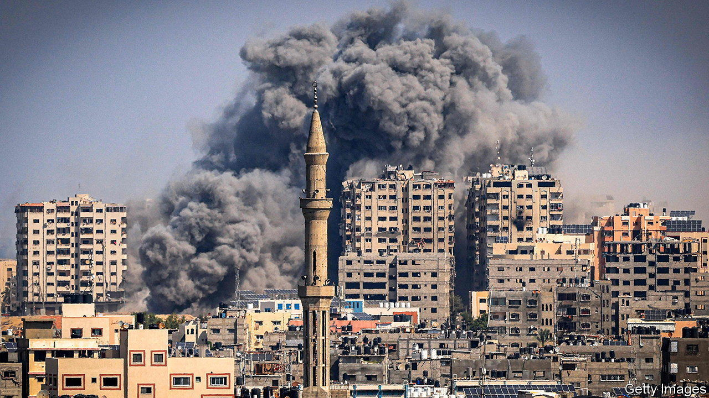

###### War in the Middle East

# The Israel-Palestine conflict: a reading list 

##### Six books that shed light on a century of violence 

 

> Oct 18th 2023 

By David Fromkin. 

Tensions in the Middle East are a political inheritance of the dissolution of the  after the first world war and the piecemeal settlements of 1922. This landmark book, published in 1989 and named as a finalist for the Pulitzer prize, provides a sweeping account of the period between 1914 and 1922, ranging from the Mediterranean to . It astutely traces the Allies’ motivations for carving up the Arab world and shows why the West’s imperial vision was doomed to fail.

By Ian Black. 

When, exactly, the Israel-Palestine conflict began is hard to say. Many consider November 2nd 1917 to be the starting-point: that is the date of the , when the British government vowed to use its “best endeavours” to create a “national home” for the Jewish people in Palestine, a territory it would take from the Ottomans.  praised by Palestinian and Israeli historians alike, offers a tour of the past century of conflict.

 By Rashid Khalidi. 

An eminent Palestinian-American historian explains why Palestinians failed to achieve an independent state. The book is resonant with personal history and lays out the barriers that obstructed Palestinians’ aspirations. It counts the poor decision-making of certain  among its explanations, too.

By Beverley Milton-Edwards and Stephen Farrell. 

The  that rules the Gaza Strip first emerged in 1987 during the first Palestinian (“shaking off”, or uprising). In its first charter  styled itself as the “Islamic Resistance Movement” and declared Israel illegitimate. In 2006 Hamas became the first Islamist movement to ascend to power in the Middle East by winning an election. The authors interviewed hundreds of people over three decades, including the group’s leaders, fighters, opponents and victims. This book explains the inception of the “largest, most influential and most deadly Islamist organisation” and how it became entrenched in . 

By Colin Shindler. 

The right first came to power in Israel nearly five decades ago, but its current government may be the in the country’s 75-year history. This richly detailed book analyses with clarity and insight the political and philosophical ideas that drive the right. The author, who is a professor at Cambridge, studies important thinkers and figures such as  (the founder of the Zionist Right) and Binyamin Netanyahu (Israel’s prime minister).

 By Emma Williams. 

In 2000 the author, a British doctor, accompanied her husband, a UN official, and three small children to Israel. A month later the second Palestinian erupted. This moving memoir—which spans three years—documents the events she witnessed. She gave birth to a fourth child in a hospital in Bethlehem, which was shelled by the Israeli army. A Palestinian suicide-bomber blew himself up near her children’s school, with his head landing at the foot of their teacher.

 journalists have also written books about the conflict. Anton La Guardia, our diplomatic editor, is the author of “Holy Land, Unholy War: Israelis and Palestinians”. Gregg Carlstrom, our Middle East correspondent, wrote “How Long Will Israel Survive?: The Threat From Within”. Anshel Pfeffer, our Israel correspondent, is the author of  ■


