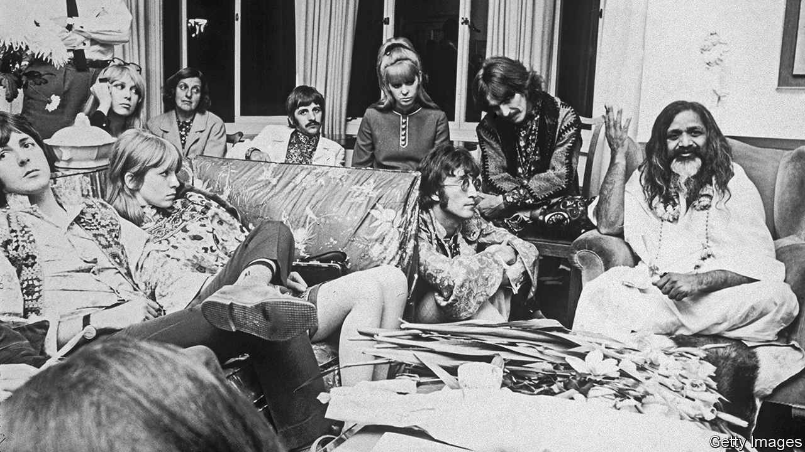

###### Spirituality

# Where to look to find enlightenment 

##### A new book looks at India’s role in sating spiritual searches 

 

> Oct 19th 2023 

By Mick Brown. 

For decades India has mostly run a current-account deficit, unable to export as much as the country imports to meet its needs. But in the accounting books of the heavens, India is a net exporter, on par with the Levant as a font of great religions. Hinduism, Buddhism, Sikhism and Jainism sprang from its sacred geography. God has repeatedly lured spiritual seekers to the subcontinent—from Xuanzang (a seventh-century Chinese monk who journeyed to India in search of Buddhist texts) to  (an American champion of LSD). Leary memorably described Varanasi, Hinduism’s most sacred place, as the “the site of a non-stop hippie festival for the last 5,000 years”.

Those seeking to join the piety party first ventured from Asia, then from Europe (and especially Britain) during the colonial era and later, after India’s independence in 1947, from America. Indian swamis and gurus energetically promoted their teachings to new converts. It is these Western enthusiasts and their Indian idols who are the subject of “The Nirvana Express”, an enlightening new book by Mick Brown, a British music journalist with a sideline writing about Asian religion. 

The first notable Western figures to take an interest in Indian religions were not exactly long-haired, pot-smoking hippies. Sir Edwin Arnold was an Oxford-educated editor of the  who spoke 19 languages and wrote memoirs, poetry and history in his spare time. In 1879 he published “The Light of Asia, a 5,300-line narrative poem about the teachings and life of Buddha. The book went on to sell over 1m copies and ignited the first sparks of popular interest in India’s religions in the West. In 1885 Arnold published “The Song Celestial”, a translation of the Bhagavad Gita; credited it with introducing him to his own religion’s most sacred text. The two men would go on to become friends.

Arnold’s Indian analogue was Swami Vivekananda, a Hindu philosopher who electrified the first gathering of the World’s Parliament of Religions in 1893 with his speeches preaching Hinduism’s message of universal acceptance. Arguing that “we Hindus must believe that we are the teachers of the world,” he founded spiritual centres in the West and acquired a devoted female following. 

Fantastic stories—packed with unlikely figures, strange twists of fate and even the occasional act of mind-reading—bring readers of “Nirvana Express” on an enjoyable journey. Some of the colourful characters include Paul Brunton, whose bestselling “A Search in Secret India”, a travelogue-cum-spiritual-handbook published in 1934 (and still in print), would establish his reputation as a sort-of guru figure himself and Meher Baba, an actual guru obsessed with movies in general and in particular. All are worthy of their own books. It is to Mr Brown’s credit that he never stoops to mockery or even gentle irony, despite what must have been considerable temptation. 

“Nirvana Express” also tracks renewed Western interest in Indian spiritualism, which started with the beatniks in the 1950s, peaked with the Beatles arriving in the Himalayas to meditate with  (pictured) and ended with the dissolution of the Rajneesh Ashram in Oregon. (This was the subject of “Wild Wild Country” on Netflix, which dramatises the short-lived but tumultuous commune better known for violence, group sex and attempts to poison the local population than for spirituality.) 

The collapse of Rajneesh Ashram, writes Mr Brown, “marked the final pangs of the Western dream of India as the repository of esoteric wisdom and the promise of enlightenment”. It is true that the image of India in the West has changed in recent years, and a country once associated with poverty and naked is now better known as an economic giant, a rising geopolitical power and an originator of modern technology. 

Yet India’s own conception of itself as an ancient land with spiritual riches to offer humanity has never faded. For evidence, look only to the title that , the prime minister, bestows on his country, and by extension, himself: , or world teacher. India has never been short of men who believe themselves chosen by God to lead the world. ■


