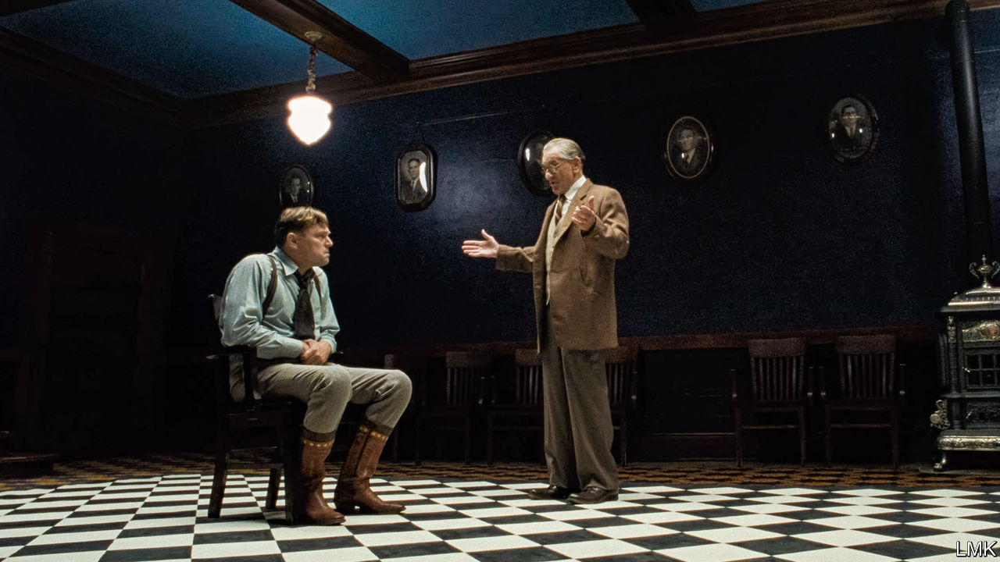

###### Movie marathons

# Why films have become so ridiculously long 

##### Popular films are nearly 50% longer today than in the 1930s 

 

> Oct 14th 2023 

Want to know what is coming soon to a cinema near you? Probably not an hour-and-a-half-long movie, as in the old days. This year audiences have endured the longest instalments yet in the , “John Wick” and “Mission: Impossible” franchises. , Christopher Nolan’s three-hour blockbuster, required 11 miles (18km) of film stock for IMAX showings. 

On October 20th comes “Killers of the Flower Moon” (pictured), a grisly western from the director Martin Scorsese. At nearly three and a half hours, its length is nearly double that of the average film last year. Even movie buffs struggle to concentrate for that long. During the premiere at the  in May, some viewers dozed off. Afterwards there was a mad dash (and long queue) for the toilets. When did watching a film become such a slog? 

 analysed over 100,000 feature films released internationally since the 1930s, the start of Hollywood’s golden age, using data from IMDb, a movie database. The average length of productions has crept up by around 24%, from one hour and 21 minutes in the 1930s to one hour and 47 minutes in 2022 (see chart). Blockbusters are the worst offenders. For the ten most-popular titles (measured by how many reviewers rated the films on IMDb) average lengths stretched to around two and a half hours in 2022, nearly 50% higher than in the 1930s.


Film-makers began churning out protracted pictures in the early 1960s. Cinema was booming and auteurs wanted to distinguish their art from television. Epics graced the silver screen, including  (1962), which surpassed the three-and-a-half hour mark, and  (1963), which originally exceeded four hours but was later cut down. Back then, audiences enjoyed an intermission while the projectionist prepared the reels for the next act. Runtimes of popular films ebbed and flowed over subsequent decades (and stretched long in some countries, such as India, known for its Bollywood sagas). But they have ballooned since 2018.

Franchises are one driver of this trend. Studios want to squeeze the most out of their costly intellectual property, but they are competing with streaming platforms for eyeballs. The hope is that a spectacular, drawn-out “event” movie will tempt audiences away from the small screen and into cinemas. This approach has often paid off:  (2019), Marvel’s three-hour superhero extravaganza, was the highest-grossing film in 2019. Last year long franchise movies made up most of the highest-grossing films in America. 

Anything that lures people off their couches to see a film in theatres is good news for cinemas. But protracted runtimes also pose a “fundamental problem”, complains Clare Binns, managing director of Picturehouse, a British cinema group and film distributor. Long movies can mean forgoing two showings per night, which hurts ticket sales and profits. 

Another explanation for longer films has to do with directors’ growing clout. Who would dare tell the likes of Mr Nolan to trim his masterpieces? Streamers, which do not have to worry as much about concision because viewers can pause whenever they like, may lure big names with deep pockets and promises of creative freedom. “Killers of the Flower Moon” will debut on AppleTV+ after its theatrical run. Netflix funded and released Mr Scorsese’s equally long  in 2019, a film that would have benefited from a decisive editor, Irish or otherwise. ■

