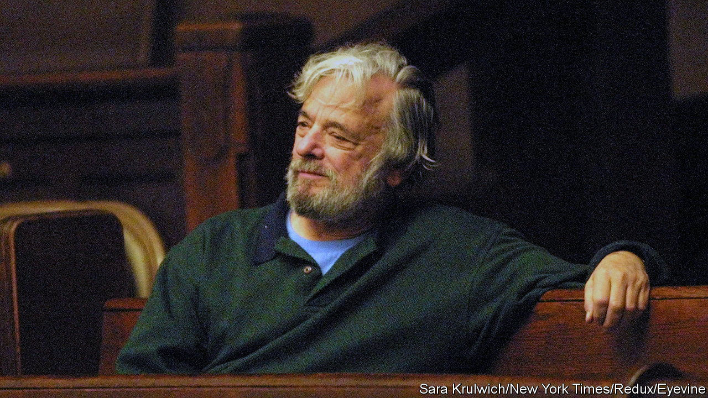

###### When the music stops

# “Here We Are” and the question of what to do with unfinished art 

##### Stephen Sondheim’s last work is a rollicking musical—for the act that he probably wrote 

 

> Oct 19th 2023 

NON-FINITO art can be arresting. Think of a delicate sculpture protruding from a monolith or a swathe of bare canvas in an otherwise detailed painting. Such artworks give the viewer pause. Did the creator intend the effect or simply stop halfway through?

“Here We Are” is one such puzzle. , an American composer, had been working on the musical on and off for years alongside David Ives, a playwright, and Joe Mantello, a director. In the weeks before his death in 2021, Sondheim gave a production the go-ahead. But then he said that it was not finished and had no idea when it would be.

The work will have its premiere on October 22nd at The Shed in New York. The producers say that it is “very much the complete show” that Sondheim “envisioned, created and sanctioned”. But those who have seen the musical may wonder whether that is the case. It is peculiar and unlike previous works, such as “Into the Woods”.

Inspired by two surrealist films by Luis Buñuel, “Here We Are” has a typical Sondheimian premise: a group of friends riven with tensions (sexual and otherwise) has met up. In the first act, they cannot find somewhere to eat and wander from restaurant to restaurant. At a recent preview it was dreamlike, filled with the kind of complex harmonies, witticisms and internal rhymes that Sondheim is known for.

Then, in the second act, the tone shifts. The group finally has a meal but then is trapped in the room. The music stops; the characters struggle to sing. Sondheim seems to have left at the intermission. Mr Mantello has said that he came up with the idea, based on the films but that Sondheim agreed with his assessment that “the absence of music was the score.”

History is littered with left-behind works-in-progress. ’s pilgrims never made it to their shrine. Gustav Klimt died in 1918 before he could finish “The Bride”, so some figures have the Austrian artist’s signature look and others are outlines. In neither case does it matter much. The stories in “The Canterbury Tales” stand alone. The gaps left by Klimt can be filled in by the imagination.

Some find the lack of closure unsatisfying, however, and attempt to finish a piece on an artist’s behalf. died partway through writing a requiem; it was completed first by a pupil and later by musicologists. (The results have divided listeners.) Artificial intelligence is also being used to fill the silence. When died, his Tenth Symphony was just a collection of sketches. A team from Rutgers University trained an ai model on the maestro’s work and extrapolated a composition.

Financial incentives can push unfinished work to be released without the necessary caveats. Before Harper Lee died in 2016, , an early draft of “To Kill a Mockingbird”, was initially passed off as a discrete novel. Others suggest that artists would rather partial or abandoned pieces stay private. Yet perhaps it is worse for the art never to be seen.  “Sanditon” collected dust until 1925, more than a century after her death. Although it stops in the middle of a chapter, betrothals still to be secured, the novel contains some of Austen’s sharpest lines.

What about “Here We Are”? Strange though it is, fans may still be pleased to hear it. The first act, at least, proves that Sondheim’s strengths remained potent. He was a master of wordplay, ambition and emotional complexity to the end. ■


