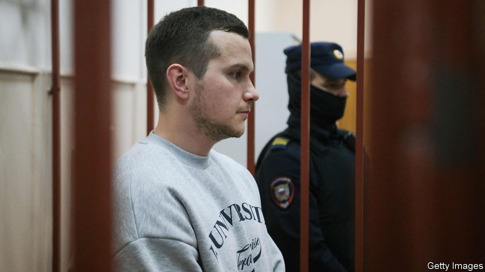

###### Legal vacuum

# Alexei Navalny’s lawyers are arrested 

##### Vladimir Putin’s latest act of persecution 

 

> Oct 19th 2023 

Alexei Navalny, Russia’s best-known opposition leader, has been in captivity for more than 1,000 days, and in solitary confinement for 224 of them. He was denied medical treatment when ill, has been refused visits by his family for more than a year and is not allowed to make telephone calls. Yet Mr Navalny, ever stoical, has described his imprisonment not as martyrdom, but as a nuisance and a challenge that needs to be overcome. 

The challenges continue to mount. In August Mr Navalny was sentenced to an additional 19 years in prison for “extremism” on top of the eleven-and-a-half years he was already serving for “fraud”. But even then he continued to communicate with his supporters and to haunt Vladimir Putin, whose thugs tried to poison him in 2020 and then subjected him to torturous conditions in jail when he returned to Russia the following year after being treated in Germany. Mr Navalny’s rare appearances in courts (mostly via video link) have turned into political speeches, and visits by his lawyers have kept him in touch with the outside world. “His voice from behind bars sounded unbearably loud for Putin,” Leonid Volkov, Mr Navalny’s chief of staff, wrote on X (formerly Twitter) from Vilnius, Lithuania’s capital.

So Mr Putin decided to turn down the volume, and to deprive Mr Navalny of his last channel of communication. On October 13th three of Mr Navalny’s lawyers—Vadim Kobzev, Alexei Liptser (pictured) and Igor Sergunin—were arrested and accused of “participation in an extremist community”; that is, of passing Mr Navalny’s words to the outside world. Olga Mikhailova, another of his lawyers, had left the country by the time her offices were raided. 

Mr Navalny learned the news from a journalist during one of his appeal hearings. “I don’t understand what’s going on. My lawyer is not here. All the other lawyers are not here. Nobody is allowed to visit me. I am isolated and cut off from any information,” he told the judge. Even the radio in his cell has been turned off, he said, to plunge him into complete silence. Shortly after that, news came that Mr Navalny’s fifth lawyer, who was supposed to attend the appeal hearing, had fled the country. 

The practice of jailing not only dissidents but also their lawyers has been tried and tested in Belarus, but is relatively new in Russia. Some 200 Russian defence lawyers have signed a petition denouncing the climate of fear in which they operate, and calling for a strike. Two volunteers have now come forward to help Mr Navalny.

Having no legal representation and no contact with the outside world makes Mr Navalny especially vulnerable, as he has been awaiting a transfer to one of Russia’s toughest prisons for a year. (“I feel like a tired rock star on the verge of depression. I’ve reached the top of the charts and there’s nothing more to strive for,” he joked when he heard of his transfer order.)

All this is part of the Kremlin’s preparation for next March’s presidential election, which is sure to be farcical. Mr Putin will aim to demonstrate total political control and to keep his opponents demoralised. A few hours after losing his lawyers, Mr Navalny somehow managed to convey that by January 15th he will produce his strategy for how best to tackle Mr Putin’s election, though it is not clear how he will now be able to communicate it. “Prison exists only in your mind,” Mr Navalny wrote in one of his early posts. If so, he remains the freest man in Russia. ■

