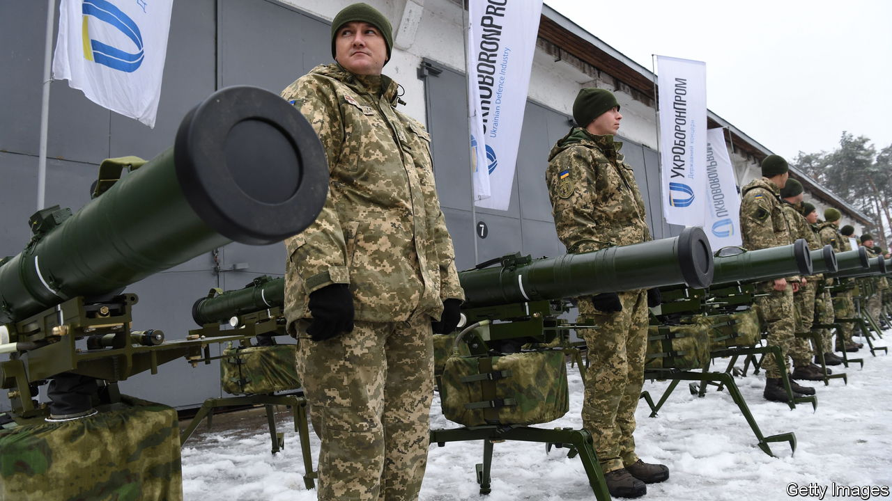

###### From corruption to production

# How a 31-year-old hopes to fix Ukraine’s state-owned defence giant 

##### It won’t be easy, but nothing in Ukraine is 

 

> Oct 19th 2023 


In MARCH Ukraine abruptly rebooted its defence-industry team. Oleksandr Kamyshin, a hyperactive manager with a reformist pedigree, was appointed to head a beefed-up strategic-industries ministry. He has previously turned around the railways and has the confidence of the president’s inner circle. Still more surprising is the recent appointment of Herman Smetanin, a little-known 31-year-old, to run the state defence consortium popularly known as Ukroboronprom. He is to sort out the sprawling, inefficient and notoriously corrupt company—in wartime.

Mr Smetanin, a design engineer who rose from the shop floor to the director’s office, is on one level uniquely qualified for the unenviable job. At the start of the war in February 2022 he was to be found in his native Kharkiv, 35km from the Russian border, as the director of its famed but faded tank factory. He lived in the factory through the terrifying first weeks, as bombs fell through its roofs, while a group of key workers continued production in breaks between the shelling. Every defence contract was eventually fulfilled. “If the mortars or artillery were landing near, you’d wait half an hour before starting again,” he recalls. 

But there are questions about the possibility, and even the desirability, of turning around an umbrella organisation built on corruption and favour from its very early days. When the Soviet Union broke up in 1991, Ukraine inherited one of the world’s largest military complexes: shipbuilding, tanks, aviation, missiles. Over the next two years Ukraine created three agencies that, with the help of poor and corrupt officers, siphoned off whatever they could on the black markets. Ukraine stopped making ammunition. Factories stood idle. The most advanced products were refashioned for the export market. 

In 1996, with the government close to bankruptcy, the three agencies were taken over by a new enterprise with close connections to Russia’s security services. (The two countries’ defence industries were then closely integrated.) A successor structure came into existence in 2010. The new company, Ukroboronprom, was supposed to be about synergy, but in reality it was about personal enrichment. “Ukroboronprom was dead at birth,” says a source who worked in the company at the time. 

When war came in 2014, and full-scale invasion in 2022, Ukroboronprom mobilised but struggled. There were notable successes, though. Perhaps half a dozen of what were over a hundred operating units were still able to produce competitive products. The Pavlohrad chemical plant, for instance, delivered gunpowder, a commodity most in demand in any war. The Luch Design Bureau in Kyiv produced Stugna anti-tank guided missiles that helped stop Russia’s march on Kyiv, and the Neptune cruise missiles that famously sank Russia’s Black Sea flagship, the . 

But it has been private enterprise, independent of state-owned Ukroboronprom, that has set the pace in this war. Strike drones, the new addition to a conflict that otherwise often resembles the first world war, are almost all produced privately. The new drone entrepreneurs believe it is they who now represent the new face of Ukrainian defence innovation. “I see it as my mission to resurrect previous glories,” says Vitaliy Kolesnichenko, the director of AirLogix, a Kyiv-based drone developer. 

Making Ukroboronprom exciting, well paid but less loss-making is one of the conundrums facing Mr Smetanin. He says his focus is on keeping things simple: increasing production, restructuring the business and tackling corruption. There is already progress on the first, he reports. Shell production is up by anything between 100% to 1,000% in the few months he has been in charge, depending on the precise type. Weapon production in every category is increasing, despite constant Russian attacks. Reform of the governing structure will introduce new subholding clusters of companies, which will be organised around specialisation: armoured vehicles, aviation, shipbuilding and so on. The 34 of 66 units still organised as state companies will soon be turned into limited-liability companies or joint-stock companies with supervisory boards. Appointments of factory directors, a major source of corruption in the past, will henceforth be done by an independent commission.

A candid ministerial insider suggests that public-private partnership may be the only hope for Ukroboronprom and its team of young reformers. “Can you turn around 60-odd underfunded, corrupt factories? I don’t think so. But can you use them as platforms for private development? Maybe.” A high-level government source agrees that Mr Smetanin will find the job of rescuing Ukraine’s slumbering defence giant hard going. “Logically, he has no hope. But we do live in a country called Ukraine, so he does have a chance.” ■


