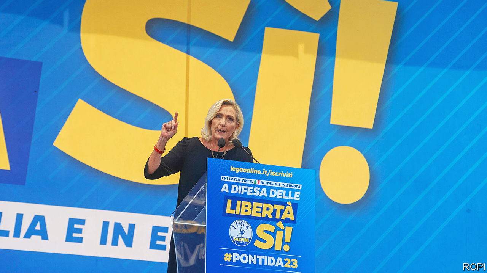

###### Europe’s populists

# Marine Le Pen poses a greater threat than Giorgia Meloni 

##### At least to the European Union and the transatlantic alliance 

 

> Oct 19th 2023 

When Giorgia Meloni took over as Italy’s prime minister in October 2022, Europe’s liberals trembled. Her party, the Brothers of Italy, has roots in post-war neo-fascism, and her electoral pitch, promising a clampdown on illegal immigration, promised uncompromisingly hard-right politics. A year on, the pragmatic Ms Meloni has not turned out to be the disruptive force some feared. Which makes centrists in neighbouring France worry that this could help Marine Le Pen.

France is not due to hold a presidential vote until 2027. But Ms Le Pen has twice made it to the run-off, each time to be beaten by Emmanuel Macron. The constitution forbids him from standing for a third consecutive term. Already, between 2017 and 2022, Ms Le Pen increased her run-off vote from 34% to 41%. Under France’s centralised presidency, the possibility of a Le Pen victory raises particular concern. 

Ms Meloni and Ms Le Pen share more than hard-right rhetoric. Like Ms Meloni, Ms Le Pen has tried to distance her party, now called National Rally (RN), from the thuggish discourse of its former self: in her case, the National Front. Unsavoury characters still move in her circle. But Ms Le Pen has promoted the more respectable-looking among them, notably Jordan Bardella, a 28-year-old Euro-deputy who now runs her party. She has also ditched some of the party’s most Eurosceptic positions, including a past promise to take France out of the euro, which proved unpopular. 

Ms Le Pen has worked hard to normalise the party too. Her suit-wearing deputies heckle far less than do members of the other main parliamentary opposition bloc, NUPES, a left-wing alliance. The party wants to show that it is not there just to rant and block, but is ready—like Ms Meloni in Rome—to govern. 

The chief reason to think that Ms Le Pen poses a far greater threat is geopolitical. Ms Meloni is no friend of Russia’s Vladimir Putin. Ms Le Pen’s party, by contrast, took a €9m loan from a Kremlin-linked bank (which it has just paid back). During her presidential campaign in 2022 Ms Le Pen briefly used a photo of her next to Mr Putin in a flyer, published before he sent the tanks into Ukraine. Although she denounced the invasion, at a parliamentary hearing in May this year Ms Le Pen continued to defend the referendum held in Crimea after Russia annexed the Ukrainian territory in 2014. 

Moreover, in office Ms Meloni has been a firm backer of NATO, and of arming Ukraine. Ms Le Pen, on the other hand, not only wants to pull France out of NATO’s integrated military command. She has also argued against the alliance’s expansion even to Sweden and Finland, let alone Ukraine. She thinks “Russian paranoia” about NATO on its borders should be “taken into account”, lifting an argument straight from the Moscow script, and has criticised France for sending heavy weaponry to Ukraine. Ms Meloni, says an RN official disapprovingly, is “very Atlanticist”.

Ms Meloni has so far played by EU rules, but Ms Le Pen still vows to overturn them. Her scheme is to lean on like-minded governments—in Hungary and Slovakia, though not for much longer in Poland—to transform the EU from within into an “alliance of nations”. She wants to hold a referendum to amend the French constitution in order to entrench its “superiority” over EU law. And she vows to reduce France’s contribution to the EU budget. If others do not co-operate, insists Jean-Philippe Tanguy, an RN deputy who helped run Ms Le Pen’s presidential campaign, “we would force their hand”, for instance by refusing to pay. Anything of the sort would begin to pull the EU apart. 

Such is the talk. Whether a French president could enact such changes is another matter. Even were Ms Le Pen to win the presidency, her party would not by itself secure a parliamentary majority. Any constitutional change has to be approved either by referendum or by a three-fifths majority in a joint sitting of both houses. Parliament also has to approve any nomination to the Constitutional Council.

A good measure of Ms Le Pen’s distance from Ms Meloni is the fact that her real ally in Italy is not the prime minister but Matteo Salvini, a more populist member of the ruling coalition. On September 17th Ms Le Pen was guest of honour at his party’s annual jamboree in Lombardy, a stronghold. Launching her party’s campaign for next June’s elections to the European Parliament there, she vowed to “put Europe back in its place”. Polls suggest the RN will beat Mr Macron’s centrists into second place. 

It could be that, as Ms Meloni runs into domestic difficulty, particularly over economic management, this will rub off on Ms Le Pen too. On immigration, argues Dominique Reynié, head of Fondapol, a think-tank, “Meloni demonstrates the impotence of populists.” The number of migrants arriving in Italy has surged on her watch. For now, though, Ms Meloni is also showing that the populist right can run a big European country. That is enough to make French centrists shudder. ■

