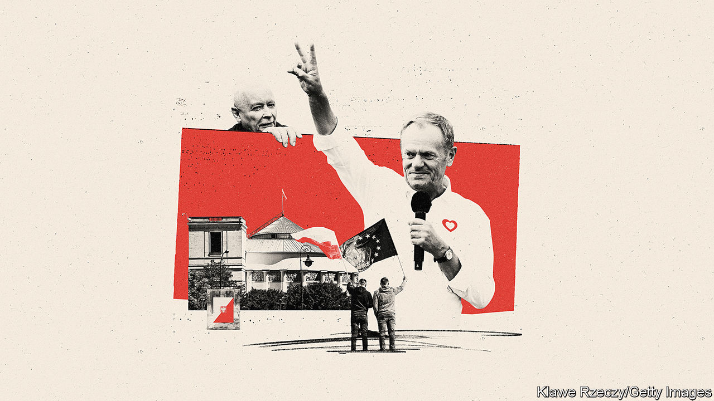
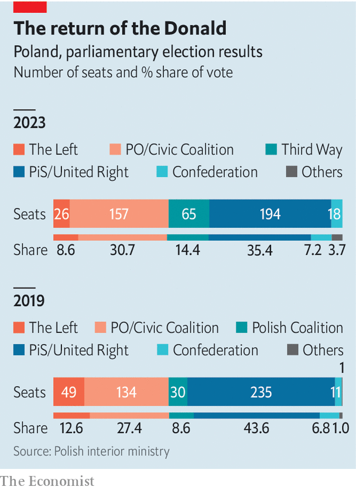

###### Tusk’s triumph

# Poland gives pro-European liberals a big win 

##### But the road back to the rule of law will long and hard 

 

> Oct 15th 2023 

THE POLLS closed at 9pm on October 15th, but those still queueing were allowed to cast their votes, so at one polling station near Wroclaw balloting continued until almost 3am. A pizzeria delivered 300 free pies to those standing outside. “Better to wait four hours than four years,” a voter there told , a newspaper. Many had worried that the vicious campaign would discourage voters from showing up. Instead turnout reached 74%, Poland’s highest rate ever—higher even than in the election in 1989 that brought an end to communism.

Indeed, this election may have been Poland’s most important since 1989. Rule-of-law advocates said it was the last chance to stop the country’s right-wing populist government from seizing control of the courts, filling the state with apparatchiks and wrecking Poland’s standing in the EU. The voters gave the opposition a surprisingly decisive victory. That augurs a change of direction for Poland and a big setback for Europe’s hard right.

 


The Law and Justice (PiS) party, in power since 2015, came first. But it took just 35.4% of the vote, down from 43.6% in 2019. The main opposition alliance, the centrist Civic Coalition (KO), got 30.7%. Another centrist outfit, Third Way, drew 14.4%, well above expectations. Lewica (The Left), an alliance of leftists and social democrats, managed 8.6%. The hard-right Confederation party won 7.2%. That gave KO, Third Way and Lewica, which promised to govern together, a majority of 248 out of the 460 seats in the Sejm, the lower house of parliament. PiS has just 194, and no other party so far wants to join them.

The opposition was jubilant. For eight years it had been shut out, not just from government but by PiS’s takeover of state institutions. “Poland won, democracy won,” declared Donald Tusk, the former prime minister and ex-president of the European Council who leads KO. He will almost certainly return to office.

PiS deployed the state media and state-owned companies, both stuffed with cronies, to blitz the country with propaganda. That gave it a “clear advantage”, according to a report by the Organisation for Security and Co-operation in Europe, a watchdog. But it was not enough. The post-election rally at PiS’s headquarters in Warsaw was a shadow of those in earlier years. Its leader, Jaroslaw Kaczynski, grimly acknowledged it might not be able to form a coalition. Days later the party still seemed to be in denial. “Evil has temporarily won,” said Marek Suski, a PiS MP. Another, Ryszard Terlecki, warned that his fraction would not be “an easy, gentle and pliant opposition”.

When PiS swept to power in 2015, it was Mr Tusk’s party that was seen as corrupt and out of touch. By contrast, PiS had its ear to the ground. It wooed Poles with generous child benefits and infrastructure investments, especially in the country’s poorer east. But the party’s obsession with control of state institutions and its constant infighting gradually left it sealed inside its own media bubble. Its vicious electoral campaign, which blasted Mr Tusk for his partly German ancestry and Brussels connections, appealed only to its core voters. PiS also attacked Confederation, its only potential coalition partner. Many Confederation supporters switched to Third Way, according to Marcin Palade, a pollster—thus aiding the opposition.

By contrast, the opposition’s broad spread of parties drew in new voters. So did clever tactics. Lukasz Litewka, a new MP for the Left, was given the lowest position on his party’s regional list, but won nearly twice as many votes as the party leader after he used his electoral posters to advertise dogs up for adoption at a local shelter. Social-media campaigns helped raise turnout among those aged 18-29 to a remarkable 69%, according to an exit poll by Ipsos, up from 46% in 2019. PiS came last among these voters. The opposition’s upbeat campaign in the final weeks went down well with voters tired of polarisation.

It may be some time before Mr Tusk gets to form a coalition. The president, Andrzej Duda, comes from PiS, and may give that party a (futile) first shot. That could delay the transition until mid-December. Negotiations will not be easy: the opposition’s three groupings are made up of nine sharply different parties. After the election Wladyslaw Kosiniak-Kamysz, who leads an agrarian party within Third Way, said he opposes including “ideological issues” (such as liberalising abortion) in the coalition agreement. Anna Maria Zukowska, a Left MP, said that in that case “farmer issues” would be treated similarly. 

Once it forms a government, the opposition has pledged to undo PiS’s efforts to turn Poland into a copy of Viktor Orban’s Hungary. This will be hard. Returning independence to the state media and state-owned companies will require removing the cronies whom PiS has installed, which could degenerate into its own form of cronyism. Re-establishing an independent judiciary will mean undoing PiS’s politicisation of the body that nominates judges. That will need legislation, which could be vetoed by Mr Duda or blocked by the PiS-controlled constitutional tribunal.

Mr Tusk has promised to unlock €35bn ($37bn) in post-covid aid that the European Union has withheld over PiS’s meddling with the courts. Poles who expect Mr Tusk’s years in Brussels to smooth the way may be disappointed. Meeting some EU conditions will be easy, but one crucial reform has been blocked by the constitutional court. The European Commission will try to stick to its requirements, to refute the charge PiS always made: that its cut-off of Poland is about politics, not the rule of law. “It’s not that just because they have a different prime minister, we will say all the problems are gone,” says a commission official. Still, the promise of a firmly pro-EU prime minister in Warsaw is a sea change for Poland—and for Europe. ■


