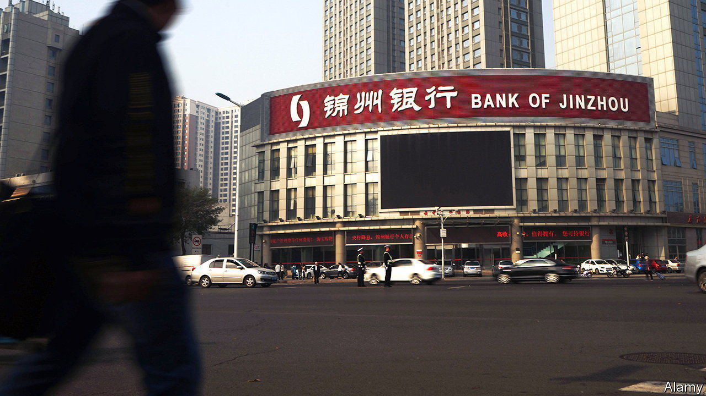

###### Nasty headache

# China’s banks may be loaded up with hidden bad loans 

##### The industry’s covid-era hangover could be about to intensify 

 

> Oct 15th 2023 

When jinzhou bank, in north-eastern China, showed signs of distress at the start of the year, state media suggested that a billionaire named Li Hejun might be to blame. Mr Li, a solar-panel tycoon, was once China’s richest man. His firm was known to have tight links to the bank. And it was not long after word spread that he had been arrested that Jinzhou Bank suspended trading in its shares and told investors it would restructure its operations.

Oddly, the bank’s finances look to have been in good shape. The firm’s overall bad-debt level was low in the first half of 2022, the last period for which detailed information is available. Although one concerning figure sticks out—more than 50% of its personal-business loans had become non-performing—this type of loan comprised just 1% of its total. Small- and micro-enterprise loans, which make up about half of the bank’s loan book, appeared normal, with only 3% having gone sour.

But was this the whole story? In theory, there is no meaningful distinction between personal-business loans and small- and micro-enterprise loans, says Jason Bedford, a veteran banking analyst. The two types are used in similar ways and should offer similar risk. In practice, though, there is a crucial difference: small- and micro-enterprise loans remain covered by a covid-era moratorium allowing banks to avoid recognising bad debts. Thus it is possible that a large portion of Jinzhou’s lending book is unrecognised bad debt. The bank has said almost nothing about its condition since earlier this year. 

If hidden bad debts such as these lurk at Jinzhou Bank, they may lurk elsewhere, too. This is worrying, for Chinese finance is already in a mess. Local governments are struggling to repay lenders at least 65trn yuan ($9trn) in off-balance-sheet debts. Many of the country’s big property developers have already defaulted on offshore bonds and owe trillions of yuan-worth of  to local residents. China’s largest wealth-management firms have started to default on payments owed to investors. Given that the type of hidden debts possibly on Jinzhou’s balance-sheet have so far received little attention, the bank’s troubles ought to come as a warning.

Problems with loans to the smallest firms began with covid-19. As China shut down, the central bank put a moratorium on the repayment of loans for small- and micro-enterprises until June 2020 in order to halt a wave of defaults. After less than three months, officials estimated that 700bn yuan in payments had been deferred. The moratorium has been extended several times since then, with officials citing the . No estimate for the total amount of unpaid loans exists and banks will not be required to disclose them publicly until next year.

The moratorium has also coincided with another state initiative. In order to stimulate the economy, the central government has leant on banks to extend loans to the smallest firms, and to do so at the lowest possible interest rates. Although such policies have been attempted for years, banks have been resistant, preferring to lend to the large, often state-owned companies with which they have relationships already. This time the policy has worked, however. A crackdown on the banking industry, culminating in the arrest of the president of one of China’s largest commercial banks last year, has made bosses more willing to follow official edicts. 

As a result, at the beginning of the year about 28% of all loans in China had been given to small- and micro-enterprises, up from 24% at the end of 2019. Many of these loans represent simply the renewal of older, unpaid debts. It is well known that small firms struggled during the pandemic. Despite this, there has hardly been an uptick in non-performing loans, notes Alicia Garcia Herrero of Natixis, a bank. 

Another result has been what some view as a catastrophic mispricing of assets. Small firms are usually judged to pose the greatest risks, but loans to small- and micro-enterprises have nevertheless been provided at rock-bottom interest rates. Banks have offered them at an average of 4% annual interest, down from 6% or so in 2019. To make matters worse, a recent surge in long-term deposits, which are remunerated at higher rates, means banks’ margins have been squeezed even tighter.

Only a few lenders have hinted at the amount of loans they have deferred. Minsheng Bank, one of China’s largest, said in its mid-term report last year that it had provided 212bn yuan in renewed loans and deferred payments in the previous six months, equivalent to 9% or so of its entire corporate loan book. Since then, it has declined to make similar disclosures. The central bank is providing funds to banks, which can be used to support specific parts of the economy. In a recent report it said that it had handed out 2.7trn yuan in loans for small firms in the first half of this year. 

Any loan moratorium comes with a gamble: that a period of forgiveness will allow struggling companies to get back on their feet after a shock. The initial decision may have saved tens of thousands of firms and even a few banks from going under. Now the fate of the pile of debt—however big it may be—depends on China’s economic fortunes over the coming months. Although the purchasing-managers’ index for manufacturers shows that the outlook for large companies has improved slightly, the one for small and medium-sized companies has continued to contract. The economic hangover from the covid era has lingered. It could now be about to intensify. ■


