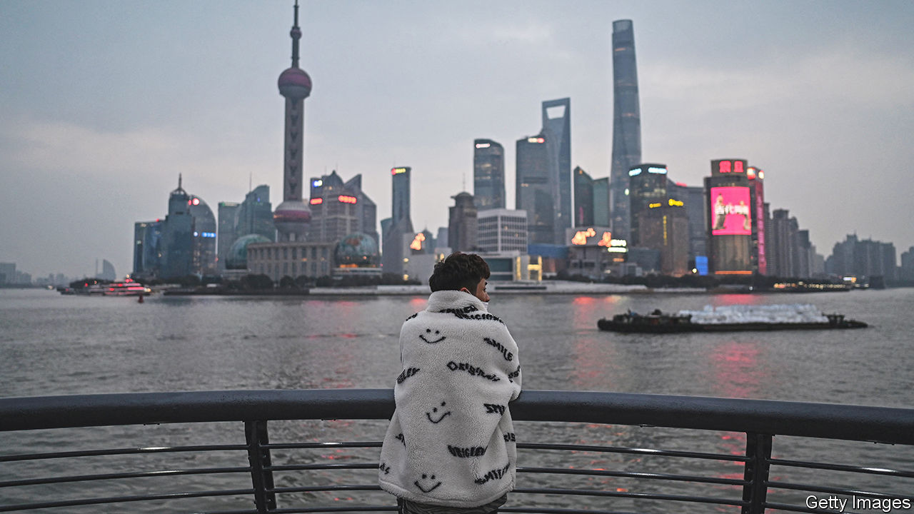
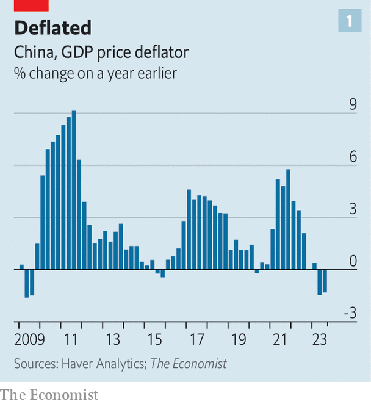
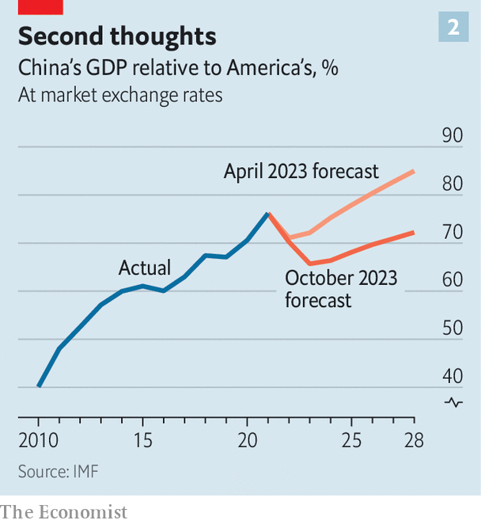

###### Peak disappointment

# China’s economy may be growing faster, but big problems remain 

##### None is more unnerving than the threat of deflation 

 

> Oct 18th 2023 

China’s emergence from its covid-19 controls was meant to be the biggest economic event of the year. Instead, the reopening has turned into one of the biggest disappointments. In a recent survey by Bank of America, fund managers in Asia expressed their “fatigue and frustration” with China’s weak growth and the lack of a concerted government response. 

On the face of it, economic data released on October 18th should cheer them up. The figures showed that China’s economy grew by 4.9% in the third quarter, compared with a year earlier—faster than expected. And its growth compared with the previous quarter was stronger still: 5.3% at an annualised rate. The economy should now have little trouble meeting the government’s growth target of “around 5%” for this year. ubs, a bank, raised its forecast for 2023 from 4.8% to 5.2%.

The source of the growth was also encouraging. Consumption contributed almost 95% of it, noted Sheng Laiyun of China’s National Bureau of Statistics. There are signs that the country’s beleaguered households may be coming out of their shells. Demand for longer-term loans is growing; the saving rate, adjusted for the season, fell below 30% of disposable income for the first time since the pandemic, according to Yi Xiong of Deutsche Bank.

One reason for this may be improvements in the job market. Urban unemployment fell to 5% in September from 5.2% in the previous month and the average workweek lengthened. Household debt burdens have also eased a little. Chinese policymakers have instructed banks to cut the interest rate on outstanding mortgages in line with the lower rates available for new ones. On October 13th the central bank announced that the interest rate on existing mortgages, worth 21.7trn yuan ($3trn), had been lowered by 0.73 percentage points, which should free up over 100bn yuan of spending power a year.

 


But the good news for households was not matched by good news for houses. The property market remains dangerously weak. The amount of residential floor space sold by property developers in September was 21% below that sold last year. Increasingly, China’s developers must actually finish buildings before they can sell them. Completed buildings accounted for almost a quarter of sales in September, compared with less than 13% in 2021. 

The threat of deflation lingers, too. China’s annual nominal growth, which includes inflation, was 3.5% in the third quarter, lower than the real, inflation-adjusted figure. This suggests that prices of goods and services fell by almost 1.4%, the second drop in a row (see chart 1), which makes the current period China’s worst deflationary spell since 2009.

Thus fatigue and frustration should not give way to complacency. At the imf’s annual meeting, Pierre-Olivier Gourinchas, the fund’s chief economist, called for “forceful action” from China’s government to restructure struggling property developers, contain financial dangers and redeploy fiscal measures to help households. 

The government has taken some steps. It has allowed a growing number of local governments to issue “refinancing bonds”, which will help clear late payments to suppliers and replace the more expensive debt owed by local-government financing vehicles. The authorities seem keen to prevent any of these vehicles from defaulting. 

 


But preserving financial stability is not the same as reviving growth. The government’s efforts to stimulate demand have so far been both piecemeal and grudging. Its fear of doing too much seems to outweigh its fear of doing too little. With the official growth target in sight, policymakers may now be tempted to wait and see how the recovery evolves before pursuing further stimulus. In the face of a hostile America and turbulent geopolitics, it appears keen to keep its fiscal powder dry. 

Still, it is hard to see how deflation strengthens China’s position. The imf now thinks that China’s prices, as measured by its gdp deflator, will fall this year compared with last. Combined with the yuan’s weakness, gdp could shrink in dollar terms. Indeed, China’s economy will gain little ground on America’s in the next five years, according to the fund (see chart 2). 

The contrast with the imf’s April forecast is stark. In the space of six months, the fund has shorn off more than $15trn, in today’s dollars, from China’s cumulative gdp for the years from 2023 to 2028. Few economies can match China’s scale. And that includes the scale of its disappointments. ■


