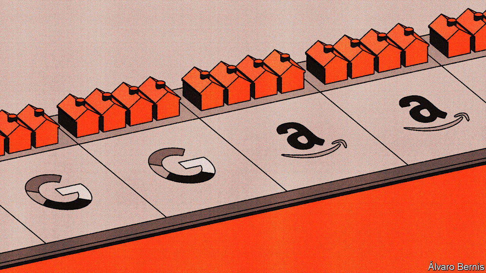

###### Free exchange

# Do Amazon and Google lock out competition? 

##### How to assess the trustbusters’ case 

 

> Oct 19th 2023 

Anti-monopoly cases have been known to reshape corporate America. In 1984 at&amp;t’s telephone network was found to have excluded competing firms. The company was controversially broken up in a move that ultimately led to a boom in innovation among its rivals. Meanwhile, a case against Microsoft in 1998 may have kept the door open for Google’s subsequent rise. Microsoft had bundled together its Internet Explorer browser with its Windows operating system, and made other browsers more difficult to install. Some business historians think the case, by stopping this practice, made life easier for new browsers. It may also have distracted Microsoft from developing its own search engine. 

Today, two big cases could redefine the limits of monopolies in the internet age. On September 12th America’s Department of Justice (doj) began its court battle against Google over the firm’s deals to obtain default status on phones and browsers. On September 26th the Federal Trade Commission (ftc), chaired by Lina Khan, sued Amazon for allegedly penalising third-party sellers that offered lower prices on other sites, among other harmful practices. In both cases, the government thinks the tech giants are so dominant that their attempts to preserve market power are suspect. This raises a question: what counts as anticompetitive?

Historically, practices that might be ignored for a startup have not been tolerated in a dominant firm. John Rockefeller’s Standard Oil was broken up in 1911, in part for striking deals with railroads that made it impossible for other oil firms to compete. Antitrust historians still debate the extent to which these deals were abusive—after all, Standard Oil benefited from economies of scale and bulk orders commonly receive discounts. But its size and bargaining power led to scrutiny. Before the firm’s break-up, it had cornered 90% of oil refineries. Microsoft’s bundling was found to be problematic because it had over 90% of the market for operating systems on personal computers. In both cases, the courts believed that dominant firms had made life too difficult for newcomers.

Today’s cases have echoes of those past. Start with Google. It pays more than $10bn to Apple and other companies to be the default search engine on their platforms. The doj argues this creates a barrier to entry for competitors. Because having lots of data lets a search engine show users more tailored advertisements, a dominant search engine has a larger expected ad revenue from an extra user. The twist is that if a smaller competitor happened to grow, it would be willing to pay more for additional users, thus bidding up how much Google would have to pay—and explaining why Google may be willing to pay large sums to prevent rivals from gaining a foothold. Yet it is easier to use a different search engine on an iPhone than it was to download a new browser on Windows. And Microsoft’s dominance in operating systems seems to have been greater than Google’s is in search. So the case is not airtight.

The case against Amazon is stronger. Luigi Zingales of the University of Chicago thinks that if the alleged facts are found to hold, the ftc should win. Sellers complain that Amazon penalises them for offering cheaper prices on other platforms by downranking products or removing them from the “Buy Box”, which allows instant purchases. Antitrust scholars call practices that force sellers to behave similarly across platforms “most-favoured-nation” (mfn) treatment, and they have come under growing scrutiny. In the past Amazon has had explicit mfn contracts with sellers. 

The problem, according to the ftc, is that Amazon has raised the cost of doing business on its platform. It charges sellers a fee for selling, one for using its logistics services and more for advertising. Sellers say that it is next to impossible to qualify for the Buy Box without paying for logistics, and that buying ads has become a must because search results are increasingly cluttered with them. Although the exact figures are redacted, regulators allege that Amazon now collects a larger share of sales on its marketplace as fees than it did a decade ago. In a competitive market, Amazon’s cost hikes and restrictions on pricing more cheaply elsewhere would cause sellers to leave the platform. And in fact, some large retailers, like Nike, have done so. But Amazon’s market share in e-commerce has grown (it currently stands at 40-50% in America), suggesting most sellers feel that the platform is too important to quit.

Amazon denies all this. As with Google, there is a chance that the case becomes a debate about how dominant the firm really is (Amazon argues that it is dwarfed by the multitude of brick-and-mortar stores). American retail is efficient and broadly consumer-friendly—hardly the sign of an industry in need of repair. Amazon also says that if a seller can offer a lower price on another platform, it should do so on its site, too. One can imagine a seller thinking that Amazon Prime customers are rich and price insensitive, and therefore charging more on Amazon than other platforms.

Ready for a remedy

But if that is the case, Amazon has plenty of options available, says Fiona Scott Morton, formerly of the doj. Imagine, for example, that Amazon thinks that the seller of a particular item is charging too much. It is free to prioritise other sellers of that item in its search results. If it cannot find any on its platform, it can recruit one from outside. If it still cannot find one, then perhaps Amazon is simply an expensive platform on which to do business.

In this final case, a possible solution is a so-called behavioural remedy, in which Amazon is made to stop penalising sellers that offer lower prices elsewhere. In Europe, where Amazon has also faced scrutiny, the company has made several concessions, including treating all sellers the same when granting access to the much sought-after Buy Box. Ms Khan of the ftc has said she does not like remedies that only target the behaviour of companies, since they are at best short-term fixes when set against more drastic measures, like breaking them up. Sometimes, however, nothing more is needed than a slap on the wrist. ■


