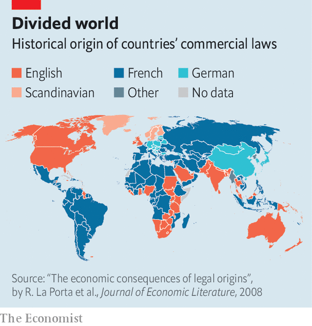

###### Not so civil anymore

# How free-market economics reshaped legal systems the world over 

##### Friedrich Hayek’s followers promised growth. They may have overpromised 

 

> Oct 19th 2023 

The legal system that operates in the United Arab Emirates (uae)—like that in many countries across the Gulf—is a blend of French civil and Islamic Sharia law. But this summer Dubai announced that it was exploring the introduction of English common law to 26 free-trade zones. These are jurisdictions that are exempt from local taxes and customs duties, and have their own independent legal systems and courts. The region is increasingly dotted by such common-law islands, reflecting the belief that the Anglosphere’s legal tradition is better for business. 

Such an idea can be traced back to Friedrich Hayek. Fifty years ago this month, the Nobel-prize-winning economist and philosopher published the first volume of his magnum opus, “Law, Legislation and Liberty”. In it, he argued that the common-law approach is more amenable to freedom than its civil-law counterpart. Later, in the 1990s, Hayek’s ideas inspired the “legal-origins theory”, which made both an empirical and theoretical case that common law is better for the economy. The theory has been as influential as it has been controversial, leading to sweeping reforms in civil-law countries around the world. 

 


The common-law tradition emerged in England. Under its strictures, the judiciary is bound by precedent: principles established by judges in previous cases are binding for future ones. This establishes case law on an equal footing with legislation. In contrast, the civil-law tradition traces back to the Code Napoléon, a legal system that was set up in France under Napoleon Bonaparte, which restricted both the independence and the discretion of the judiciary, subordinating it to the legislature. 

England’s approach was transplanted across the globe by the British empire and underpins the legal systems of 80 or so countries, including America. The Code Napoléon was transplanted across Europe by French occupations during the Napoleonic Wars and was introduced around the world by the French empire. China, Japan, South Korea and Taiwan all based their modern legal systems on Germany’s approach, which is also based on civil law. In total, civil-law traditions underpin the legal systems of about 150 countries today, including around 30 mixed systems.

Hayek argued that common law is a better basis for a legal system than civil law for similar reasons that markets are a better foundation for an economy than central planning. A decentralised judiciary has access to “local knowledge”—the subtleties and idiosyncrasies of actual legal cases—that a centralised legislature does not. This is analogous to the way in which the butcher, the brewer and the baker are better placed to know what goods to produce, in what quantities and at what market price than a collection of well-meaning bureaucrats. A legal system based on judicial precedent allows judges to adapt the body of law to real-world circumstances.

Common sense

The arguments put forward by Hayek mostly concerned the law’s ability to protect individual liberty, but they apply to its ability to promote economic growth, too. Twenty-five years ago, in a landmark study in the , Andrei Shleifer, Rafael La Porta and Florencio Lopez-de-Silanes, then at Harvard University, as well as Robert Vishny of the University of Chicago, used data from 49 countries to show that investors’ rights are better protected in common-law countries. The paper gave credence to Hayek’s ideas and set off a flurry of research into the relationship between legal origins and the economy.

In three subsequent papers, Simeon Djankov, a World Bank economist, working with Messrs Shleifer, La Porta and Lopez-de-Silanes, used data from more than 100 countries to tease out the impact of legal origins on the regulation of startups, the stringency of labour protections and the efficiency of contract enforcement. “What we found is that regulation was consistently less onerous and contract enforcement consistently more efficient in common-law jurisdictions,” says Mr Shleifer. The difference was sharpest in the barriers facing entrepreneurs. The number of forms to fill out and business days needed to process an application, and the cost of administrative fees, were all higher under civil-law jurisdictions. In 2001 Paul Mahoney of the University of Virginia analysed data from across the world and found that, in the three decades to 1992, gdp per person had grown 0.7 percentage points a year slower in civil-law countries than in their common-law counterparts. 

These findings were influential, particularly at multilateral institutions. The World Bank’s Ease of Doing Business Index was shaped by the legal-origins theory. Indeed, Mr Djankov jointly founded and ran the initiative from 2003. In the decade and a half to 2020, more than 400 studies using data from the index were published. Leaders including France’s Emmanuel Macron, Germany’s Angela Merkel and Japan’s Abe Shinzo made rising up the rankings a goal. The result was a wave of reform in civil-law countries, which tended to rank lower. As Mr Djankov notes, there was “a dramatic international convergence in rules and regulation to the common-law standard”. 

Has this produced a surge in economic growth? Perhaps not. More recent studies have splashed cold water on the legal-origins theory, says Holger Spamann of Harvard University. Ones that control for a wider array of confounding factors have found that a country’s legal tradition does have an effect on its economic prospects, but one that is not nearly as strong as the original studies implied. Moreover, some economists argue that legal traditions act as a proxy, indirectly capturing the impact of entirely different inheritances, such as those relating to colonial legacies or cultural attitudes. Under this reading, moving from a civil-law approach to a common-law one is unlikely to be worth the significant hassle for places like Dubai.

Yet such a switch may nevertheless have been worth it in an earlier era, albeit for the wrong reasons. Before it was discontinued in 2021, when World Bank staff were alleged to have fiddled data partly in response to pressure from China, the Ease of Doing Business Index made civil-law countries seem like a less attractive destination for foreign investors. For a time, then, the legal-origins theory may have become self-fulfilling—leading to faster economic growth simply because it was supposed to lead to faster economic growth. ■


