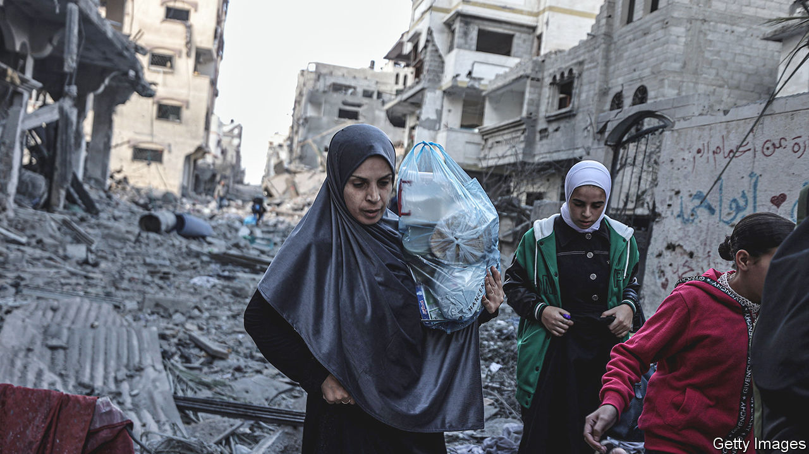
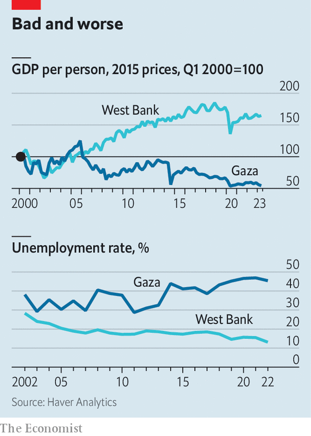
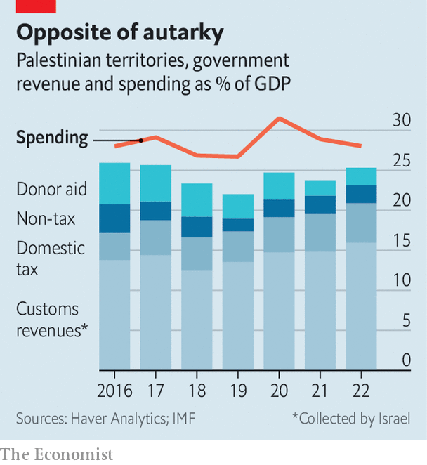

###### War by other means

# Israel turns to financial weapons as well as military ones 

##### It is going after Hamas on all fronts 

 

> Oct 19th 2023 

In less than a fortnight, some 3,500 Gazans have been killed, 12,000 injured and more than a million displaced—on whose behalf America and the un are attempting to open a passage into Egypt. Entire neighbourhoods in the strip have been bombed to dust. Cut off from food, water and medical supplies, the un warned on October 16th that Gaza’s 2.3m people were on “the verge of an abyss”. Since Israel’s strikes began, war has drained nearly every source of economic life from the territory. 

For the better part of two decades, Gaza has relied on support from international donors for its financial survival. On October 18th Binyamin Netanyahu, Israel’s prime minister, said that his country would allow a modest amount of food and medicine across Egypt’s border into the territory, which would be the first supplies let in since Hamas launched its brutal attack against Israel on October 7th. Israel’s allies, including America, are pushing for more to be admitted. Yet at the same time, Israel wants to suffocate Hamas by any means possible, which requires using economic as well as military weapons. 

Averting a humanitarian catastrophe is made all the more difficult by the miserable pre-war state of the Palestinian economy. Israel, Gaza and the West Bank share a single market, governed by a deal that the un brokered in 1994. The idea behind the agreement was that Palestinians would work in Israel and that Israeli capital would flood into Gaza and the West Bank, where rich returns were waiting. In reality, Israeli restrictions remained in place and the Palestinian economy still depends on handouts. On the eve of the war, the average Israeli was 15 times richer than the average Palestinian. Only a third of West Bankers have access to a sewage system; some 10% manage without a water supply. West Bankers have been allowed to work in low-skilled jobs in Israel, but have been subject to tight restrictions on their movement. 

In Gaza, things have been even worse. Growth in gdp per person in the West Bank averaged 2.8% a year from 2007 to 2022. The average Gazan became poorer during the same period, with the local economy shrinking by 2.5% a year. The territory has operated under a near total blockade from Israel since Hamas took power in 2007. Until recently, it was supplied with electricity by Israel, but received only a third of the amount it sought. Each of the three wars fought between the two sides—in 2008, 2014 and 2021—cost Gaza the equivalent of at least a year of gdp. 

 


If there is nothing for an economy to generate, it is not just growth that suffers. Unemployment is rife. More than half of the Gazan adult population were living below the imf’s poverty line in 2021. There are few ways to make money. One way used to be dealing imports and exports through tunnels under Gaza’s southern border, but Egypt cleared out most after a bust-up with Hamas in 2014. Another way is to rebuild what war destroys. One of Gaza’s main businesses is construction, which grew by 20% last year. It will presumably grow by more once this round of war ends.

Others cobble together incomes from a range of outside sources. Some 70,000 Gazans remain on the payroll of the Palestinian Authority (PA), even though its officials who run the West Bank were kicked out of Gaza by Hamas in 2007, and none of them actually goes to work. Qatar deposits cash—some $10m a month—into the bank accounts of thousands more locals. The PA pays Gaza’s electricity bills, which Israel subtracts from the tax it collects on behalf of the PA in the West Bank. The un educates 300,000 Gazan children; a network of hospitals it runs with charities provides the territory with basic health care. 

The strip’s assets

Another organisation on which Gazans depend is Hamas, whose administrative branch runs the strip’s government. Since it took power, Hamas has expanded the public payroll from roughly 20,000 to 50,000 civil servants. Last year its spending contributed 0.8% to gdp growth, compared with 0.3% from all household and business spending. As charities run so many of the strip’s schools and hospitals, and the PA keeps the lights on, Hamas is able to spend lavishly elsewhere. 

 


It finances its spending with an adroit tax system. Though Gaza gets no imports from Israel, it does get them from Egypt, from which trade had recently increased, and the West Bank. Hamas taxes food and fuel crossing the Egyptian border; picks up 16.5% of the value of products from baby food to jeans; charges three shekels ($0.75) per kilo of fish caught by fishermen; and levies income tax. Altogether economists reckon that Hamas may take in somewhere in the region of 1.5bn shekels a year. 

Other sources of finance are already in Israel’s sights. Gaza’s various Islamist groups receive maybe $100m a year from Iran, according to America’s best guess. Hamas also receives individual donations from the Gulf and the West, some of which are furtively transferred across borders using cryptocurrencies. Israel and its allies have already come down hard on these sources of finance where possible, freezing accounts in Istanbul and London. 

Will aid to Gaza end up strengthening the position of Hamas? In the past, Israel has been wary of multilateral organisations working in the strip. Other governments have found that links between charities and Hamas are rare, however. In Gaza, few believe rumours that Hamas taxes aid. So grim is the situation that “a few bits of fuel getting lost is worth it”, argues the boss of a think-tank in Gaza.

Israeli policymakers also face dilemmas in the West Bank. Just a few thousand Gazans work in Israel; in contrast, a quarter of the West Bank’s labour force works over the border or in Jewish settlements. Israel does allow exports and imports through the West Bank—the duties on which make up around two-thirds of the PA’s budget. These taxes are collected by Israel and occasionally held up for months at a time before being transferred. Some Israeli officials reportedly want to cut such payments, either to redirect money towards Gazan reconstruction or in the hopes of stopping payments to Gazan families. Other Israeli officials insist that the PA needs more, not less, funding in order to keep a fragile peace. 

In some ways, the choices facing Israeli politicians are exaggerated versions of ones that they have faced in the past. When Israel wanted to contain Hamas, it made no sense to help the group collect taxes. Now that Israel wants to destroy Hamas, it makes no sense in military terms to allow supplies into Gaza. Yet if it restricts the flow of supplies even more harshly, a humanitarian disaster will ensue. On October 17th Gaza’s health ministry begged for generators. Without them, it said, hospitals were about to shut down. ■


