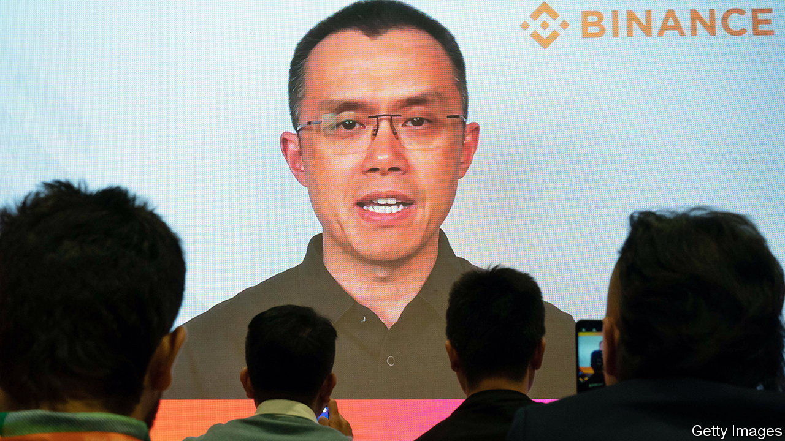
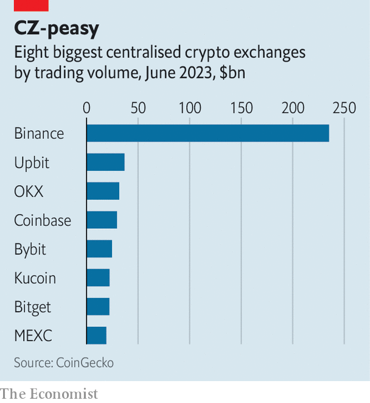

###### Crypto’s future

# Will Binance come over to the light side? 

##### With FTX crushed, CZ must decide whether to go along with regulation 

 

> Oct 19th 2023 

“The luke skywalker and the Darth Vader of crypto.” That is how Michael Lewis, author of “Going Infinite”, a recent book about the rise and fall of Sam Bankman-Fried, founder of ftx, a now-bankrupt crypto exchange, is supposed to have described the intense rivalry between his subject and Changpeng Zhao (pictured), the boss of Binance, a rival firm. 

Until Mr Bankman-Fried’s exchange collapsed with an $8bn hole in its balance-sheet, the analogy seemed apt. The two men controlled the two largest crypto exchanges in the world. Both were known by acronyms: “sbf” and “cz”. Young, talented and seemingly in favour of playing nice with regulators, sbf was something of a wunderkind, and cz was his shadowy foil. Keen to avoid being pinned down by national laws, his exchange was based “nowhere”. Binance had long been under investigation for possible money-laundering and criminal-sanctions violations by America’s justice department. cz had invested in ftx before the two turned on each other. Then sbf publicly goaded cz about his legal problems, and a tweet by cz probably helped set off the run on ftx.

 


Now, with ftx out of the picture and sbf on trial, charged with various kinds of fraud, which he denies, cz looks a lot like the last man standing in crypto. Binance utterly dominates crypto trading (see chart). A whopping 40-50% of it by volume takes place on the platform. The big question, which cz discussed in an interview with  in Bahrain on October 11th, is how Binance will now evolve. 

For as long as crypto exchanges have existed, financial laws have been ill-suited to them. Given the nature of the assets that are traded, they are in effect hybrids of exchanges, brokers and settlement firms. If crypto exchanges were largely unregulated that was at least partly because few laws had been written to govern them.

But, in the wake of ftx’s collapse, the situation is starting to change. Legislators and regulators around the world are rushing to pen new laws or crack down on the industry. This has two big implications for exchanges. First, regulators want to make sure that they are not mishandling or improperly using customer funds, as ftx did. Second, they want to ensure that exchanges are not facilitating financial crimes.

cz insists that customers can trust his exchange. “There are so many ways” Binance is structured differently to ftx, he says. The firm has met heavy redemption requests from clients, including in choppy markets. He points out that the Securities and Exchange Commission (sec), America’s financial regulator, spent a long time investigating Binance for this kind of misconduct. The regulator could provide “zero evidence” that Binance was commingling user funds, says cz, “which actually helps us to prove that we don’t do it.” Other complaints by the sec, including that the company issued securities without a licence, are still to be heard in court.

Yet it is the second requirement that might turn out to be trickier for Binance. In December Reuters, a news service, reported that prosecutors at America’s justice department were split on whether or not to charge the firm with money-laundering or sanctions violations. According to Bloomberg, another news service, Binance withdrew its application to become a licensed exchange in Singapore in 2021, where it was based at the time, in part owing to its inability to comply with strict anti-money laundering rules. The sec quotes evidence from a former employee, who admitted that the company thought it was an “unlicensed securities exchange” and “did not want to be regulated, ever”.

cz dismisses this as “private chat by an ex-employee”, and adds it “was not the right thing by far”. He notes that Binance is “the most licensed crypto firm in the world”, with permission to operate in 18 countries across Asia, Europe and the Middle East (its American arm operates in 44 states). Binance now appears to be playing nice with various authorities. A spokesperson confirms that in recent days it has frozen “the small number of accounts” soliciting donations in support of Hamas, to comply with international sanctions laws.

The test for the firm now will be in Europe. America is cracking down on crypto, and is unlikely to pass new laws soon. By contrast, European legislators have written a “Markets in Crypto-Assets” or “mica” framework, which entered into force in June. Exchanges can keep operating under existing licences until 2026, unless refused under mica, which will require strong policies against money-laundering and terrorist financing. cz says that, in addition to such policies, a full licence means that authorities look at “your wallet infrastructure, your security, your customer support policies, your refund policy. They look at your whole business.” 

A crypto exchange can no longer argue that it cannot comply with national rules because they do not exist. Failing to meet Europe’s standards would reveal that Binance does not want, or is unable, to follow even clear laws. In “Star Wars”, Yoda warns Luke Skywalker that it is easier to amass or wield power by turning to the Dark Side. It is harder to operate in the light. ■


