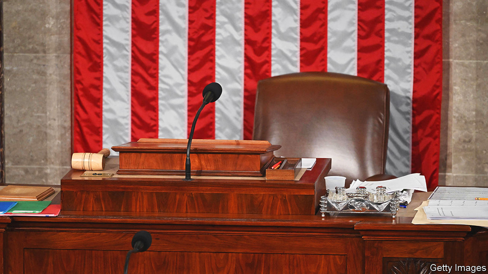

###### Speaking of goat rodeos

# America’s Republicans cannot agree on a speaker. Good 

##### How the GOP could yet, inadvertently, further the national interest 

 

> Oct 19th 2023 

The view of the world from the White House end of Pennsylvania Avenue looks like this:  has attacked Israel, one of America’s closest allies. The biggest war in Europe since 1945 is raging, and Ukraine needs American support to prevent it from being swallowed by . Taiwan also needs help. And a government shutdown is looming. Meanwhile at the other end of Pennsylvania Avenue, the world looks like a lot of men in suits arguing about who should be in charge of the meeting.  have spent two weeks squabbling about who should be speaker. Congress is paralysed. 

It has been a poorly timed piece of self-indulgence. Fortunately, there is a chance of a reprieve. That could mean a Congress that works slightly better, at least temporarily, plus a fresh package of military support for Israel and for Ukraine (and perhaps for Taiwan too). The government may even stay open.

To recap, on October 3rd Kevin McCarthy, the House speaker, was sacked by a small faction of Republicans led by Matt Gaetz, an elaborately coiffured nepo-politician who seemed to be acting out of personal animus. With Mr McCarthy gone, Steve Scalise, an affable congressman from Louisiana who has spent a decade climbing the Republican leadership ladder, tried his luck. He was rejected by the House Republican caucus, too.

Then Jim Jordan, a congressman from Ohio who is known for his dogged support of Donald Trump’s efforts to overturn the election of 2020 and his delight in shutting down the government at every opportunity, put himself forward for the position. This would have been like placing the most unco-operative member of a team in charge of running it, in the hope that the result would be less disruption. Mr Jordan was rejected as well. The Republicans have such a thin majority in the House that once the regicide has begun, it is hard to end the bloodletting.

While this abdication of responsibility has been under way, the House has had a temporary speaker, Patrick McHenry of North Carolina. The hitherto obscure Mr McHenry has yet to receive the memo about his party being the tribunes of working-class Americans, and has never been seen in public without a bow-tie on. Yet Mr McHenry may also, by a bizarre sequence of events, now find himself in a position to change the fate of more than one country.

Both parties are keen to support Israel. There is also majority support in the House for continuing to arm Ukraine and fund the American government. But the Republicans who run the House have long refused to allow bills to come to a vote unless they enjoy the support of a majority of Republican lawmakers. So matters of great importance have been left to fester.

One possible (and indeed plausible) solution is that support for Israel is packaged together with support for Ukraine and Taiwan, some more money for border security and a  to keep the government funded until this time next year.

The principles of good governance suggest these matters should be considered one by one. The dealmaking required to get them through the House, however, suggests lumping them together. Given the necessary authority, Mr McHenry could shepherd such a bill through with support from Democrats. And, because he does not officially have the job of speaker, he cannot easily be removed by his own side, as Mr McCarthy was.

Some combination of Republicans and Democrats should grant Mr McHenry the authority, at least for now, to bring bills to the floor. All it would take is a simple majority. For pragmatic Republicans who are fed up with being at the mercy of their party’s least constructive lawmakers, it is an opportunity to break the logjam. They should take it. Israel, Taiwan and Ukraine need American help. America needs a Congress that can consider legislation. Right now it has urgent work to do. ■

