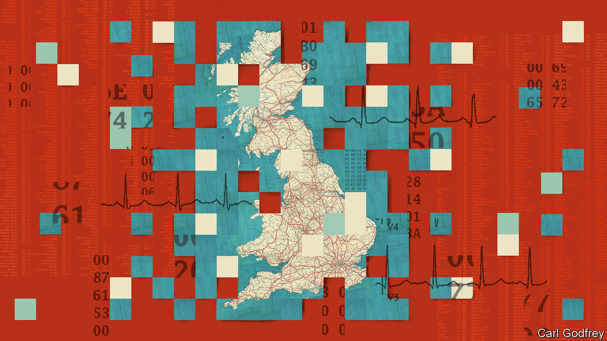

###### Polishing the crown jewels

# How to make Britain’s health service AI-ready 

##### The NHS should clean up and open up its data. Patients will benefit 

 

> Oct 19th 2023 

AT THE HEART of Britain’s publicly funded health-care system lies a contradiction.  generates and holds vast swathes of data on , organised using NHS numbers assigned to every person in its care. The system enables world-leading studies, like the RECOVERY trial during the pandemic, which discovered treatments for covid-19. You might suppose it to be a treasure trove for artificial-intelligence (AI) developers eager to bring their models to bear on improving human health. Yet if you put this to a developer they will roll their eyes and tell you why all is not as rosy as it seems. 

That is because the kinds of tabular data that inform clinical trials—who took which drug, what the outcome was—are not the same as those most useful for training machine-learning models, such as scans or genomes, which hold more information about a patient. Much of this sort of NHS data is a mess, organised in ways which serve doctors treating patients, but not AI developers hoping to feed it to computers. Making it suitable for those models is a task with which the NHS has not yet come to grips. It is often easier for those seeking to organise these richer data to start from scratch, as with a vast  now under way.

To open up the NHS’s data riches to AI, its managers and political masters should turn to three principles: cleanliness, comparability and consent. Cleanliness starts with hosting rich data in cloud-computing environments where the data are easier for AI developers to wrangle. Hospitals and clinics also need greater incentives to prepare their datasets for machines. Most of the NHS’s successful AI projects so far have relied on the drive of dedicated, intellectually curious doctors who have had to fight the system rather than be helped by it. Forging stronger links between the NHS and universities—and giving PhD students easier access to datasets—is another good idea. 

A more open approach to licensing intellectual property would also help. Too often, the NHS demands fees and terms so steep and strict that they deter developers. It should see the big picture and accept smaller fees, to incentivise the building of clean datasets. That will mean less money proportionally for the NHS, and possible riches for developers, but in the long run would benefit the service and its patients. And if used outside Britain, it might mean more revenue overall. 

Comparability of data is also vital. Though everyone has an NHS number, scans are often gathered and stored in different ways in different places, making it harder to create large datasets for machine learning. The NHS is poised to announce the winner of a contract to link up disparate datasets. This will help, but more is needed. For example, scans of the same type should be carried out in ways similar enough to allow AI to detect signals of health rather than differences in the scanning process. 

The final pillar is consent. Though everyone wins if everyone lets their data be fed to computers, Britons should be allowed to opt out. Politicians must persuade people of the benefits of vast datasets in which everyone—young or old, black or white—is represented. They must also reassure them that their data will be anonymised, and not used to their detriment, for instance by insurers. 

The NHS has no time to waste. The rewards on offer are better, earlier diagnosis of disease, and a more productive, efficient system. That is sorely needed when waiting lists are long and funds squeezed. The NHS’s position as a world leader in data-heavy trials faces a stiff threat from health systems in other places, which are digitising rapidly. Abu Dhabi, for example, is considering feeding health-care data into foundation models, and may open up its trained models to the world. Consumer technology—smartphones, watches and devices connected to them—is fast improving its capacity to peer inside the human body. It may one day begin to rival the scanning capacity of the NHS, usurping it as the easiest and cheapest channel for the provision of algorithmic health care.

The economy stands to gain, too. NHS data could be the basis of a thriving export industry, licensing AI tools to health-care systems around the world. But if it does not clean up its digital act, Britain will become a taker of new health technology, just as it has become a taker of American digital services like online search and social media. That would be a missed opportunity, and the beginning of the end of the data primacy of the NHS. ■

