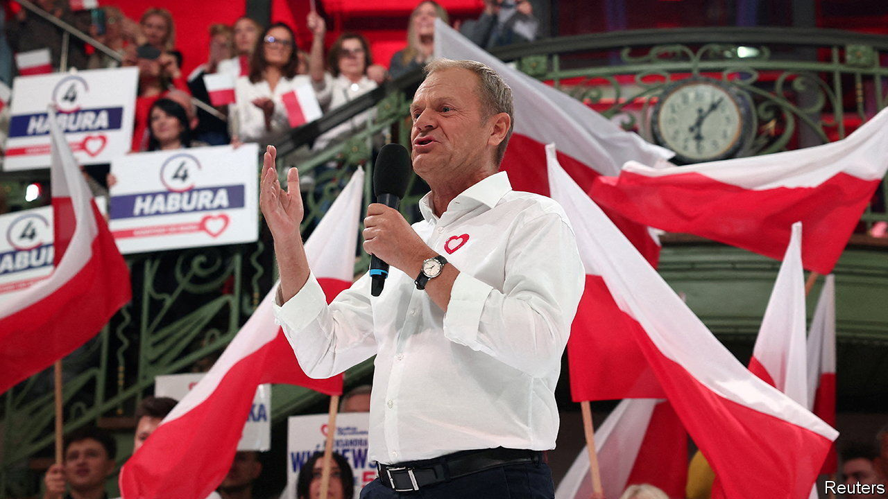

###### At last, good news

# Poland shows that populists can be beaten 

##### A victory for the rule of law in the heart of Europe 

 

> Oct 17th 2023 

Liberals do not get much to cheer them up these days, but the news from Warsaw this week qualifies. Confounding fears that many disenchanted voters might simply stay at home, Poles turned out in record numbers on October 15th  the populist-nationalist Law and Justice (PiS) party that has run the country for the past eight years. They gave what looks like a solid mandate for government to an opposition alliance headed by , a former prime minister and a former head of the European Council to boot. The alliance won 248 seats in the 460-member Sejm, or lower house of parliament, and 66 of 100 seats in the Senate, the weaker upper house.

Following a run of successes for illiberal populists—in Hungary and Italy last year, and in Turkey in May, not to mention a sharp recent rise in popularity for Germany’s AfD—the result is a relief. To understand why it is such good news, consider what would have happened if PiS had managed to stay on.

Four more years of PiS would have meant three kinds of problems. First, PiS would have continued its creeping capture of the country’s supposedly independent institutions, such as the judiciary. It has installed its own hand-picked judges in senior positions, in particular taking over all 15 slots in Poland’s Constitutional Tribunal, the country’s most important court since it can strike down laws it deems unconstitutional, as well as in a council that vets all lower judges. It has turned state broadcasters into megaphones for PiS propaganda. It has deployed its people to lead state-run industrial enterprises, such as Orlen, an oil company, which conveniently slashed the price of fuel ahead of the election. It has been building a patronage system, whereby even humble government jobs in towns it controls depend on supporting, or at least not criticising, the ruling party.

There would, second, have been reason to fear a continuation and perhaps a deepening of PiS’s illiberal domestic agenda. Its judges have made abortion illegal except in cases of rape or incest or to protect the life or health of the mother, and it started rewriting textbooks to make them more “patriotic”. 

Third, a re-emboldened PiS would have continued in its combative stance towards the EU, where it often teams up with Viktor Orban’s government in Hungary, a populist alliance that was strengthened by the recent return to power of Robert Fico in Slovakia. The central Europeans have been hostile to schemes to share responsibility for dealing with illegal migration, and have backed each other in disputes with Brussels over the rule of law, which the populists tend to flout. Most alarming, given its hitherto excellent record of supporting Ukraine, the PiS government has recently started to play politics with the war, blocking the import of grain from its neighbour in defiance of EU rules.

Much can still go wrong. The opposition agreed to form a government if it won, but there is no guarantee that this will proceed smoothly; the alliance consists of nine parties whose agendas run from radical-left to centre-right. And as prime minister, Mr Tusk will encounter many obstacles, starting with the president, Andrzej Duda, who though nominally independent is a PiS ally. Mr Duda can veto all legislation, and the opposition will not have the votes to override him. Mr Tusk will also bump up against the PiS-stacked Constitutional Tribunal; its judges are appointed for nine-year terms. Short of changing the constitution, there will be no easy way to get rid of them; so Mr Tusk may find his bills struck down. Winkling out PiS’s judges from lower courts will be tricky too, and would invite the same criticisms that liberals used to make of PiS.

Mr Tusk will be able to count on goodwill from Europe, but this is no panacea. Some €35bn ($37bn) of covid-recovery funds owed to Poland, and even more from the regular budget, are blocked because of the row over the rule of law; the European Commission would be happy to unblock it, but first the Poles must meet the conditions it has laid down. These obstacles are exactly why creeping authoritarianism, PiS- or Orban-style, is so dangerous. Turning it around will be hard. But at least a start can now be made. And opposition parties around Europe and the world can see that populists can be beaten. ■

