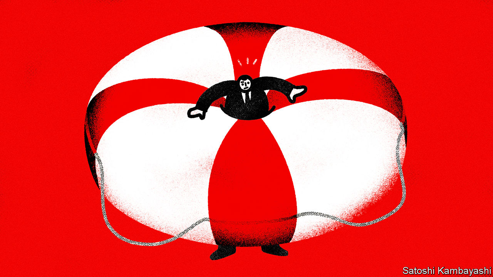
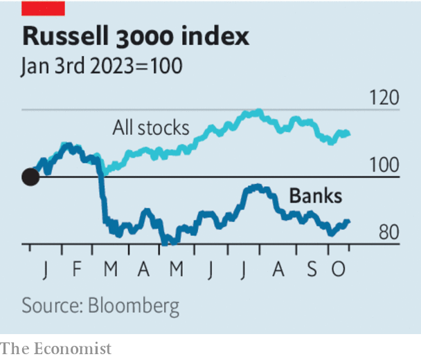

###### A brush with Basel

# Why America’s banks need more capital 

##### Though imperfect, regulators’ plans are necessary to keep the system safe 

 

> Oct 19th 2023 

AMERICA SPENT more than a decade trying to make its banks safer, only for several of them to  suddenly earlier this year. So it is no surprise that  are trying once again to shore up the system. Their latest proposals would on average increase by 16% the amount of high-quality equity capital banks would need to fund their operations, among a litany of other changes designed to bring America’s rules in line with principles agreed globally. If the package—dubbed the “Basel 3 endgame”—is implemented, banks, which have been reporting their profits over the past week, will have to spend years building up their safety buffers.

Bankers are furious. “What person in what ivory tower thinks that is a rational thing to do?” asked Jamie Dimon, the boss of , of one of the rule changes last month. Some of the industry’s complaints about the details are reasonable. Overall, however, the increased safety brought about by more capital is worth the costs.

 


The benefits of the reform are most obvious for the type of bank that has been vulnerable this year. Silicon Valley Bank (svb), which had $212bn in assets, collapsed in March having suffered enormous losses on its bond portfolio as interest rates rose. As a bank with assets of less than $700bn, it was exempt from having to mark its bond portfolio to market when calculating its safety buffer, even if those bonds were categorised as holdings that may be sold (rather than held until they mature). Only when depositors fled from SVB, forcing it to sell bonds at a loss, was its capital cushion revealed to be an accounting fiction. The new proposal lowers the asset threshold to $100bn, requiring banks of SVB’s size to value accurately at least some of their bonds. As a result many will have to build up capital, which should help prevent a repeat of the debacle. 

For the biggest banks, the argument is less clear-cut. They did not suffer during the spring crisis, and instead hoovered up deposits that fled from smaller institutions. They are considerably better capitalised than they were a decade ago. And because their depositors remain loyal even if they don’t pay much interest, higher rates have served mainly to boost their profits by raising the amount they can charge on loans. In earnings reports released since October 13th JPMorgan, Bank of America and Citigroup all recorded rising net interest margins in the third quarter of 2023, fitting a pattern whereby the larger the bank, the more likely it has been to benefit from higher interest rates. 

Capital also comes with downsides. It is a more expensive means of funding loans than debt or deposits, and some of those costs get passed on to borrowers. Some of the new rules might make financial intermediation in important markets harder. If regulators neglect shadier parts of the financial system, activity could migrate there to escape their scrutiny. Mr Dimon is right that some of the new edicts are poorly designed.

Yet the move towards bigger safety buffers is nonetheless desirable. The big banks did not collapse in the spring, but it is they whose failure would cause an economic catastrophe—and, probably, land taxpayers with the biggest bail-out costs. By one estimate the global financial crisis of 2007-09 cost every American $70,000 in income over their lifetimes. So painful are banking crashes that studies which attempt to weigh the costs and benefits of capital often call for a much fatter cushion than would be in place even if the Basel 3 endgame is implemented. 

It is no surprise that bankers object to more capital, which is rather like being forced to buy insurance against unlikely events. But society as a whole benefits enormously when that insurance is in place. The strength of America’s economy means that now is a good time to try to make the system safer, because building safety buffers is harder than maintaining them.

Even if the proposals are enacted, America’s banking woes are far from over. The simplest way to build capital is to retain profits rather than pay them out in dividends. Yet many small banks are enduring a profit squeeze, because they are having to pay more interest to retain depositors, or now depend on short-term borrowing at the prevailing high rate of interest. Use of a supposedly temporary emergency lending programme at the Federal Reserve, for example, has crept up over the summer. The facility has outstanding balances of $109bn. 

Bond portfolios also continue to shrink in value. By the end of July, banks’ unrealised securities losses were worth $558bn; since then, long-term bonds have sold off further as investors have bet on interest rates staying higher for longer, reducing the chance of a reprieve. For many banks the best path to viability will be to find another institution willing to gobble them up. The system that emerges will be more concentrated. Regulators are right to seek to make it less fragile, too. ■

