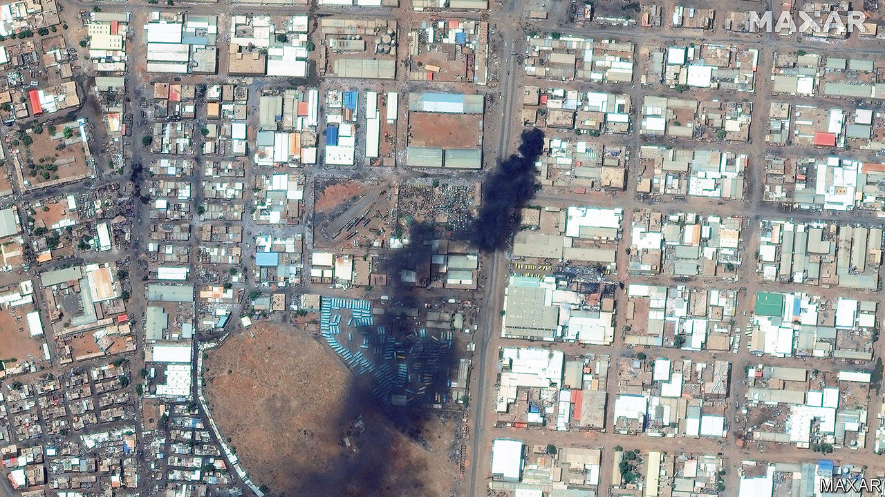

###### Sudan’s agony

# After six months of civil war, little remains of Khartoum 

##### Sudan’s capital has become Africa’s Aleppo 

 

> Oct 19th 2023 

Mohammed Hussain, a merchant, is a refugee in his own city. A few months after civil war broke out in Khartoum’s streets in April, he tried to take his sick father to hospital. But the roads were blocked by soldiers from the Rapid Support Forces (RSF), a rebellious paramilitary group that is trying to seize control of the country. Unable to get medical help, his father died. Last month, fighters from the RSF seized Mr Hussain’s home, robbing him and threatening to kill him. He fled to relatives in another part of the city. Khartoum, he says, echoes to the sound of gunfire and shelling “every day and every night”. 

The first shots of Sudan’s civil war were fired in Khartoum, where the two rival warlords had their headquarters. On one side is Sudan’s de facto president, General Abdel Fattah al-Burhan, who leads the Sudanese Armed Forces (SAF). On the other is the leader of the RSF, Muhammad Hamdan Dagalo, better known as Hemedti. Since then the fighting has spread far beyond the capital’s barracks. In West Darfur, the RSF and allied Arab militias are waging a genocidal campaign against the Masalit, a black African ethnic group. Nationwide, some 9,000 civilians have reportedly been killed, though this is probably a massive underestimate. More than 5.6m have been driven from their homes. 

Though the fighting has spread, Sudan is unusual in the degree to which the centre of its war is the country’s capital. Ever since British imperialists founded the modern city on the banks of the Nile, power and wealth in Sudan have been concentrated in Khartoum. The RSF, whose rank-and-file are mostly drawn from far-flung and downtrodden regions, are now exacting their revenge. “The RSF believe they cannot create a state in their own image unless they violently destroy the old one,” argues Kholood Khair of Confluence Advisory, a Sudanese think-tank. In recent weeks, RSF fighters are alleged to have burnt land-registration records and taken over whole residential neighbourhoods. “Every house is occupied,” says another Sudanese analyst. “The city is theirs.” 

Though the RSF controls most of downtown Khartoum, including districts that host the presidential palace and other government ministries, the SAF remains holed up in several well-fortified bases in the city centre. It also controls the air base at Wadi Saidna, to the north. For months the RSF has been trying to overrun these redoubts of the army. The SAF has responded with a combination of air strikes, including by armed drones, and the occasional raid on residential districts and warehouses used by the RSF, says Nathaniel Raymond, a conflict monitor at Yale University. Mr Burhan, who fled from the army headquarters in August, now runs what is becoming a de facto capital in Port Sudan, on the Red Sea. 

Since the civil war began six months ago, more than half the capital’s population has fled. “Everyone I know has left now,” says Waleed Adam, who escaped in July after RSF troops raided his apartment. Most of those who have remained are too old or too infirm to leave. Many are also too poor. Civilians who try to get out risk being robbed or forced to pay bribes to go through armed checkpoints. “If you forget your ID card for any reason the RSF arrest you,” says another recent escapee. 

Many parts of the city are, in effect, under siege. Aid agencies can barely operate and medical care hardly exists. In August an airstrike hit one of the city’s largest hospitals. “Nowhere is safe,” says Mustafa Moduay, a teacher who has stayed put. 

Many of the capital’s historic landmarks as well its factories have been ground to dust. “Old Khartoum has been effectively demolished,” says Magdi el-Gizouli of the Rift Valley Institute, a think-tank. The presidential palace was hit by an airstrike in May. The iconic Greater Nile Petroleum Operating Company Tower, one of the capital’s tallest buildings and a symbol of the regime of the former dictator, Omar al-Bashir, was set alight last month. Khartoum, says Mr Raymond, faces the fate of Dresden, a historic German city destroyed by Allied air raids in the second world war. Whichever side conquers the capital will be left ruling over little more than ruins. ■

