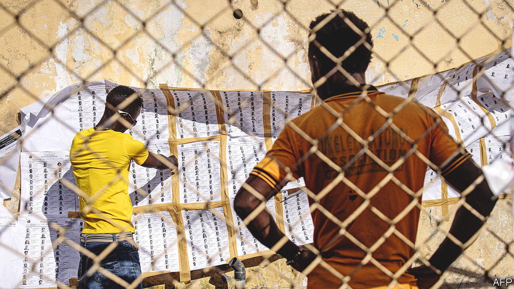

###### From bullets to ballots

# How Liberia and Sierra Leone ended their cycles of violence 

##### The lessons two African countries offer on ending intractable conflicts 

 

> Oct 19th 2023 

The election on October 10th in Liberia may have seemed a sleepy affair. But it was far more remarkable than it appears. Just 20 years ago the west African country was emerging from two devastating bouts of civil war in which drug-addled commanders forced child soldiers to kill their parents, among other atrocities. The war killed perhaps 250,000 people—roughly a twelfth of the population.

As with every poll since the war, this election took place amid some fears of violence and a few deadly clashes. Yet on the day the voting was calm, helped by a pledge by all political parties to ensure a peaceful election. After a tight race there will be a run-off between the incumbent, George Weah, once a famous footballer, and Joseph Boakai, a former vice-president. Though some worry that violence may yet erupt if the result in the next round is close, it has so far been the fourth generally peaceful and broadly fair presidential election since the civil war, and the first since UN peacekeepers left in 2018. 

Liberia and neighbouring Sierra Leone, where another bloody civil war ended in 2002, are poor, troubled countries with ropy democracies. Yet both are in much better shape than 20 years ago. The level of extreme poverty has plummeted. Both countries were resilient enough to remain stable through an Ebola crisis in 2014-16. Since the wars, power has changed hands peacefully between rival parties once in Liberia and twice in Sierra Leone. 

No post-war president in either country has sought to flout constitutional term limits, as has happened in several other countries in west Africa. Unusually, neither country has fallen back into war, whereas many other poor ones—from Cameroon and Congo to Somalia and Sudan—have been stuck in a “conflict trap” of recurring violence. What can Africa and the world learn from these two countries?

First, long conflicts rarely end in decisive military victories, so diplomacy and negotiations are needed. The wars in Liberia and Sierra Leone both ended in agreements, signed under heavy diplomatic pressure, that tried to tackle the root causes of the violence. In Sierra Leone, some fighting resumed after the agreement until a small British military intervention pushed the rebels towards a version of the deal they had already signed. 

Another lesson for peacebuilders is how to disarm combatants. Some 180,000 fighters handed in their guns across the two countries, but unlike in other conflicts, they were not integrated wholesale into the regular army. This was sensible, argues a forthcoming book by two experts: Alan Doss, who was the un’s top person in post-war Liberia and before that its number two in Sierra Leone, and David Harris of Bradford University. In Liberia the army was disbanded. Sierra Leone’s was restructured and downsized. The senior ranks were depoliticised. Liberia even had a foreigner in charge of its new armed forces. Now 61% of Liberians say that they trust the army, up from 46% in 2012, according to Afrobarometer, a pollster. 

Much of this was possible thanks to robust support from outsiders. Nigeria, the regional hegemon, was “hellbent on ending the war”, recalls Gyude Moore, a former post-war cabinet minister in Liberia. “Even long after the war ended, Nigeria still remained really, really involved.” America and Britain also played an important part, ensuring that UN peacekeeping missions were sent, and pushing through sweeping debt relief and a fourfold increase in aid per person.

Liberia and Sierra Leone also had internationally respected leaders after the conflict. President Ellen Johnson Sirleaf in Liberia and President Ahmed Tejan Kabbah in Sierra Leone won broadly credible elections. Ms Johnson Sirleaf had worked for the UN and the World Bank, from which her finance minister was directly seconded. Mr Kabbah was a former UN official. Because both presidents abided by term limits, they gave their rivals a strong incentive to stay in politics rather than resume fighting, note the two authors.

Sierra Leone and Liberia also faced up to the atrocities of the wars, at least to some degree. Both held Truth and Reconciliation Commissions (TRCs), which heard from both victims and perpetrators. “The TRC is critical,” says David Sengeh, the chief minister (prime minister) of Sierra Leone. Its recommendations are a guide “to make sure you don’t go there [back to conflict].” 

Balancing truth, reconciliation and justice is tough. Sierra Leone established a special court and successfully prosecuted some perpetrators. But some criticised the cost of $300m. In Liberia Ms Johnson Sirleaf controversially ignored the TRC’s recommendation to establish a court, partly out of fears it could rekindle conflict. Yet demands from victims and activists to do so have since grown louder. 

Alas, not all the lessons can be applied elsewhere. Conflict is easier to end for good when it is not about imposing a particular vision on society, say Messrs Doss and Harris. In Sierra Leone and Liberia the fight was primarily about power and resources, though this was often refracted through ethnic divisions, rather than ideology, religion or secession. This made it easier to get leaders to do deals. Jihadism in the Sahel and secessionist fighting in Cameroon do not lend themselves so easily to compromise.

Law and order may simply be easier to sustain in small countries. The Economic Community of West African States (ECOWAS), a regional club, could do a lot in Liberia. “It can’t do the same in Mali,” says Mr Moore. And peace has lasted because people had suffered so grievously that they said “never again”, argues Mohamed Ibn Chambas, a Ghanaian who was the head of the executive arm of ECOWAS at the time. 

The path from war to an enduring peace is long. In Liberia the last UN peacekeepers left only after a deployment of 15 years. And obstacles still abound. Sierra Leone’s election in June sparked controversy after discrepancies were found between the official count and a parallel sample-based one conducted by civil-society groups. The opposition has since boycotted parliament. “They could have gone to court: they didn’t,” retorts Mr Sengeh. The opposition says the courts are not impartial.

Still, optimism is growing that the crisis will be resolved. Mediators from ECOWAS, the African Union and the Commonwealth have once again returned to Sierra Leone. On October 16th they began talks between the rival parties.

Thus the final lesson is that good things take time and unrelenting effort to come to fruition. For hungry, hopeful people in countries trying to emerge from conflict in Africa—and for their foreign helpers who may be distracted by other crises in places such as Ukraine and the Middle East—that is perhaps the hardest lesson of all. ■

