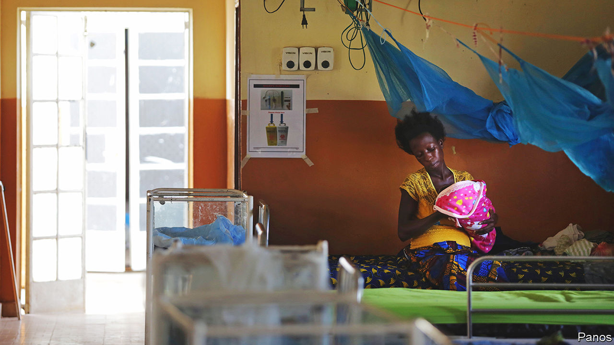
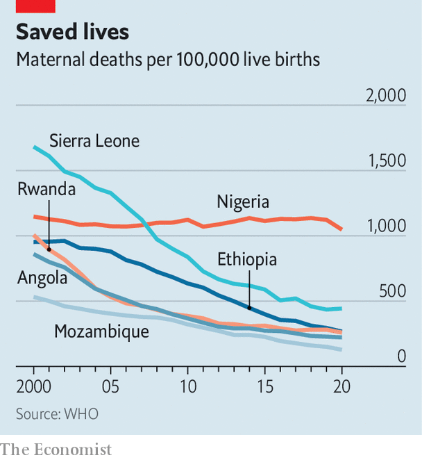

###### No miracles required

# How to save the lives of 200,000 women a year 

##### Maternal deaths are being prevented, but not quickly enough 

 

> Oct 19th 2023 

Preventing maternal deaths is not difficult, says Hannah Saidu, who manages a maternity unit in Sierra Leone, so long as “you have skilled midwives, and you know what to do”. If that is obvious, it still bears repeating. About 200,000 women in sub-Saharan Africa die in childbirth every year, largely from bleeding, hypertensive disorders and infection. The World Health Organisation estimates that there are 545 deaths in the region for every 100,000 live births, a rate four times higher than in south Asia and 90 times higher than in western Europe.

 


The rate in Africa has fallen by a third since 2000, but still has a way to go. There has been barely any progress in Nigeria, the continent’s most populous country, where a woman has a 1 in 19 chance of dying in childbirth over her lifetime. By contrast, mortality has fallen by three-quarters in Angola, Ethiopia, Mozambique, Rwanda and Sierra Leone (see chart). Those numbers point to an encouraging truth: countries do not have to wait until they are rich to start saving women’s lives.

Consider Sierra Leone, which was once, alongside South Sudan, the worst place in the world to give birth. Health clinics still regularly run short of drugs. Blood supplies are so limited that patients muster their own donations from relatives; one doctor describes giving his own blood before operating on a patient. A woman’s lifetime risk of maternal death is the same as drawing the joker from a pack of cards.

Even here, there is cause for hope. Successive governments have made maternal health a priority, training more midwives and monitoring deaths closely. Since 2010 a donor-backed initiative has made health care free for pregnant and breast-feeding women. It works imperfectly, and underpaid staff still ask for a contribution from patients. But the scheme helps explain why 83% of births now happen in clinics, compared with 50% before fees were abolished. Mortality, though still high, has dropped below the African average.

Women in poor countries die because they are slow to seek care, slow to reach hospital, and slow to be treated. Lives can be saved by spotting warning signs early. Sierra Leone is having trials for a blood-pressure monitor, known as CRADLE, which uses a simple traffic-light system. If the device flashes red, a patient should be referred for emergency treatment. Mariama Momoh, a midwife and public-health specialist, says it lets workers with even basic training make fast decisions.

Another innovation, used in several other African countries, is a plastic drape that is placed beneath the woman during delivery. By noting how much blood has collected, health workers can quickly assess danger. A recent trial in Kenya, Nigeria, Tanzania and South Africa combined the use of a calibrated drape with a bundle of treatments, such as oxytocic drugs and uterine massage. Severe bleeding was 60% lower in trial hospitals. 

Innovation only works when there are robust health systems to support it. One reason that Nigeria fares so badly is that only half of births there are attended by skilled staff. In Rwanda, which has a system of community-based health insurance, almost every birth is. Ethiopia has mobilised a “health development army” of volunteers to encourage women to attend health centres. In many countries, the growth of cities is bringing women closer to hospitals, where they get better care than in rudimentary rural clinics. 

Another way to reduce maternal deaths is to empower women. When they have control over their fertility, they have fewer babies and at wider intervals, which reduces the risk of complications. Governments can help by boosting access to contraceptives. In Senegal improved supply chains led to fewer shortages of pills and implants in public health centres, notes Gloria Ikilezi of Exemplars in Global Health, which studies good practice. When women’s health is a priority they are also more likely to receive treatments like iron supplements, which reduce the risk of severe bleeding in childbirth.

One recent study estimates that when countries introduce quotas for women in parliament, maternal mortality falls by 7-12% as reproductive-health services improve. As important are the conversations that happen around the cooking stove or the water pump. In Sierra Leone, unwed pregnant teenagers are often thrown out by their families and are afraid to visit clinics, says Mangenda Kamara of Lifeline Nehemiah Projects, a grassroots organisation. She is pioneering a scheme that pairs girls with an older mentor, who encourages them to go for antenatal check-ups and goes with them to hospital during labour. More than 250 girls have been mentored; none (in that small sample) has died.

Cheap innovation, stronger health systems and women’s empowerment are achievable anywhere. But globally, progress is slowing. There has not been quite the same focus on maternal mortality as there has been on diseases like AIDS and malaria, says Rasa Izadnegahdar of the Bill &amp; Melinda Gates Foundation, a philanthropic outfit. Innovation has therefore spread more slowly than need be. The UN has a goal of reducing maternal mortality worldwide to 70 deaths per 100,000 live births by 2030. On current trends that target will be missed. ■

