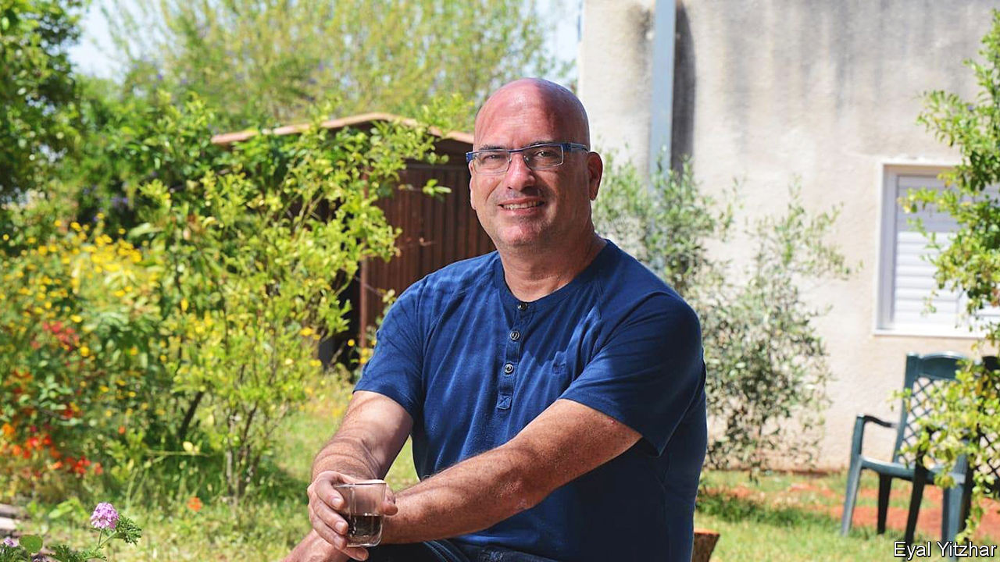

###### Life on the edge

# Ofir Libstein had extraordinary dreams for his small patch 

##### The mayor of Shara HaNegev was killed in the Hamas attacks on October 7th, aged 50 

 

> Oct 19th 2023 

Whenever he walked round his patch of the northern Negev, Ofir Libstein fairly buzzed with ideas. Sha’ar HaNegev was not large, just 180 square kilometres, three kilometres from the Gaza Strip, with around 6,000 people living in ten kibbutzim and one communal farm. But he had power, as mayor, to make it work as well as possible. Sorting out the traffic on the main road, for example, by replacing the multiple intersections with roundabouts. Encouraging his Facebook followers to eat at local restaurants, like Julie’s amazing Chinese in his own kibbutz, Kfar Aza, that were still struggling after covid. And putting all available buildings to new use. Whenever he saw a disused mess hall, a deserted factory, even an old cowshed, he wanted to fill them with entrepreneurs working on exciting things. 

He was an entrepreneur himself, starting young. When his uncle ran the kiosk in Kfar Neter he opened a branch at school. When his father did wheelchair repairs for the nursing home where his mother worked, he went into a motorised wheelchair business with him. From there he moved, with relatives, into office equipment, then into online coaching, then into agritech, the mainstay of Sha’ar HaNegev. The Libstein pot was always bubbling and, almost always, successfully.

His most popular idea, though, was to leverage flowers. In 2007 he and his wife Vered founded the Darom Adom (“Red South”) festival to celebrate the anemones which, for a brief few weeks in early spring, spread scarlet through the woods and fields. This wonder drew in visitors from far and wide, but he had noticed that there was nothing, besides marvelling, for them to do. So he introduced country lodging, walking trails, bike tours, jugglers and acrobats, craft fairs and farmers’ markets, more every year. The festival bloomed and boomed. His Facebook page showed him lying among anemones, smiling broadly in appreciation. 

He founded the festival largely to prove that life in Sha’ar HaNegev, though so near Gaza, was not all Hamas and shooting. It was a hard case to make. Hamas rockets hit the Iron Dome right overhead, and pieces fell everywhere; the ground around was full of improvised bombs. In 2018, youths in Gaza tied incendiary devices to kites and balloons and sent them floating across, where he watched with sick horror as trees, crops and gardens exploded in flames. In May 2021 rockets fell on Sha’ar HaNegev for 11 straight days. Despite the fact that everyone in Kfar Aza had steel-and-concrete safe-rooms in their houses, in 2022 he sent the mothers and children away to the north. A study had found that most of the local children had post-traumatic stress. 

Yet he insisted those scary times were rare. That was just life on the edge: 5% hell, but 95% paradise. His main Facebook picture showed a view of lush, rolling, improbably green hills dotted with trees. In those fields grew wheat, barley, vines, melons, avocados, cotton, almonds and olives. The desert soil was watered with a huge network of irrigation pipes. And that was not all that grew there. Increasingly he was pinning his hopes on tech startups, and in the five years he had been mayor 40 companies had arrived in his new enterprise zone. Among the single-storey white houses, shaded with palms and lively with children (including four boys of his own), there were now glass-walled offices in which go-ahead tech types networked and hatched their ideas. 

He also looked abroad for help. The Californian city of San Diego twinned itself with Sha’ar HaNegev, and the Jewish Federation there provided seed money for a tech incubator; the Jewish National Fund in Australia helped with 14 fortified kindergartens and an “Innovation Campus”. Since 2013 the region’s population had doubled. That spelled better protection, through sheer numbers, of the western border. He was keeping the land of Israel. 

As a , living in Kfar Aza or Kfar Neter for most of his life, his devotion to Israel was total. But he was less a Zionist than a socialist and communitarian, as the first kibbutz-builders had been. Besides, his dreams for the region went far beyond mere defensive hunkering down. His vision was “spatial”: if there was good in a place, it should benefit the whole diverse human mosaic there. Prosperity had to involve everyone. He was sure that most Gazans wanted what Israelis did: peace, well-paid jobs, care for their families. He set out to provide them. 

It was hard to deal directly with Palestinians, since the border was almost entirely sealed. But in partnership with the Israeli city of Sderot, which lay less than a kilometre from the fence, he planned an industrial zone called Arazim around the Erez crossing. This could draw up to 10,000 Gazans to work in Israel every day. There would also be a training hub for them, education programmes and a medical centre. He envisaged so many Gazans with a stake in Arazim that they would never think to attack it, or allow Hamas to. That, in his view, was how Israel could properly protect itself. Even he admitted that this was quite a stretch, but the residents of Sha’ar HaNegev did not seem to object. In the regional election for mayor in 2018—when his rival had been Israel’s first female brigade commander, promising more security—he, known mostly for anemones, won with almost 70% of the vote. 

That margin, and his ten-year term, inspired him. He could do a lot in all that time. Already, for example, he had incorporated the poorly treated Bedouin into his anemone festival, and was chairman of a museum where their culture was celebrated. Perhaps Palestinians could become involved in Sha’ar HaNegev in the same way, once the two sides had learned to respect each other. Perhaps the share of life there that was paradise could rise to 100%. 

But the factories of Arazim were not yet built when, early in the morning on October 7th, swarms of Hamas terrorists broke through the border fence. The residents of Kfar Aza had already been warned by text not to go outside, but he disobeyed his own order, answering fire with fire. He rushed out to defend both his kibbutz and his dreams—including those lovely, leveraged anemones that dyed the dry ground red. ■


