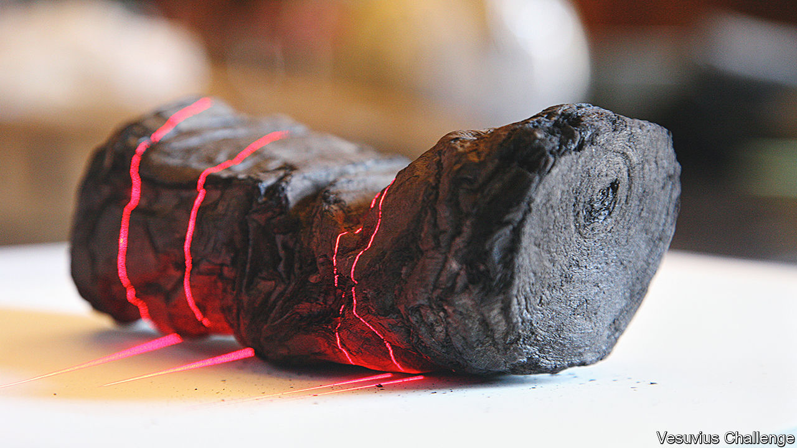
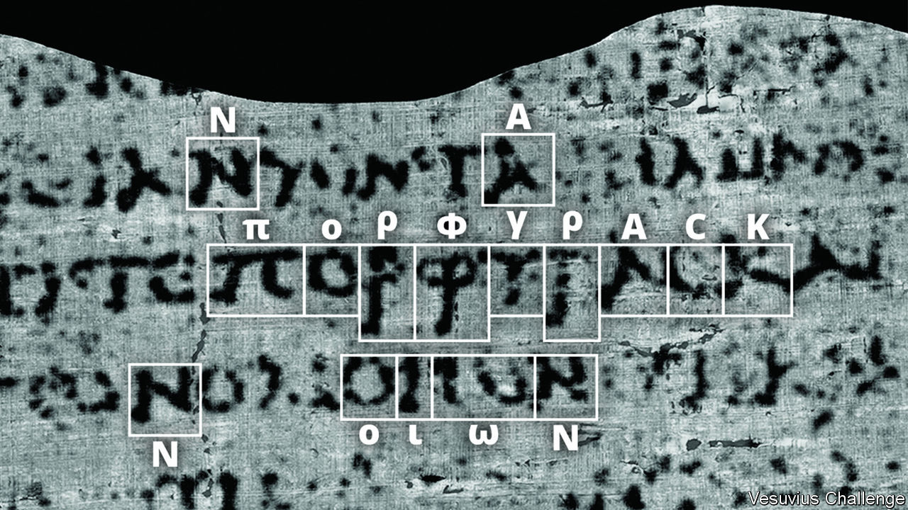

###### Unrolled at last

# AI could help unearth a trove of lost classical texts 

##### Computers could let archaeologists read hundreds of burnt scrolls from a Roman library 

 

> Oct 18th 2023 

THE OBJECT known as P.Herc.Paris.3 resembles a dark grey lump of charcoal, about the size and shape of a banana. That explains its nickname: Banana Boy. It is in fact a papyrus scroll, found in the ruins of a villa in the Roman town of Herculaneum, in Campania. Along with hundreds of other scrolls in the villa’s library, it was carbonised when scorching gases engulfed the town during the same eruption of Mount Vesuvius, in 79AD, that also buried the nearby town of . 

Although the scrolls survived, their charring means that unrolling them is almost impossible. Now, nearly 2,000 years later, words from inside Banana Boy have been revealed for the first time, after volunteers competing in a prize challenge used X-rays and artificial intelligence to do the unrolling virtually. 

The first word to be found, announced on October 12th, was “porphyras”, which means “purple” in ancient Greek (see picture below). It was uncovered by Luke Farritor, a computer-science student at the University of Nebraska-Lincoln, earning him a $40,000 prize. Mr Farritor built on work by Casey Handmer, a former NASA physicist, whose examination of X-ray images of Banana Boy’s charred layers identified a characteristic “crackle pattern” indicating the presence of ink. 

Scroll up

The same word was later found by Youssef Nader, a robotics student at the Free University of Berlin. (Dr Handmer and Mr Nader both received $10,000 prizes.) Mr Nader has since produced an image from the scroll showing four columns of text, side by side. For classicists, this is heady stuff. The villa in question is thought to have belonged to Lucius Calpurnius Piso, the father-in-law of Julius Caesar. The ability to read its well-stocked library could significantly expand the number of texts that have survived from antiquity. Already there is excited speculation about forgotten plays, new works of philosophy—or even lost Homeric poems.

 


Efforts to read the scrolls began in the 1750s, when the villa was rediscovered. Attempts to unpick them with knives caused them to disintegrate. Recognising their fragility, Antonio Piaggio, a conservator from the Vatican, built a machine in 1754 to unroll them slowly, using weights on strings. Even then, the unrolled scrolls fell to pieces. And the resulting fragments were almost impossible to read: charcoal-based ink is hard to see against the shiny black of charred papyrus. But the few characters that could be read revealed some scrolls to be philosophical works written in ancient Greek.

A quarter of a millennium later, in 1999, scientists from Brigham Young University illuminated some of those fragments with infrared light. That created a strong contrast between papyrus and ink, making the writing more legible. Multi-spectral imaging in 2008, combining many wavelengths of light, was even better, revealing previously unreadable words. Many fragments turned out to belong to texts written by a Greek philosopher called Philodemus of Gadara. Until then, they had been known only from mentions in other works. (Cicero, though, was a fan of his poetry.)

Around 500 scrolls remain unopened. Given the damage it does, physical unrolling is no longer attempted. Instead the focus has shifted towards finding ways to unwrap them virtually, by using 3D scans of the rolled-up scrolls to produce a series of legible 2D images. The pioneer of this approach is W. Brent Seales, a computer scientist at the University of Kentucky. In 2009 he arranged for Banana Boy, and another scroll known as Fat Bastard, to be scanned in a computerised tomography (CT) X-ray machine, of the sort usually used for medical scans. This produced detailed images of their internal structures for the first time. But the ink within the scrolls could not be made out.

In 2015 Dr Seales analysed a different carbonised scroll found in 1970 at En-Gedi, near the Dead Sea in Israel. It had been written using a metal-rich ink, which stood out strongly in X-ray images. (The text turned out to be the Book of Leviticus.) This confirmed that, in the right circumstances, digitally unrolling a carbonised scroll and reading the contents could indeed be done.

The next step was to combine the existing approaches into a new one. In 2019 Dr Seales arranged for Banana Boy, Fat Bastard and four fragments of other scrolls to be scanned at high resolution using the Diamond Light Source in Britain, a particle accelerator that can produce much more powerful X-ray light than a CT scanner. He then paired infrared images of the fragments, in which the ink can be readily seen, with X-ray scans of the same fragments in which it cannot. 

Earlier this year Stephen Parsons, a graduate student working with Dr Seales, fed the two sets of images into a machine-learning model, which used the infrared scans to teach itself how to recognise the faint signs of ink in the X-ray ones. By applying the resulting model to X-ray images from the rolled-up scrolls it would be possible to reveal their contents. At this point, deciphering the scrolls had, in theory, been reduced to a very complex software problem. But that software still needed to be improved and scaled up.

Enter Nat Friedman, a technology executive and investor with an interest in ancient Rome. Mr Friedman offered to help fund Dr Seales’s work. Over a whisky, they decided that the best way to accelerate things was to organise a contest, with prizes handed out for completing various tasks. Mr Friedman and Daniel Gross, another entrepreneur, launched the Vesuvius Challenge in March, with a prize fund of $250,000. Other tech-industry donors soon increased that to over $1m. To get the ball rolling, an initial challenge was posted on Kaggle, a website that hosts data-science contests, to improve the ink-detection model developed by Dr Parsons.

More than 1,200 teams entered. Many competed in subsequent challenges to improve the tools for ink detection and “segmentation”, as the process of transforming the 3d scans into 2d images of the scroll’s surface is known. Scrutinising segmented images from Banana Boy, Dr Handmer realised that the crackle pattern signified the presence of ink. Mr Farritor used this finding to fine-tune a machine-learning model to find more crackles, then used those crackles to further optimise his model, until eventually it revealed legible words. 

Mr Nader used a different approach, starting with “unsupervised pretraining” on the segmented images, asking a machine-learning system to find whatever patterns it could, with no external hints. He tweaked the resulting model using the winning entries from the Kaggle ink-detection challenge. After seeing Mr Farritor’s early results, he applied this model to the same segment of Banana Boy, and found what appeared to be some letters. He then iterated, repeatedly refining his model using the found letters. Slowly but surely its ability to find more letters increased. All the results were assessed by papyrologists before the prizes were awarded.

Multae manus onus levius reddunt

No less important than the technology is the way the effort has been organised. It is, in effect, the application of the open-source software-development method, Mr Friedman’s area of expertise, to an archaeological puzzle. “It’s a unique collaboration between tech founders and academics to bring the past into the present using the tools of the future,” he says. Dr Seales reckons the spur of competition means the equivalent of ten years’ worth of research has been done in the past three months. 

An active community of volunteers is now applying the new tools to the two scanned scrolls. Mr Friedman thinks there is a 75% chance that someone will claim the grand prize of $700,000, for identifying four separate passages of at least 140 characters, by the end of the year. “It’s a race now,” he says. “We will be reading entire books next year.”

Being able to read Banana Boy would indeed just be the beginning. Only a small fraction of Greek and Roman literature has survived into modern times. But if the hundreds of other scrolls recovered from the villa could be scanned and read using the same tools, it would dramatically expand the number of texts from antiquity. Dr Seales says he hopes the Herculaneum scrolls will contain “a completely new, previously unknown text”. Mr Friedman is hoping for one of the lost Homeric epic poems in particular. 

Even more important, all this might in turn revive interest in excavating the villa more fully, says Mr Friedman. The existing scrolls were recovered from a single corner of what scholars believe is a much larger library spread across several floors. If so, it might contain thousands of scrolls in Greek and Latin.

One reason that classical texts are so scarce is that the papyrus upon which they were written does not survive well in Europe’s temperate, rainy climate. So it is a delicious irony, notes Dr Seales, that the carbonisation of the scrolls, which makes them so difficult to read, is also what preserved them for posterity—and that fragments of scrolls that disintegrated when they were unrolled physically would eventually provide the key to unrolling the rest of them virtually. ■


