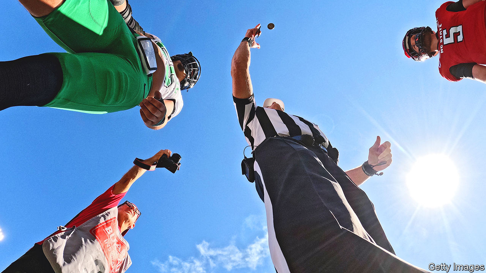

###### News you can use

# How to predict the outcome of a coin toss 

##### Coins are fair. Their tossers, less so 

 

> Oct 15th 2023 

Legend holds that the city of Portland, Oregon, was nearly called Boston. A coin toss in 1845 between Francis Pettygrove, who hailed from a different Portland, in Maine, and Asa Lovejoy, from Boston (the one in Massachusetts) eventually decided the matter. But things might have turned out differently, per Frantisek Bartos, a graduate student at the University of Amsterdam, if people were not such wobbly tossers.

Mr Bartos was interested in a prediction made by Persi Diaconis, Susan Holmes and Richard Montgomery, a group of American mathematicians. In 2007 the trio analysed the physics of a flipping coin and noticed something intriguing. Besides sending it somersaulting end-over-end, most people impart a slight rotation to a coin. That causes the axis about which the coin is flipping to drift while it is in the air, a phenomenon called precession.

After crunching the numbers, the physicists concluded that a coin thrown by a human should exhibit a subtle but persistent bias. There was about a 51% chance that a coin would land the same way up as it had been prior to being thrown. If it was heads-up in the thrower’s hand, in other words, it would be slightly more likely to land heads-up too. Or at least, that was the prediction.

Enter Mr Bartos, and his admirable dedication to empiricism. He convinced 48 volunteers to perform 350,707 coin tosses, using everything from an Indian two-rupee piece to a Swiss two-franc coin. His data confirmed what the physics had predicted. The coins landed same-side up 50.8% of the time. 

The statistics revealed that the coins themselves showed no particular bias. The determining factor was indeed humans’ apparent inability to throw straight. Mr Bartos was not the first person to collect statistics on coin tosses. But he is the first to have done so on a scale large enough to detect the bias. (A previous effort of 40,000 tosses, conducted by two students at the University of California, Berkeley, lacked the statistical power to confirm the theory.)

A 50.8% chance is only very slightly different from perfect fairness. But Mr Bartos points out that it is bigger than the advantage enjoyed by a casino in most varieties of blackjack. And in some situations it may matter. In 2019 Sue Cudilla became mayor of Araceli, a town in the Philippines, on the toss of a coin after the election had been declared a dead heat. Even more importantly, a coin toss can determine who bowls or bats first in cricket. Professional athletes spend thousands of dollars and hours of training in search of marginal gains. Perhaps they should look to the loose change in the umpire’s pocket.■


