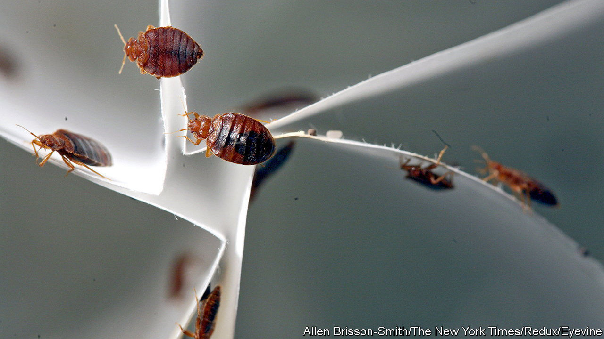

###### Sleep tight!

# It’s not just Paris. Bedbugs are resurgent everywhere 

##### Like bacteria, the insects are becoming resistant to the chemicals used to kill them 

 

> Oct 17th 2023 

TO ERNEST HEMINGWAY, Paris was a movable feast. To a bedbug, so are Parisians. In videos on social media, the seats of the city’s metro are seen swarming with bedbugs, tiny insects no bigger than an apple pip, which feed on human blood. 

The health risk from bedbugs is minor: itchy bites and a small risk of allergies and secondary infections. As the present panic suggests, the bigger impact tends to be psychological, says Clive Boase, an entomologist and pest-control consultant. Mosquitoes, leeches and other parasites are unpleasant, but do not colonise your home. If a traveller brings bedbugs back from their holidays, they can start an infestation that can be very difficult to shift. 

 among the non-French is unwise. The story is not so much one of bad hygiene and dirty trains as it is another cautionary tale of globalisation, climate change and evolutionary biology. Warm cities provide ideal environments for bedbugs. Cheap travel helps them spread. And after decades of widespread use, the chemical insecticides used to kill them are losing their power. 

 


Bedbugs are resurgent everywhere. A decade ago New York went through a similar panic to Paris’s today. Figures from Switzerland’s Pest Advisory Service, which maintains one of the few long-term datasets about the insects, show that in the decade to 2005, bedbug complaints in Zurich numbered around 20 a year. A decade later, they had sextupled (see chart). Numbers fell during covid-19 lockdowns, but they have risen since. “There won’t be a city without bedbugs,” says Mr Boase.

Humans probably acquired bedbugs with their first addresses. DNA analysis suggests that the pests are descended from parasites that prey on bats, with which humans shared caves, and on birds, which may have nested in early thatched roofs. In evolutionary terms, that makes bedbugs a comparatively recent affliction. That may explain the one bit of good news about them. Mosquitoes spread malaria, dengue fever and yellow fever. But no human pathogen is known to use bedbugs as a vector—perhaps because there has not been time for one to evolve the ability.

The insects thrive in warm environments with plenty of dark places to hide. Cities, and crowded blocks of flats, are ideal. The bugs shelter in the crannies of furniture, in mattress seams or in cracks in walls, coming out to feed at night. Warm, centrally heated homes accelerate their life-cycles, making the problem worse—as does a warming climate. 

The introduction and widespread use of insecticides such as DDT in the aftermath of the second world war came close to eliminating the bugs from most rich-world houses. But that chemical assault exerted a powerful evolutionary pressure on the insects to develop resistance to the poisons. Just as bacteria have evolved resistance to many of the antibiotics once used to kill them, modern bedbugs are almost invulnerable to at least some insecticides.

That growing resistance has been boosted by a depleting arsenal of chemicals to hurl against them. Fumigants such as hydrogen cyanide, sulphur dioxide and DDT itself are now regarded in most places as too toxic to use. Pyrethroids, which are the active ingredients in many commercially available insecticide sprays, are safer, but become less effective every year. 

Exterminators are therefore turning to other avenues of attack. Diatomaceous earth, a white silicate powder, can kill the bugs by desiccating them. Polymer sprays can trap them; certain oils can block the pores through which they breathe. Temperatures above 45°C are also fatal. Some pest-control firms therefore offer to heat-treat affected furniture in insulated tents, or even to roast entire rooms. But such treatments are expensive. 

New insecticides, to which the bugs lack resistance, could probably be invented. But for now at least, says Mr Boase, the market does not exist to justify much corporate research. And since the bugs do not spread diseases, public-health bodies have more pressing priorities. If bedbugs continue to spread, though, those incentives could start to shift. ■


