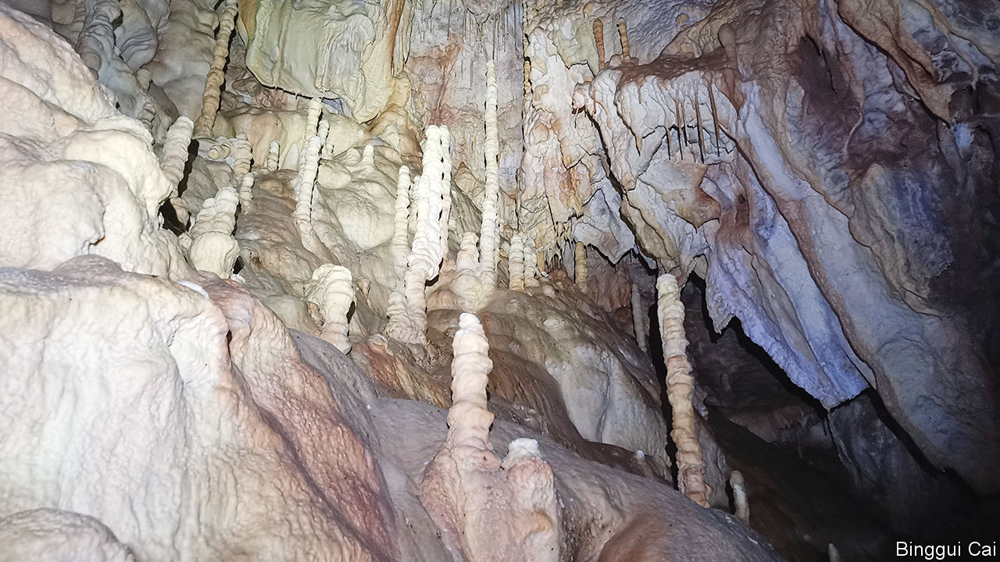

###### The weather underground

# What a Serbian cave tells you about the weather 2,500 years ago 

##### Like ice cores, stalagmites preserve a long record of the climate 

 

> Oct 18th 2023 

IF YOU LIVE in northern Europe or North America, your  partly on what the northern polar jet stream is up to. Jet streams are powerful and persistent winds that snake around the Earth from west to east, several miles above the surface. The meanderings of the northern polar jet stream can bring cold air down from the Arctic over the American Midwest, or send waves of Atlantic storms crashing into Ireland or Scandinavia. 

As with most sorts of weather, scientists suspect that the flow of the jet streams is being affected by climate change. Data from the past century and a half suggest that the northern jet stream has become stronger over that time. But a century is not all that long in climatic terms, and it is not entirely clear whether the strengthening is a natural phenomenon. 

In a paper published in , Miaofa Li at Fujian Normal University and Slobodan Markovic at University of Novi Sad, in Serbia, shed new light on that question. Climate scientists routinely examine ancient air trapped in polar ice to glean insights into the state of the climate hundreds or even thousands of years ago. The researchers point out that something very similar can be accomplished by looking at the chemical makeup of rock formations in a pair of Serbian caves. 

As with many caves, the floors of both Cerjanska Cave and Prekonoska Cave, both in Serbia’s south-east, are dotted with thin spires of rock called stalagmites. These are formed, very slowly, by water as it drips down from the rock above. Each droplet carries dissolved minerals. If water drips onto the same spot over many years, a stalagmite gradually forms as the minerals are deposited. Crucially, analysing the minerals from which the stalagmite is made can reveal information about the water that made it. 

The researchers were interested in Serbia specifically because of how its location affects its weather. The sort of rain the country gets depends on the strength of the northern polar jet stream. When it is blowing strongly, it tends to blow in clouds that formed over the Atlantic Ocean. When it is weak, clouds tend to drift in from the Mediterranean instead. 

Those two bodies of water have unique chemical signatures. Water from the Mediterranean has more of a rare isotope of oxygen known as oxygen-18, in which that element’s eight protons are joined by ten neutrons instead of the usual eight. Water from the Atlantic has less. By examining the proportions of that isotope in the stalagmite’s layers, the researchers hoped to be able to detect when Serbia had been exposed to more Atlantic storms or more Mediterranean ones, and thus what the jet stream had been doing. 

Drs Li and Markovic and their colleagues examined two stalagmites, one 380mm specimen from Cerjanska and one 238mm one from Prekonoska. Using traces of two other elements, uranium and thorium, they were able to date both stalagmites. The one from Cerjanska grew between 434BC and 1913, while the one from Prekonoska Cave was formed between 798BC and 404. They then analysed 581 samples of an oxygen-containing mineral called calcium carbonate. 

The researchers conclude that the North Atlantic jet stream seems to be stronger today than it has been at any time during the past 2,500 years. And their confidence in their method was boosted when they were able to see in the rocks the signatures of climatic events known to have happened from other sources, such as the Roman Warm Period, which lasted between 300bC and 200, and the Dark Ages Cold Period, which ran from roughly 300 to 700. Intriguingly, the data suggest the jet stream was stronger during cooler periods and weaker during warmer ones—the opposite of the trend being seen today. 

Why the modern jet stream appears to be doing the opposite is not yet clear. The researchers raise as one possibility the atmospheric influence of something called the North Atlantic Warming Hole. This is a persistent blob of unusually cool water that stretches from the Hudson Strait in northern Canada almost as far as the western coast of Ireland. It is thought to be caused by the melting of Greenland’s ice sheets and the weakening of the great oceanic conveyor belts that transport warmer water from the tropics into the higher northern latitudes. Perhaps more data, gleaned from other stalagmites in other caves, might help unravel the mystery. ■


