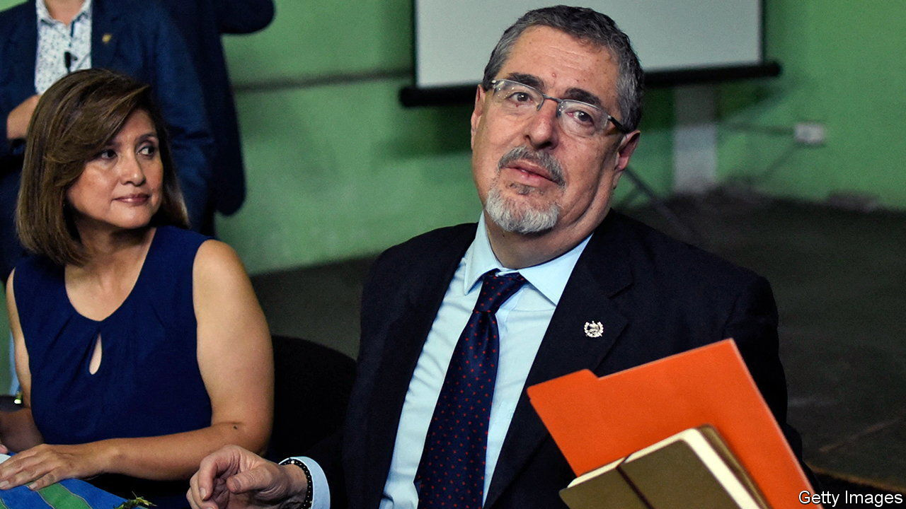

###### Democratic display

# Bernardo Arévalo is still battling to become Guatemala’s president 

##### The anti-corruption campaigner has faced a series of hurdles 

 

> Oct 19th 2023 

More than two weeks after protests began outside a drab government building in the capital of Guatemala, hundreds of demonstrators are still in place. Amid flags and the noise of vuvuzelas, the crowd camped outside the public prosecutor’s office in Guatemala City calls for the resignation of a list of officials, starting with María Consuelo Porras, the public prosecutor. They are not alone. Since October 2nd hundreds of Guatemalans have been blocking roads across the country, protesting against those who appear to be undermining democracy in the Central American country.

Ms Porras, who has been put under sanctions by the United States for corruption (which she denies), is at the forefront of a select group trying to stop the transfer of presidential power to Bernardo Arévalo. Since his landslide win in elections in August, on an anti-corruption platform, Mr Arévalo has become a symbol of hope in a country and region where democratic backsliding has become the norm. 

Initially “the pact of the corrupt”, as Guatemalans refer to a small elite drawn from the ranks of the political, military and judicial spheres, claimed, without evidence, that the elections were fraudulent and forced the ballot boxes to be reopened. The result stayed the same. Then they tried to suggest that Semilla (Seed), Mr Arévalo’s party, was fraudulently formed and should be dissolved. That case is continuing.

Most reckon these attempts to stop Mr Arévalo from being sworn in on January 14th will fail. Although some Guatemalans are fed up with the roadblocks, the peaceful protests are putting pressure on the elite, as are many foreign governments. Keeping Mr Arévalo from power would risk a widespread uprising. “The most sacred thing in a democratic country is the vote,” says Alida Vicente, a lawyer and elected member of an indigenous administration in Palín, in the south, who travelled to the capital to join the protest. 

On October 16th Guatemala’s interior minister resigned, after a group of 50 people wielding guns, wooden planks and stones killed a protester while trying to disperse a protest. Many businesspeople are supporting Mr Arévalo, either because they are keen to be close to those in power or for fear of American sanctions if they do otherwise. The courts are divided. While the case against Semilla continues, on October 14th an appeals court quashed the conviction of José Rubén Zamora, a prominent investigative journalist who was sentenced in June to six years on trumped-up charges of money-laundering. (But it also ordered a retrial.)

The continuous challenges are hurting Semilla. Formed by a group of urban academics, the party ran its first round on $20,000. It did not even have money to do internal polling. The party has no experience of holding power. It will hold only 23 of 160 seats in Congress.

Still, Mr Arévalo should be able to make his mark. Alejandro Giammattei, the outgoing president, has strengthened the powers of the presidency. “Guatemala’s public administration is so bad that even using a few executive powers he could drastically improve it,” reckons Daniel Haering Keenan of the Universidad Francisco Marroquín in Guatemala City. And the battle for Mr Arévalo has sparked a desire to protect democracy more generally. As Esteban Toc Tzay, an indigenous leader who was at the protests, put it: “This is the feeling of the Guatemalan people.” ■

