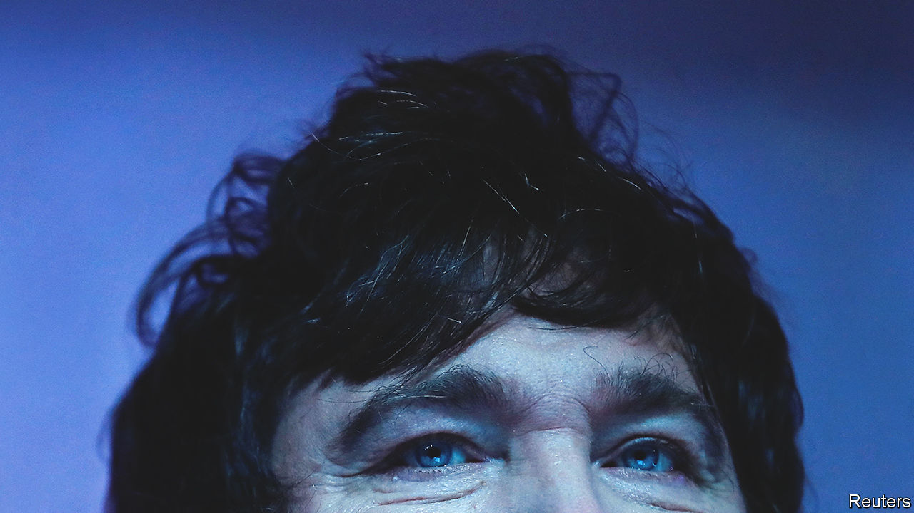
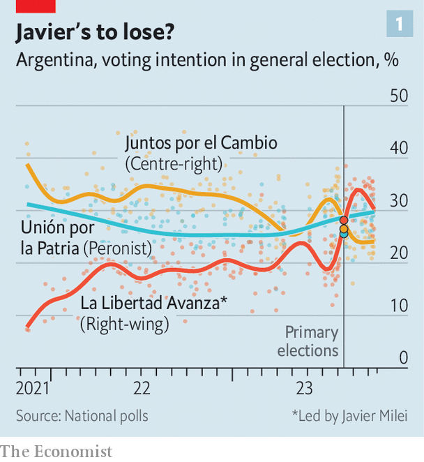
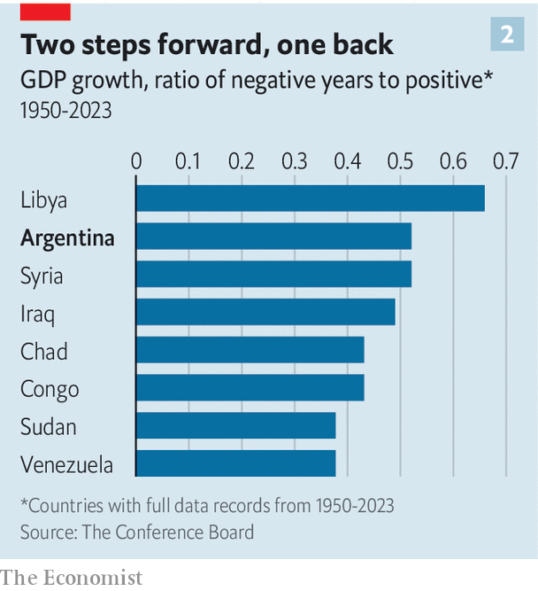

###### The radical option

# Can Argentina’s next president fix the economy? Don’t count on it 

##### Javier Milei still leads the polls. But the country needs more than dollarisation 

 

> Oct 19th 2023 

There are four types of countries in the world: developed, undeveloped, Japan and Argentina. Decades after the Nobel-prize-winning economist Simon Kuznets is said to have coined this phrase in the 1970s, Argentina still stands out for its exceptional record for high annual inflation, which currently stands at a massive 138%. Could that be about to change? On October 22nd Argentines will vote in a presidential election. For the first time in decades, two of the three leading candidates are offering free-market solutions to the country’s many problems. 

 


Those two candidates are Javier Milei, a libertarian who is leading the polls, and Patricia Bullrich, a centre-right former security minister who is the candidate for Together for Change, the main centre-right coalition (see chart 1). Mr Milei, who wields a chainsaw to symbolise his approach to the state, has promised to slash public spending by 15% of GDP (it is currently around 40% of GDP), scrap most taxes, privatise state-owned companies and swap the local currency, the peso, for the dollar. His coalition, Freedom Advances, was created only in 2021. Ms Bullrich also wants to balance the budget by cutting spending, beef up central-bank independence and have a dual-currency system in which both the dollar and the peso would be accepted. 

The third candidate is Sergio Massa, the country’s current economy minister, who, though part of a left-wing Peronist administration, is considered more centrist and has good relations with the IMF. If on October 22nd no candidate obtains either 45% of the vote or 40% with a ten-percentage-point lead over the runner-up, a run-off will ensue in November. 

Argentina’s decline has been gradual and mostly self-inflicted. A century ago it had a GDP per person higher than that of Germany, Italy or France. Millions of European migrants flocked to work on its fertile lands. “” became a colloquialism to describe obscene wealth by a landowning aristocracy. Today the phrase is a joke. Germany’s GDP per person is now quadruple Argentina’s. Neighbouring Chile’s is almost a third higher. 

 


According to the World Bank between 1950 and 2016, the country experienced 14 recessions, defined as one or more consecutive years of negative growth (it has since had another two). Over this period, for every two years of growth, Argentina has had one year of recession, a record more typical of war-torn oil states (see chart 2). Recessions not only happen frequently, but are deep. In an average slump, Argentina’s GDP contracts 3.5% per year. The result is that it is almost impossible to maintain economic growth. According to Martín Rapetti of Equilibria, a consultancy in Buenos Aires, Argentina’s real GDP per person was roughly the same in 2020 as it was in 1974. 

Argentina has defaulted nine times on its sovereign debt since it became independent in 1816, including three times since 2000. This has led it to be shut out of international capital markets. Administrations have either forced the central bank to print money to finance the deficit, or taken out debt with multilateral lenders to keep spending going. Since 1956, when it joined the IMF, Argentina has been involved in 22 bail-out programmes. It now owes the fund $43bn.

The country’s economic problems have mostly been caused by its politics. Since 1930 Argentina has had six military coups, which have impeded the regular functioning of the courts and the legislature. Even in democracy, institutions have been undermined. Populist presidents have fired central-bank chiefs at will and expropriated dozens of private companies. Between 2007 and 2014, when a particularly left-wing strand of Peronism was in power, the government published bogus inflation statistics and fined economists who divulged their own estimates, which were often more than double the official one. 

The current Peronist government has created or increased at least 27 taxes, often by decree. At least seven new exchange rates have been invented under this administration. In the run-up to the election, Mr Massa abolished income taxes for 99% of registered workers, increased wages for public employees and handed out a bonus in pesos worth $100 (converted at the official exchange rate) for pensioners. 

Populism has contaminated trade, too. Successive Peronist administrations have cut the country off from international commerce in order to protect workers and keep domestic prices down. Trade as a percentage of GDP is just 33%, among the world’s lowest (it is 84% in Mexico and 64% in Chile). Such governments have also bashed the country’s main export sector, agriculture, as an oligarchy, and sought to hobble it by imposing export restrictions on farm produce. Exports of soya, the country’s main product, are taxed at 33%. 

All of this means that most Argentines prefer to do things off the books. Banks, which in the past have effectively confiscated savings under government orders, are avoided. Domestic credit to the private sector is only 11% of GDP, compared with 83% in Chile. Nobody trusts the local currency. Though the country has had five different currencies in as many decades, Argentines have long preferred to save in greenbacks. They are thought to hold at least $250bn in offshore accounts or under the mattress, the equivalent of more than a third of GDP. 

Unsurprisingly, confidence in government is at a 20-year low. Corruption is rampant. In December the powerful vice-president, Cristina Fernández de Kirchner, who was president between 2007 and 2015, was sentenced to six years in jail for defrauding the state of $1bn (she denies wrongdoing and has appealed against the decision). In September, Martín Insaurralde, the chief of staff for the governor of Buenos Aires province, the country’s most populous state, was tagged in photos taken by an escort of the two of them on a yacht. He and his ex-wife are being investigated on suspicion that they evaded taxes and laundered up to $100m into property, which they deny.

More than half the population is estimated to get some form of government welfare. Many of these handouts are inefficient. A programme introduced in 2020 which aims to bring casual workers into the formal market reaches almost 1.3m people—yet only around 15,000, or 1.2% of recipients, have so far found formal jobs. According to the Inter-American Development Bank, administrative inefficiencies mean that Argentina’s government loses an amount worth over 7% of GDP a year because of leaks in welfare transfers, wasteful public procurement and waste in employee remuneration. This is more than any other country in Latin America. 

Though inefficient, these welfare payments continue because they are essential to the way politics functions. Middlemen known as , who are in charge of distributing social handouts, also make sure their recipients vote for the right party. In September one  was arrested in Buenos Aires province while he was withdrawing money with 48 different debit cards that belonged to local legislators. Police suspect he was acting on behalf of politicians to buy votes. Argentina’s federal structure also encourages clientelism, as presidents jockey for the support of the country’s 23 powerful governors.

Such potential skulduggery has benefited Mr Milei, who gained fame by railing against politicians as a “caste” who steal from hard-working folk. His team is mostly made up of political novices, though some are well-regarded economists. 

The rise of the libertarian has raised hopes among some analysts. Ramiro Blazquez of BancTrust, an investment bank which focuses on Latin American debt, thinks that the fact that two of the leading candidates are proposing free-market policies is a good sign. He points out that, last time Argentina went through a similar economic crisis in 1989, which included hyperinflation, it ushered in a liberal government that managed to turn the country’s fortunes around for a decade. Today, talk of cutting public spending is not turning off voters but attracting new ones. “The political rhetoric has changed, people’s expectations have changed,” says Fernando Marull, a consultant in Buenos Aires.

Mr Marull also notes that certain sectors—such as mining, oil and gas and tech—are booming. The country has one of the world’s biggest reserves of lithium. Rystad Energy, a consultancy, estimates that oil output in Argentina will more than double to 1m barrels per day by 2030. Even in dollar terms the local stock market has risen by almost 75% over the last year.

Get the chainsaw!

Yet positive headwinds may not be enough to save Argentina. “Argentina’s principal problem is political,” says Mr Rapetti. An addiction to charismatic leaders who co-opt state institutions rather than build political consensus has made it impossible to implement good policies and maintain them over time. Other countries in Latin America have managed to stabilise their economies by creating independent central banks, targeting inflation and getting their fiscal accounts in order. All this led to stable currencies. It is unlikely that a similar combination of policies could be implemented quickly in Argentina, because of years of distortions and handouts. Painful economic policies are also likely to lead to massive protests.

In the presidential primaries for this election, candidates who advocated broad coalitions as the basis for macroeconomic stabilisation fared badly. Instead, voters plumped for Mr Milei, whose radical dollarisation proposal could be a quick fix for inflation, but will not solve the country’s underlying decay. Mr Milei’s party is not expected to get a majority in Congress. That could result in legislative gridlock. Optimists believe that if the economic crisis gets bad enough, politicians from other parties would eventually line up behind him. Given Argentina’s track record, voters should not hold their breath. ■

