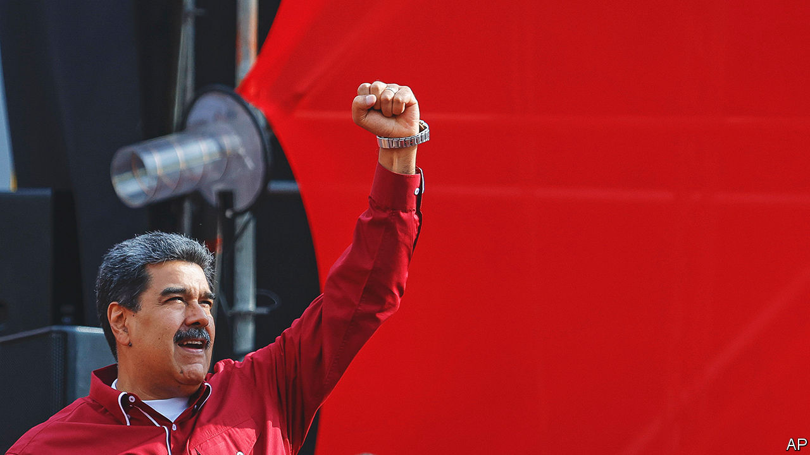

###### Blowout

# Joe Biden lifts sanctions on Venezuela, but not without conditions 

##### Nicolás Maduro’s government will have to hold its side of the bargain 

 

> Oct 19th 2023 

Nicolás Maduro, Venezuela’s autocratic president, has managed to stay in power by undermining his country’s democratic politics. So few held out much hope when, on October 17th, members of his government and the opposition jetted to Barbados to strike a deal in order to set out how free and fair presidential elections could be held in 2024.

Such cynicism seemed well founded. The deal, which was overseen by Norway’s government, was entitled a “partial agreement”. It initially appeared to be underwhelming, albeit with some concessions. The document finally cleared the path for the opposition to hold its primary elections, scheduled for October 22nd. The opposition will be allowed to choose its candidate “according to its internal rules.” An approximate date was agreed for presidential elections. These will be held in the second half of 2024. 

Just getting Mr Maduro to agree to these small democratic steps had taken months of mostly secret negotiations. The day after the deal was signed it finally emerged just how he was cajoled. On October 18th, President Joe Biden’s administration announced that, with immediate effect, it would lift most of the restrictions placed on Venezuela’s energy, gold and financial sectors. The state oil company Petróleos de Venezuela sa (PDVSA), which has been under sanctions since 2019, will be able to sell oil to whoever it chooses, with the exception of Russia. Some Venezuelan bonds can be traded by American entities again. 

The turnaround represents a significant financial boost for Mr Maduro’s government, particularly the change of rules for PDVSA. For the last four years it has been bypassing sanctions by selling oil on the black market, for as much as a 40% discount. “I think this could almost double Maduro’s revenues from oil: he will be receiving a much lower discount, and exporting more,” says Francisco Monaldi, at Rice University in Houston, Texas. Mr Maduro was certainly jubilant when he appeared on state television. “It is a world consensus that sanctions against Venezuela be lifted,” he gushed.

But the wily dictator has more to do if he really wants to come in from the cold. Antony Blinken, America’s secretary of state, said that the Biden administration has given Mr Maduro only until the end of November to start releasing political prisoners and any “wrongfully detained” Americans. On October 19th five Venezuelans—journalists and politicians who had been imprisoned for years—were set free.

Another, more difficult, request for the regime to comply with involves the opposition primary election, on October 22nd. The clear favourite to win is Maria Corina Machado, a conservative. She has already been banned from holding office. Mr Blinken made clear that, also by the end of November, Mr Maduro’s government must “define a specific timeline and process for the expedited reinstatement of all candidates”. He warned that “failure to abide by the terms of this arrangement will lead the United States to reverse steps we have taken”. Mr Maduro has a poor track record of keeping his part of a bargain. Now he is about to be tested. ■

