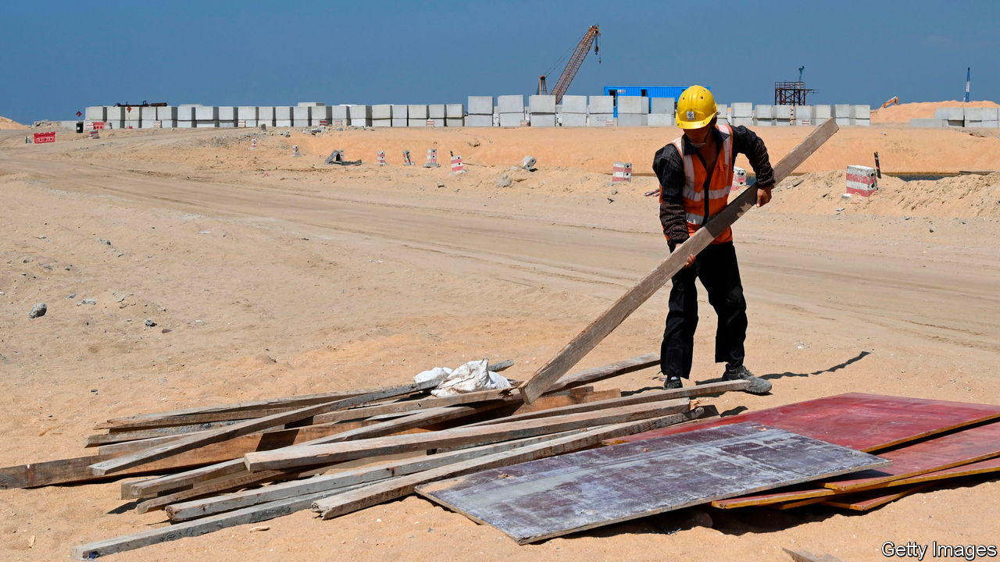

###### The Economist explains

# How China’s Belt and Road Initiative is changing 

##### The many motivations behind Xi Jinping’s key foreign policy 

 

> Oct 17th 2023 

On October 17th officials from at least 90 countries are expected to arrive in Beijing for a two-day diplomatic festival. The occasion is a summit organised by Xi Jinping, China’s president, to celebrate the tenth anniversary of the  (BRI), his most ambitious foreign-policy programme. It involves China financing billions of dollars of investment in roads, railways and other infrastructure across Eurasia and Africa. China claims the BRI has created 420,000 jobs and lifted 40m people out of poverty. But many in the West think its  is to construct a Chinese-led world order in which unsavoury regimes can thrive. The guest list for this week’s summit resembles a gallery of rogues. Vladimir Putin, Russia’s president, will play a starring role. Various other strongmen have confirmed their attendance. Even the Taliban are sending a delegation. Does China’s BRI bankroll international development or cement autocracy? 

Launched in 2013 as “one belt, one road”, the BRI quickly became a clear expression of Mr Xi’s determination to break with Deng Xiaoping’s dictum to “hide our capabilities and bide our time; never try to take the lead”. It seeks to make Eurasia (dominated by China) an economic and trading area to rival the transatlantic one (dominated by America). By investing in infrastructure, Mr Xi hoped to create new markets for Chinese companies, such as high-speed rail firms, and to export some of his country’s vast excess capacity in cement, steel and other metals. By investing in volatile countries in Central Asia, he sought to create a more stable neighbourhood for China’s own restive western regions of Xinjiang and Tibet. And by encouraging more Chinese projects around the South China Sea, the initiative aimed to bolster China’s claims in that area (the “road” in “belt and road” refers to sea lanes).

In many ways, the BRI’s first decade has been a startling success. More than 150 countries have signed up to the scheme, including 18 of the EU’s 27 members. That helped make China the developing world’s largest creditor, boosting its diplomatic and geopolitical clout. It has also brought concrete benefits to many developing countries, where roads and railways would otherwise have gone unbuilt. 

Yet the BRI’s progress has slowed. During the programme’s early years, China lent recklessly to poor countries without proper assessments of risk. Many of those loans have now gone bad, forcing Beijing to become more cautious. China’s foreign lending has been falling since 2016. Mr Xi says it will now focus on “small but beautiful” investments—a marked change of tone for a programme he once hailed as the “project of the century”.  partly explains the shift: China’s faltering economy has made lavish spending abroad less popular among ordinary citizens. Other countries have also grown more wary of cosying up to China as its global rivalry with America heats up. The EU has tightened rules around foreign investments in critical infrastructure, citing national-security concerns. Italy, the only G7 member to join the BRI, is expected to withdraw. 

The BRI may be slowing its march and moderating its aims. But it remains a crucial part of Mr Xi’s long-term goal of rallying the global south around China’s democracy-free model of development. A decade ago, Western countries were slow to recognise the project’s significance. They are now scrambling to provide alternatives. Plans for a transport corridor connecting India with the Middle East and Europe were unveiled at last month’s G20 summit in Delhi. America has promised to ramp up lending to developing countries via the World Bank. China’s BRI has encountered some bumps in the road. Yet it had already changed the world’s direction of travel.■

