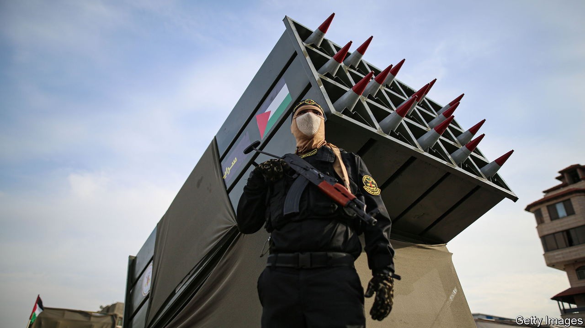

###### The Economist explains

# What is Palestinian Islamic Jihad? 

##### Israel blames the group for a deadly explosion at a hospital in Gaza 

 

> Oct 18th 2023 

ON THE EVENING of October 17th a blast  in Gaza City. Thousands of civilians had been sheltering there, alongside the sick. Palestinian officials say that hundreds died. , the militant group that runs Gaza, and several . Israel’s army, citing drone footage as evidence, said that the explosion was caused by a malfunctioning rocket fired by Palestinian Islamic Jihad (PIJ), another militant group. PIJ, which operates in the West Bank and Gaza, denied the allegation. On October 18th, on a visit to Israel, President Joe Biden also blamed “the other team”, backing up Israel’s account. What is PIJ and what threat does it pose in this conflict?


The group was founded by Fathi Shaqaqi, a Palestinian doctor, and Abd al-Aziz Awda, a Muslim preacher born in Jabalia refugee camp in northern Gaza. The pair were students in Egypt in the 1970s, where they were members of the Muslim Brotherhood, the world’s oldest Islamist group. Mr Awda and Shaqaqi advocated violent resistance against the Israeli occupation of Gaza and the West Bank. Inspired by the Islamic revolution in Iran in 1979, they hoped to establish an Islamic state on the territory of the British mandate of Palestine, part of which became the state of Israel after 1948. They thought the Muslim Brotherhood was insufficiently committed to the cause, and began recruiting for their own militant alternative. After returning to Gaza in 1981 they spent several years building support. The group claimed responsibility for several attacks on Israeli soldiers in Gaza in the early 1980s, at least half a decade before Hamas carried out its first attack.

Throughout the 1980s PIJ was a loose network of military cells, with only a few hundred members in total. In 1988 Israeli authorities deported Dr Shaqaqi to Lebanon, where he was later joined by other PIJ deportees. While in exile these fighters formed ties with Iran and Hizbullah, an Iran-backed militia in Lebanon. PIJ members began participating in Hizbullah’s training camps. The group founded the al-Quds Brigades, a more structured military operation than it had had before. Seeking to undermine peace talks between the Palestinian Authority and Israel, it carried out a series of suicide attacks in Israel. The most serious, in 1995, killed 21 Israeli soldiers and one civilian. 

Despite their ideological similarities, PIJ has remained at arm’s length from Hamas. During the first Intifada, or “shaking off”, an uprising against Israeli rule that ended in 1993, the two groups collaborated on several operations but never formally joined forces. Hamas won an election in Gaza in 2006 and, after failing to strike a power-sharing deal with Fatah, its rival, fought a brief war for sole control of the strip in 2007. PIJ limits itself to armed conflict. It has never participated in elections and, unlike Hamas, has provided little support to Gazans. 

PIJ’s influence declined in the 1990s, after Israel jailed many of its fighters in the West Bank. But many were released around 2000 and PIJ’s military capacities have since grown, assisted by arms supplies from Iran. In 2014, PIJ fired more than 100 rockets from Gaza at Israel. It is the second-largest of around a dozen armed groups in Gaza, after Hamas. Its presence in the West Bank has grown recently, particularly in Jenin, a city in the north. In 2022 several brigades linked to PIJ carried out a series of shootings on Israeli military checkpoints.

PIJ has played a large role in the violence that began when Hamas invaded Israel on October 7th this year. PIJ fighters are thought to have joined the attack, in which more than 1,300 people died. The group later claimed to be holding 30 Israeli hostages in Gaza; Hamas is thought to be holding around 200. PIJ has since claimed responsibility for several rocket and mortar attacks on Israel. Israel is preparing for a ground invasion to “destroy Hamas”. PIJ will be in its sights, too. ■

