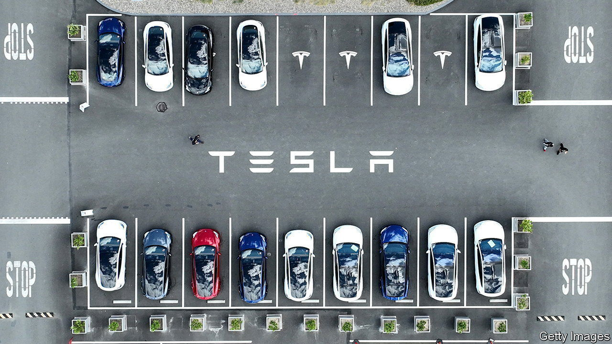
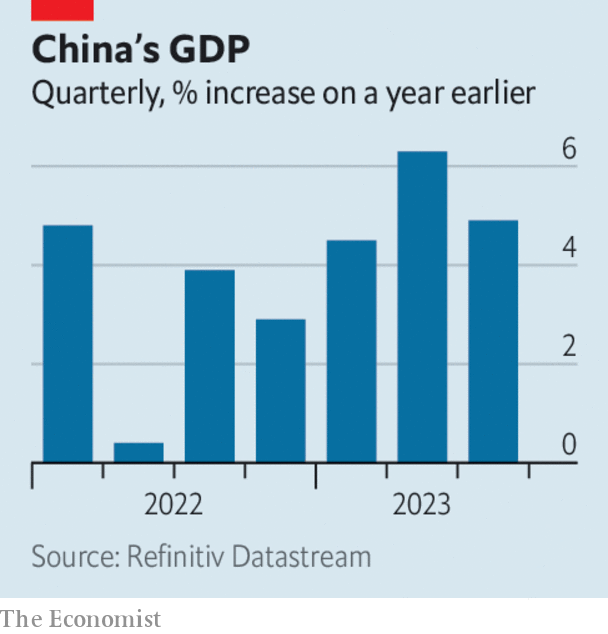

###### The world this week

# Business 

#####  

 

> Oct 19th 2023 

 issued a downbeat earnings report. Net profit fell by 44% in the third quarter, year on year; its operating margin, a closely tracked measure of the difference between its income and expenses, plunged to 7.6%. The carmaker also said that although it will start delivering its long-delayed Cybertruck to customers in November it could take up to 18 months for the vehicle to turn a profit.

The American government tightened its ban on selling chips to China for use in , extending the rules to capture sales of chips that had previously fallen just outside the ban’s technical parameters. The clampdown is bad news for , which said that the new restrictions would apply to its H800 AI chip. Chinese tech companies have been rushing to buy up the modified chip in case of a prohibition. Meanwhile, Nvidia announced a partnership with , a Taiwanese manufacturer, to build data centres powered by Nvidia’s technology. 

The race for dominance in AI was thrown into focus when  announced that its ERNIE 4 chatbot was now as good as OpenAI’s GPT-4. The Chinese tech giant showed off ERNIE’s capabilities at an event in Beijing by getting it to complete tasks, such as writing a martial-arts novel. ERNIE has 45m users, a fraction of ChatGPT’s 180m, though the American bot was launched several months earlier. 

 at last completed its takeover of , the biggest ever in the video-game industry, 21 months after it was first announced. The deal had been resisted by antitrust regulators; Microsoft quickly sealed the acquisition after Britain’s competition authority approved a revised proposal. America’s Federal Trade Commission lost its attempt to block the transaction in court, but it is pressing ahead with its own legal hearing and may still challenge the deal.

A net 9m new subscribers joined  in the third quarter, the largest number since the pandemic, which the company attributed in part to its crackdown on sharing passwords. It also raised its prices. The monthly cost in America of a premium package, which includes high-res 4K streaming, is now $22.99. 

Injection rejection

Plunging demand for covid vaccines continued to take its toll on drug companies.  slashed its forecast of revenue for the year by $9bn and will book a $5.5bn write-down in the third quarter because of the “lower-than-expected utilisation” of the shots. The share prices of Pfizer and BioNTech, which developed a vaccine with Pfizer, have fallen by more than a third since the start of the year. Moderna’s stock has lost half its value. 

, one of America’s biggest pharmacy chains, filed for bankruptcy protection. The company is struggling to cope with a huge debt pile, falling revenues and the cost of litigation associated with the opioid crisis. It has already closed some shops and will shut others. Around 45,000 jobs are at risk. 

 


  was 4.9% larger in the third quarter than in the same period a year ago, a faster pace of growth than analysts had forecast. September’s growth in industrial output and retail sales also beat expectations. Officials downplayed talk of an economic recovery, warning that “the external environment is becoming more complex.” The property market is very fragile, as speculation mounts that , the country’s biggest developer, may have defaulted on its dollar debt. 

Britain’s annual  rate held steady in September, at 6.7%. Food prices rose at the slowest pace since June 2022. The core rate, which excludes energy and food, eased to 6.1%. The Bank of England left interest rates on hold at its most recent meeting, and markets are betting it will do so again. “Let’s not get carried away,” Andrew Bailey, the bank’s governor, has said; the fight against inflation is not over. 

Net income at  fell again in the third quarter, the eighth consecutive quarter of declining profit. The bank made $1.9bn, down by 36% compared with the same period last year. David Solomon, its chief executive, has reportedly given up his hobby as a DJ, following internal criticism that it was distracting him from his main job. 

By contrast, profit at climbed by 35%, to $13.2bn. America’s biggest bank was boosted by almost $23bn in revenue from net interest income, the difference between what a bank earns in interest on its loans and what it pays out on deposits. 

Café culture

A financial analyst lost his claim for dismissal against Citigroup for claiming a false . The man said he alone had consumed the two coffees, two sandwiches and two pasta dishes, though it turned out his partner had joined him. Citi forbids expensing meals for spouses. The analyst specialises in financial crime. 

