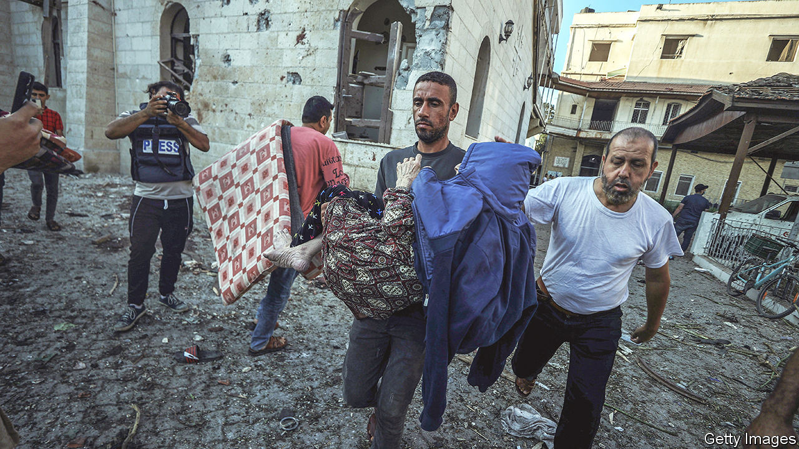
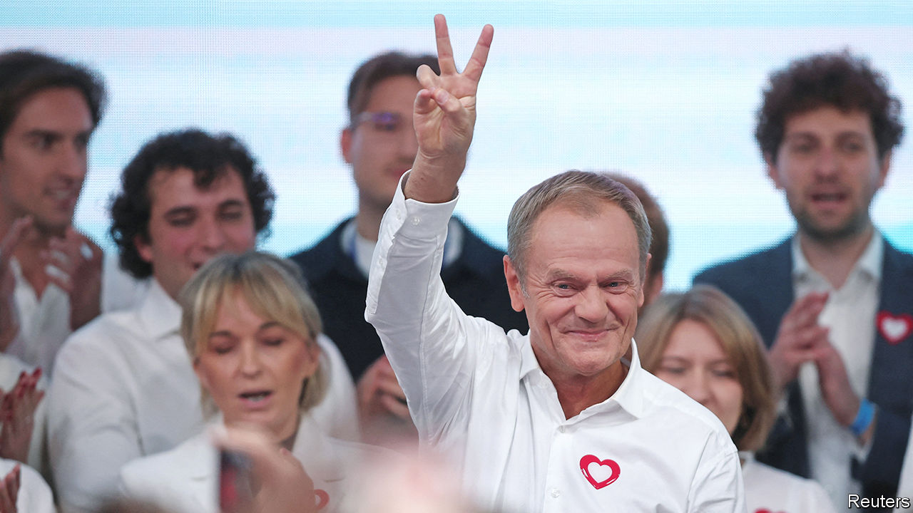

###### The world this week

# Politics 

#####  

 

> Oct 19th 2023 

’s trip to  to lend support after the terrorist attack by Hamas was overshadowed by a blast at a hospital in , which the Palestinians said killed hundreds of people. America and Israel pointed to intelligence that suggests the explosion was caused by a missile launched by Islamic Jihad, another militant group, that misfired, falling in the hospital’s car park. Hamas and many Arab countries said an Israeli strike was to blame. The incident triggered outrage in the Arab world, leading Jordan to cancel a summit between Mr Biden and the leaders of Jordan and Egypt and Mahmoud Abbas, president of the Palestinian Authority. 

The  worsened in Gaza, where about 3,500 people have been killed, according to the Palestinians, amid Israel’s retaliation for the Hamas attack. Under mounting international pressure, Israel will allow food, water and medicine to cross from Egypt to southern Gaza, where the population has moved to take shelter. King Abdullah of Jordan warned that the “region is on the brink of falling into the abyss”, but was adamant that his country and Egypt would not accept refugees. 

Israel’s ground troops were poised to enter Gaza. They have been held back in part because of fears that , a powerful militia based in Lebanon, will launch a big assault across the border into northern Israel at the moment when Israeli soldiers are focused on Gaza. Hizbullah is backed by Iran, which has warned that an “axis” of militias is ready to open “multiple fronts” against Israel. 

The  government put the country on the highest state of alert after an Islamist extremist stabbed a teacher to death. Soldiers were drafted in to boost security and all pro-Palestinian demonstrations were banned. In  a supporter of Islamic State shot dead two Swedish nationals. In  a six-year-old boy died after being stabbed 26 times by his mother’s landlord. The mother was wounded. Police say they were targeted because they were Muslim. 

incidents and “celebrations” of the attack by Hamas were reported throughout Europe.  police force reported a big rise in assaults on Jewish targets. Rishi Sunak, the British prime minister, reminded people that showing support for the terrorist group could be punishable by a prison sentence. 

 


Inthe liberal Civic Coalition and its allies won enough seats at an election to form a majority in parliament, heralding a big shift in government. The conservative Law and Justice (PiS) party, a thorn in the EU’s side since gaining power in 2015, came first but will struggle to rule, even with the support of a far-right party. It is expected to get the first stab at forming a government; talks could take weeks. Donald Tusk, the leader of the Civic Coalition, called on the country’s PiS-allied president to swiftly start the process. 

 has used long-range  for the first time, according to Volodymyr Zelensky, the country’s president. The missiles were reportedly used to attack Russian bases in east Ukraine, destroying nine helicopters. America silently provided the missiles to Ukraine, rather than announcing their deployment, apparently to take the Russians by surprise. 

Friends in need

 visited , where he tried to gain support for his war on Ukraine. The Russian president went to a summit held by Xi Jinping, his Chinese counterpart, on China’s Belt and Road Initiative. European delegates walked out of one meeting he attended. But not Viktor Orban. The Hungarian prime minister shook Mr Putin’s hand, the first EU leader to do so since the start of the war. 

Republicans in America’s House of Representatives continued to squabble over choosing a new. After spurning Steve Scalise, they were unenthusiastic about rallying around Jim Jordan. 

Voters in  decisively rejected a constitutional amendment that would have created an advisory body for Aboriginal and Torres Strait Island people. The referendum on the Voice, as it was dubbed, was beaten by 61% to 39% and failed in all six Australian states. Critics of the proposal said it would have undermined the principle of legal equality by favouring one racial group in the constitution.

The centre-right National Party won  general election, ending the six-year rule of the Labour Party, formerly led by Jacinda Ardern. Christopher Luxon, the incoming prime minister, will form a coalition with the ACT party, which is classically liberal. But with a slim majority he may have to rely on the populist New Zealand First Party for support.

Supreme Court declined to legalise , accepting the government’s argument that only Parliament could decide the status of marriage in the country. 

Pro-democracy campaigners in  were outraged by the decision of the Constitutional Court to add an exception to a law that bars people under the age of 40 from running for president. The court said that people who have been elected to regional posts can now run, which would allow the 36-year-old son of the outgoing incumbent, Joko Widodo, to contest February’s election.

Separatists in Indonesia’s  province claimed responsibility for an attack on a gold mine that killed seven people. The rebels repeated their warning to non-indigenous Papuans to leave the mountainous region. 

Two tourists and their guide were killed in a terrorist attack in  that the government blamed on the Allied Democratic Forces, which declares allegiance to Islamic State. The attack was in the Queen Elizabeth National Park, which is close to the border with Congo.

UN peacekeepers in  are struggling to leave the country by the end of the year, as agreed, because of a rapid deterioration in security that is preventing it from retrieving equipment. Some 300 blue helmets have been killed over the course of the ten-year-long mission.

Daniel Noboa was elected as president. The 35-year-old businessman is a centrist who has promised to reduce crime, the big issue during the election. A presidential candidate was assassinated in August. Mr Noboa’s victory is a rejection of the leftist faction aligned with Rafael Correa, a disgraced former president. 

Representatives from Nicolás Maduro’s autocratic regime in  and the opposition met in Barbados, their first meeting in nearly a year. Some progress was made as the two sides agreed to a timeline for an election in 2024. After the talks America relaxed sanctions on the country’s oil sector. 


Don’t try this at home

Pepper X was named as the world’s  by Guinness World Records. The previous record was held by the Carolina Reaper. Both are grown by Ed Currie (no pun intended), a farmer from South Carolina. Pepper X rates at nearly 2.7m Scoville Heat Units (a jalapeño is around 3,000 to 8,000). Mr Currie said he was in severe pain with cramps for an hour after eating a whole one. 

