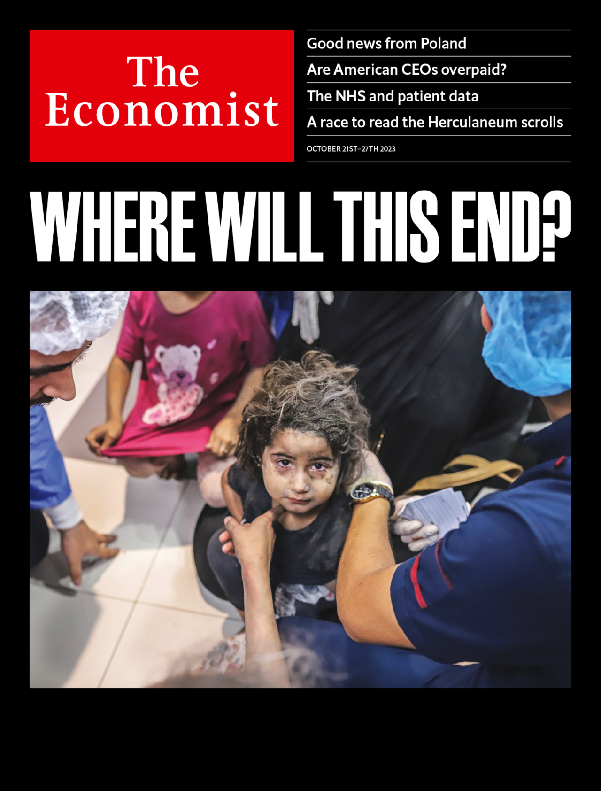

###### The world this week

# This week’s covers 

##### How we saw the world 

> Oct 19th 2023 

THIS WEEK WE have one cover, on the daunting challenges in Gaza: the destruction, the obstacles a ground invasion will face and the options for the territory’s long-term future. The stakes could hardly be higher. After a devastating blast in a hospital in Gaza, Arab countries rushed to condemn Israel. Hizbullah, a heavily armed Lebanese militia, is lurching closer to outright war with Israel. Only America can bring the Middle East back from the brink. 

 


 

 

 

 

