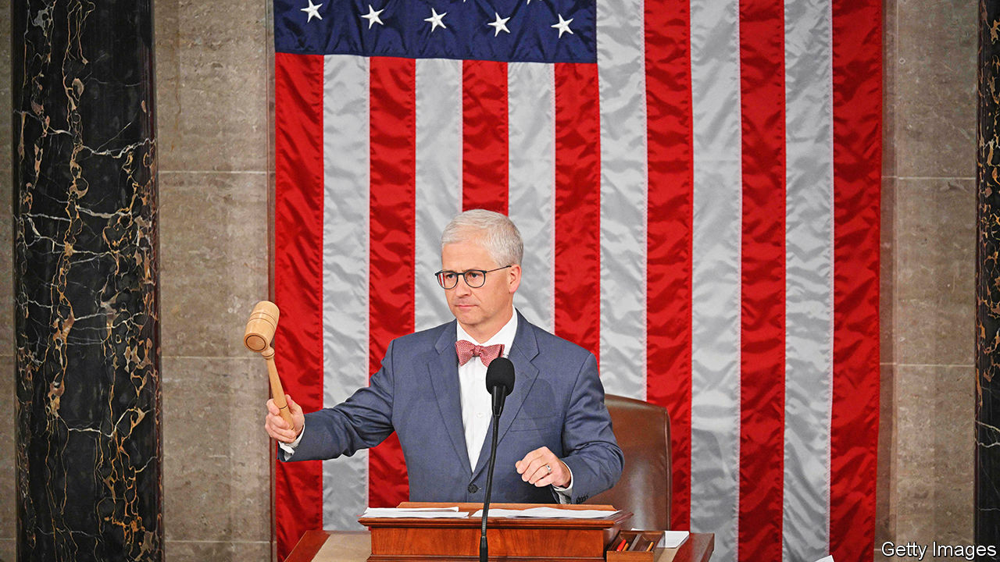

###### Hail McHenry

# How the Republican civil war in the House could end 

##### The outcome could be surprisingly pleasant 

 

> Oct 19th 2023 

JOHN MCCAIN, the late senator from Arizona, liked to joke that the approval rating for America’s Congress had fallen so low that legislators could expect support only from “paid staffers and blood relatives”. McCain’s old line seemed closer to reality than hyperbole as the House began its third week without a speaker. Yet, unlikely as it seems, good legislation still has a chance to pass despite the House Republicans’ dysfunction.

Jim Jordan, a hard-right Ohio congressman, became speaker-designate on October 13th after Steve Scalise, the number two House Republican, gave up. But Mr Jordan fell short during a full House vote on October 17th. He lost even more support in the second round of voting. The top job always seemed an odd fit for a conservative firebrand like Mr Jordan. A former Republican speaker once called him a “legislative terrorist”, and after nearly 17 years on Capitol Hill the Ohioan had yet to be the primary sponsor of a bill that became law. 

Perhaps Mr Jordan will find a way. He had not dropped out by the time this issue was published, though many House Republicans were already looking elsewhere. Some lawmakers even began weighing a more quixotic measure: empowering the interim speaker.

Patrick McHenry became speaker pro tempore on October 3rd after being hand-picked by the recently removed Kevin McCarthy. The ten-term congressman from North Carolina embraced a limited role in his unprecedented position and did little more than oversee the election of a new speaker. But with no end to the Republican impasse in sight and critical legislative deadlines approaching, talk of expanding Mr McHenry’s power has grown louder.

To do so, the House would have to pass a simple resolution giving Mr McHenry more authority. “That would basically just empower McHenry to be able to do things like bring bills to the floor and conduct some basic business of the House,” says Molly Reynolds of the Brookings Institution, a think-tank. This is not a permanent solution and his expanded powers would almost certainly come with an expiry date. But members in both parties could find something to like with this short-term fix.

Mr McCarthy lost his job after negotiating a temporary extension of government funding. Mr McHenry, not long for the job, could oversee the passage of a long-term funding bill—something the permanent speaker should then be grateful for, even if he votes against the legislation. Many Republicans, however, would balk at giving up what they consider one of their main points of leverage against the White House and Democrat-controlled Senate.

Strong bipartisan majorities in Congress also support more aid for Israel and Ukraine, but a growing anti-Ukraine bloc has held up support while remaining assistance dwindles to dangerously low levels. The White House reportedly plans to ask Congress for $100bn to fund a mix of security priorities, including money for Israel and Ukraine, potentially to last until the 2024 presidential election.

“It’s time to end the Republican civil war, and in order to do that all options are on the table,” Hakeem Jeffries, leader of the House Democrats, told . Other Democrats expressed an openness to elevating Mr McHenry for the purpose of avoiding a shutdown or passing bipartisan legislation. John Boehner and Newt Gingrich, former Republican speakers, have endorsed the idea, as have some moderates still in Congress. Dave Joyce, leader of a centrist faction, said that “by empowering Patrick McHenry as speaker pro tempore we can take care of our ally Israel until a new speaker is elected.”

Various procedural gimmicks could slow the process. Mr McHenry, perhaps fearing a potential primary challenge, might oppose the scheme himself. But, reckons Matt Glassman of Georgetown University, “if a majority is hellbent on empowering McHenry, they will be able to do it.” The past month has been one of surprises, generally unpleasant. Maybe the biggest of all would be all this chaos ending with some responsible governance, even if it proves short-lived.■


