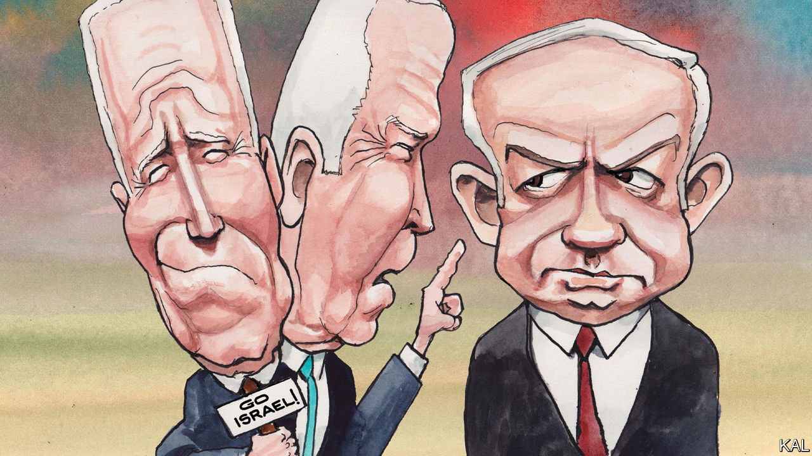

###### Lexington

# Joe Biden has shown a steady hand in the Gaza crisis 

##### But more severe tests are still to come 

 

> Oct 18th 2023 

Joe Biden has a temper. He vents it sometimes on aides when he is unhappy with their work, and occasionally even on voters who have the nerve to criticise him. But when it comes to building relationships to achieve his goals over the long term, whether with a wayward legislator or an oppositional foreign leader, Mr Biden has long demonstrated unusual patience and forbearance. 

So it was in 2010 when, as Barack Obama’s vice-president, he landed in Israel only to be blindsided by an announcement from the government of Binyamin Netanyahu that, contrary to the wishes of the Americans, it intended to expand Jewish settlements in East Jerusalem. This seemed a deliberate humiliation, and some of President Obama’s aides thought Mr Biden should turn around and head home in protest. But Mr Biden had begun developing a relationship with Mr Netanyahu in the 1980s, when he arrived in Washington to serve at the Israeli embassy, and the vice-president had his own ideas of how to manage matters.

Mr Biden issued a statement criticising the move, then put together a joint working group with Mr Netanyahu to contain the fallout. Then he and his wife Jill went to dinner with the Netanyahus. According to Mr Netanyahu’s own grateful account, Mr Biden spoke that night about deeply personal matters, about how hard it had been to overcome the deaths of his first wife and their daughter in a car crash. Mr Biden later gave the prime minister a photograph, scrawling a message on it that might serve as an epigram for much of the US-Israel relationship: “Bibi, I don’t agree with a damn thing you say, but I love ya.” 

Since Hamas attacked Israel on October 7th, Americans have got the steady leadership most of them voted for in 2020, and they have been reminded of the pettiness and volatility they rejected. Donald Trump, who has not forgiven Mr Netanyahu for congratulating Mr Biden on winning in 2020, lashed out at the prime minister, while Republicans in the House struggled to show they could govern themselves, let alone a country. As Republicans bickered over who would be speaker, their foreign-policy message became increasingly muddled, if not contradictory—critical of Mr Biden for endangering America by not helping Israel stand up to the menace of Iran, yet also critical of Mr Biden for endangering America by helping Europe stand up to the menace of Russia.

Mr Biden has followed his own playbook. In May 2021, when Hamas barraged Israel with rockets from Gaza, he did not call for restraint or a ceasefire, as past presidents probably would have. Rather than try to box in Mr Netanyahu publicly, a step that could backfire, he voiced support for Israeli air strikes, while in phone calls over eleven days he questioned the prime minister about his strategy, to show him he had no clear endgame, according to “The Last Politician”, a new book on the Biden presidency by Franklin Foer. On the fourth call, as Mr Netanyahu continued insisting the Israeli operation was not done, the president told him time was up. “Hey man, we’re out of runway here,” Mr Biden said, according to Mr Foer. “It’s over.” Mr Netanyahu agreed to a ceasefire.

Michael Oren, who as Israel’s ambassador in Washington during most of the Obama years relied on Vice-President Biden to be his point of contact, says Mr Biden’s connection with Mr Netanyahu is less about chemistry than history—their own shared past, and Israel’s. Mr Biden “remembers the six-day war, he remembers the ’73 war,” Mr Oren says. “There’s a saying, ‘He has Israel in his heart.’ It’s very personal with him.”

That is less and less true generally of Democrats, who have their own divisions over foreign policy. Some on the party’s benighted leftist fringe celebrated the massacre of Israeli civilians, and members of the growing anti-Israel faction of House Democrats began almost immediately calling for a ceasefire. Mr Biden recognised this would be not just a political impossibility for Israel, but a strategic and moral one. 

Yet while Mr Biden has been forthright that Israel has not just a right but “a duty” to defend itself, he has also been deft in . In a speech three days after the Hamas assault, he said he and Mr Netanyahu had discussed “how democracies like Israel and the United States are stronger and more secure when we act according to the rule of law.” The American president had not demanded anything, in other words; the two leaders had instead recommitted themselves to a shared value.

Palestinians have politics, too

Now comes the hard part, of course. Gazans are already suffering and dying under Israeli , and a ground invasion will cause far more agony, as Hamas hopes. (Gazan civilians may be prisoners of Israel, but they are also hostages of Hamas.) And an invasion will increase the chance of a wider war. Mr Biden’s judgment and ability to influence Mr Netanyahu are in for a . 

And just as, once this crisis eases, Mr Netanyahu will face a reckoning for  of intelligence and operations,  deserves scrutiny. His decision to ease pressure on Iran and his attempt at a benign neglect of the Israel-Palestine conflict have ended in violence, albeit violence that has been a long time coming. 

One can draw a line to this war in Gaza from the moment in 2006 when Condoleezza Rice, then secretary of state, glanced up at the television news from her elliptical trainer and learned, to her shock, that Hamas had won elections in Gaza that she had been promoting as spreading democracy in the Middle East. “I thought, ‘Well, that’s not right,’” Ms Rice later told a biographer, Elisabeth Bumiller. Four successive American administrations have paid too little attention to the miseries of Palestinian life and the realities of Palestinian politics. They have failed to buttress Palestinian institutions and reform-minded Palestinian leaders. A true friend of Israel would not make that mistake again. ■


