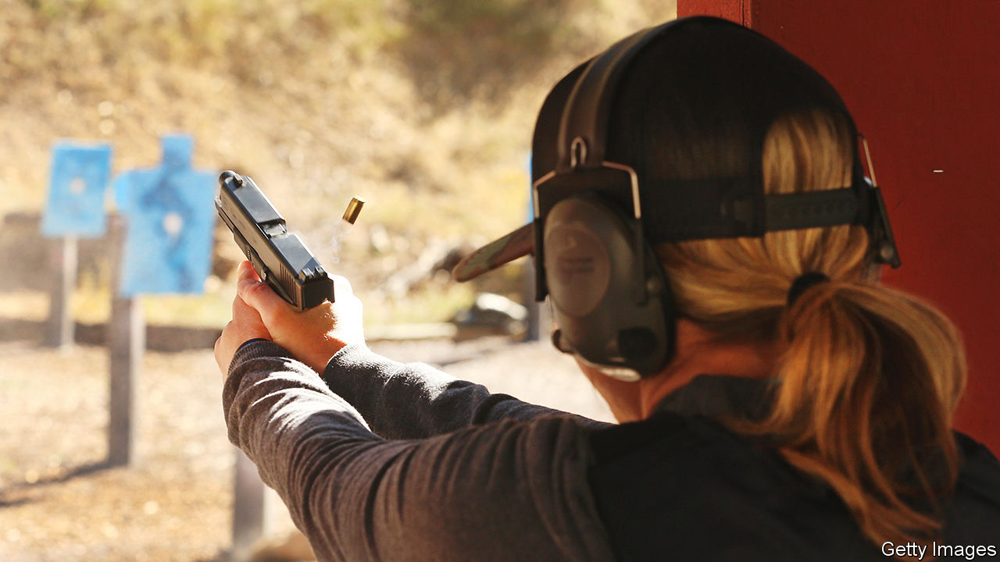

###### Algebra and pistols

# One response to school shootings in America: arm the teachers 

##### In Utah, teachers are learning how to properly carry guns into their classrooms 

 

> Oct 15th 2023 

Nestled among golden-coloured earth and desert scrub, the Thistle Gun Range, an hour’s drive south of Salt Lake City, gives off “wild-west” vibes. Add the wind softly blowing through thigh-high weeds, the sound of gunshots ringing through the canyon and six-foot-tall deputies from the Utah County Sheriff’s department wearing cowboy hats, and it is easy to see why your correspondent felt immersed in a western. Only this was no rodeo. It was a live range day for teachers and other school staff learning how to shoot.

Since 2019 Sheriff Mike Smith of Utah County and his colleagues have taught teachers how to defend themselves against active shooters. That includes learning how to safely carry and use a  inside schools. In the state of Utah, school staff can carry a concealed weapon if they have a permit, but this licensing process is not enough, says Sheriff Smith. “You don’t actually have to go shoot a gun and show that you can proficiently hit a target in a classroom setting.” Teachers are also not trained how to respond to an active shooter or carry a weapon in a school. His class aims to do that.

Sheriff Smith realised he had a problem several years ago when he and more than 200 officers responded to an active-shooter situation at a school. It was a hoax, but he was still disturbed by what he saw. Because of Utah’s law on carrying concealed weapons in school buildings, some of the teachers that day were armed. Sheriff Smith says that officers found weapons stored in desk drawers and inside purses where pupils could easily find them. “They didn’t have any training, any policies, any procedure in place to govern how they use that weapon, which I think is a recipe for disaster,” he says. So when he became sheriff of Utah County a few years after the hoax, he created the teachers’ academy.

The 20-hour-long course over six sessions provides instruction on much more than just shooting guns. It covers emergency medical techniques, self defence, tactical de-escalation, mindfulness and more. Then the shooting happens. One class is spent in a simulator where the teachers practise responding to an active-shooter situation. The last day of the course involves a live range day during which the teachers finally get to shoot their loaded guns.

Those in the most recent cohort spent the live range day rotating between four stations over five hours. Most of the time was devoted to perfecting shooting technique with live rounds on lifeless targets, but one heart-thumping station looked like a scene from a Jason Statham film. It took place in a multi-room training facility used to train SWAT teams in many scenarios, including those involving shooters in schools. The teachers, this time armed with paintball guns, were stationed inside the rooms. Armed aggressors, played by officers using blank rounds while dressed in dark protective gear from head to waist, charged through the halls. With only seconds to respond, the teachers slammed doors, took cover behind whatever they could find and fired their paintball rounds at the intruders as they entered. 

“If someone comes in your classroom, shoot ’im,” said Sheriff Smith to the trainees minutes before the scenario began. “If someone else steps into your classroom, well, shoot them too.” The scenario was over in a few seconds, but many of the teachers were breathless for minutes after. “I’m shaking,” said Rachel Walker, a testing administrator. “You get a dose of adrenalin!”

It is unlikely that a teacher in a classroom will face an armed intruder, but every teacher carrying a concealed weapon must be prepared every day to keep their weapon out of sight and out of pupils’ hands. For women, carrying a concealed weapon can be tricky. They are usually smaller and curvier than men, which makes concealing a weapon at the hip harder. They also tend to wear tighter clothing, sometimes without suitable pockets. Teachers of younger pupils must be particularly careful, as little children tend to give waist-level hugs. 

Gun manufacturers have started , says Deputy Beth Gerber to her trainees, now at their final station for the day. Her friend carries her gun in a bra holster called the “flashbang”. It nestles the weapon underneath her ample bosom, she says. To retrieve it, she lifts up her shirt (flash), then grabs the gun (bang).

With or without proper training, teachers across the country are carrying guns into schools. About 30 states allow teachers and administrative staff to carry firearms on school grounds. Sheriff Smith says that teachers leave his course thinking more critically about this, especially after going through the practice scenarios and accidentally putting a bullet where one should not have gone. “I think I would like to get my conceal-carry [permit], but I don’t think I would take it to school,” says Russell LeMon, a high-school history teacher and military veteran, on his final training day. “That scares me a little bit. Too much liability.”

Protecting schoolchildren from gun violence is difficult. America is the only country where people are outnumbered by civilian guns. According to , a news organisation that covers education, there have been 33 school shootings with injuries or fatalities so far this year.

“It’s a sad reality that our teachers have to worry about somebody coming into their school to kill them,” says Sheriff Smith. Some  say the only thing that stops a bad guy with a gun is a good guy with a gun. These teachers are living that slogan. “These are normal, everyday, average people. These aren’t ‘gun nuts’,” he says. “They want to do what they can to keep their kids safe.”■


