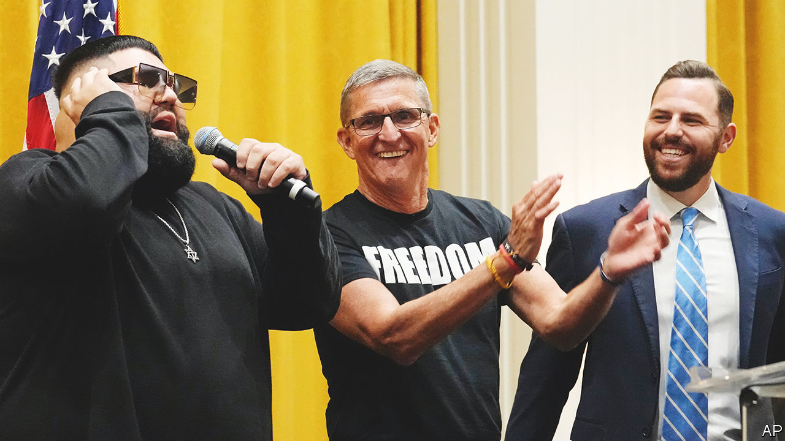

###### End times

# Part of Donald Trump’s base thinks he is fighting a spiritual war 

##### On tour with Michael Flynn, conspiracy mixes with Christian apocalypticism 

 

> Oct 18th 2023 

IN A HOTEL ballroom , barely an hour into a two-day conspiracist talkathon, your correspondent lost the plot. It happened amid calls for the audience to quit being “weak-kneed wussies” and “join Team Jesus”, and warnings about child traffickers and poisonous . What really did it, though, was an invitation to approach the stage to be healed by a self-styled prophet resembling Ozzy Osbourne. 

Later one of Mr Trump’s sons took to the podium. Worship music played; several hundred hands went up in prayer. Someone blew a shofar, a trumpet used in Jewish rituals that is popular among some charismatic Christians. Was this a Trump rally, a religious revival or a gabfest about how globalists had spread covid-19 to suspend civil liberties? Was it all of those things? The man selling tickets over the phone—at a recommended price of $250, or pay what you wish—had offered just two instructions. No masks allowed and please leave guns in the car. 

The event was part of the ReAwaken America tour, a roadshow helmed by Michael Flynn and born of protests over lockdowns and election “theft”. (Mr Flynn served as Mr Trump’s first national security adviser, was prosecuted for lying to the FBI, then pardoned by his ex-boss.) This was the 21st incarnation of the event and the second at Mr Trump’s hotel in Miami; previous stops around the country have largely been at megachurches. Dozens of mostly obscure speakers get about 15 minutes each to stoke one menace or another, for 15 hours straight. The tour is a stew of apocalyptic sermonising, QAnon and election denialism.

The point, if there is one, is to overwhelm—or as Steve Bannon, a banker-turned-provocateur once described the way that disinformation operates, to “flood the zone with shit”. A former marketing manager for a hotel chain who bills herself as a “geopolitical expert” talked of Iranians posing as Venezuelan asylum-seekers to infiltrate and attack America (“We will be the next Israel”). Someone pitched precious metals as an alternative to central-bank digital currencies: the idea being that the government can turn off your money should you misbehave, so put it in gold or silver. “There are lots of threats out there—I could talk for three hours!” exclaimed another speaker as her 15 minutes of blame ran out.

Michael Barkun, a political scientist at Syracuse University, wrote of the principles underlying conspiracism: nothing happens by accident, nothing is as it seems, and everything is linked. Connect the dots and a hidden, malevolent scheme emerges. Such thinking is correlated with feelings of powerlessness and anxiety. Conspiracy theories are perversely reassuring, then: events become ordered rather than random. Educated, establishment types are the dupes. There may be evil at work, but it can be resisted. A woman on a cigarette break told your correspondent as much: “We know everything. Every lie known to man was revealed to us already…The government is a mafia.” 

Talk of a spiritual war suffuses such events. That makes sense: those evangelical Christians who believe in the end-times—when Jesus will return to Earth, battle the Antichrist and save the faithful—often see the world through a Manichean lens. Forces of good and demonic evil are constantly struggling. (A third of evangelicals hold this worldview strongly, according to surveys by Paul Djupe of Denison University in Ohio.) 

The disposition dovetails with and propels lots of conspiracies. That is not new: in 1991 Pat Robertson, a Baptist televangelist, published “The New World Order”, a bestseller about how a cabal of elites was bent on creating a totalitarian government. Apocalyptic tropes figure heavily in QAnon, which is more popular among white evangelicals than just about any other religious group.

Politicians long ignored conspiracists. They tended to vote at lower rates: why participate if you think the game is rigged? In surveys after the 2012 election, Joseph Uscinski of the University of Miami found a self-reported turnout gap of 23 percentage points between people with low and high predispositions to conspiracy. 

During his campaign Mr Trump legitimised the latter group by suggesting, among other nonsense, that Barack Obama had been born abroad and that Hillary Clinton had taken bribes from Russia. In surveys by Mr Uscinski after the 2016 election, the gap closed. It is not so much that Mr Trump persuaded lots of people to turn conspiratorial, reckons Adam Enders of the University of Louisville. Surveys of such thinking are pretty stable over time. Rather Mr Trump activated existing beliefs and connected them to politics.

Not that doom-mongering is exciting all the time, even among the most die-hard conspiracists at the ReAwaken tour. As a pastor read from the Book of Revelation and described how to identify the coming Antichrist, the crowd thinned and flagged. Phones came out. Some played Candy Crush, others shopped online. “Are you all awake?” came a call from the stage. Then more pleadingly: “Are we doing alright?” ■


