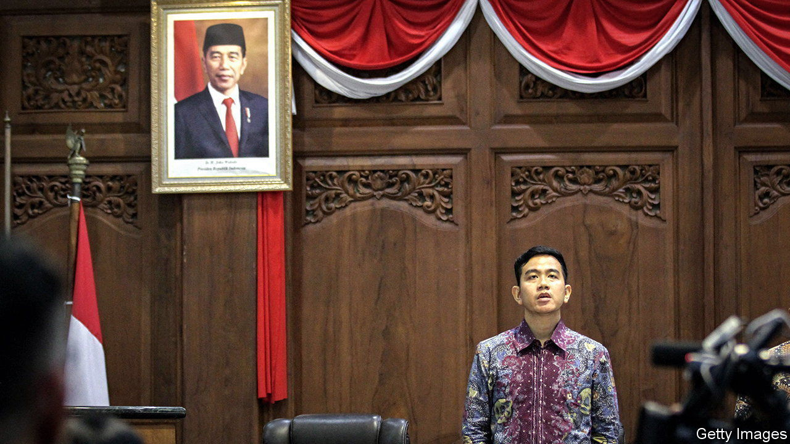

###### Intrigue at court

# Jokowi is building a political dynasty 

##### A controversial court decision helps promote the Indonesian president’s son 

 

> Oct 26th 2023 

When Joko Widodo won Indonesia’s presidency in 2014, the country’s liberals celebrated. He was the first person from outside its traditional elite to lead the world’s third-largest democracy. Jokowi, as he is known, promised a new kind of politics and a lesser role for the business and military families who had accrued enormous wealth and influence during the three decades of Suharto’s rule. He declared that becoming president “does not mean channelling power to my own children”. But less than a decade on, Jokowi has beaten the old guard at its own game. 

Nowhere is this clearer than in his efforts, apparently successful, to establish a dynasty ahead of the presidential election due in February. On October 16th, shortly before the deadline for registering candidates, Indonesia’s constitutional court handed him a victory in this regard: it controversially removed a barrier to Jokowi’s son becoming vice-president. 

The court, whose chief justice, Anwar Usman, is Jokowi’s brother-in-law, ruled that anyone who had served in a position won “through a general election, including a regional leader election” would be exempt from a minimum-age requirement of 40 for presidential and vice-presidential candidates. Prabowo Subianto, the defence minister and favourite to succeed Jokowi, promptly named the president’s eldest son, Gibran Rakabuming (pictured), as his running-mate. Mr Gibran, 36, is mayor of the Javan city of Solo—the post that launched his father into national politics. He was the only putative candidate under the age of 40.

Opposition and civil-society groups decried the court’s ruling. , a popular weekly newspaper, called for the chief justice to be fired. It noted that Article 17 of Indonesia’s Judicial Authority Law bans constitutional-court judges from hearing cases affecting their relatives or themselves. 

Jokowi, who is forbidden by the constitution from seeking a third term, has not publicly endorsed any candidate. But Mr Gibran’s selection suggests he is behind Mr Prabowo. A former general and sometime rival of the president, he has said he would continue Jokowi’s policies. That makes political sense. Despite the democratic backsliding he has overseen, Jokowi and his signature measures, including infrastructure development, are extremely popular.

There are two other candidates. Ganjar Pranowo—who is backed by the PDI-P, Jokowi’s political party, notwithstanding the president’s apparent preference for Mr Prabowo—is running a close second. Anies Baswedan, the only candidate who has dared criticise the president (over his handling of the pandemic) is trailing in third place. They have selected running-mates from rival factions of a powerful Muslim organisation, Nahdlatul Ulama, which claims to have over 100m members. It is especially influential in East Java, Indonesia’s second-largest province.

Surveys suggest no candidate will win more than half the votes in the first round of elections in February, which would mean the poll going to a run-off in June. If Mr Anies has been eliminated at that point, most of his Muslim supporters would be expected to vote for Mr Prabowo, potentially delivering him victory. ■

