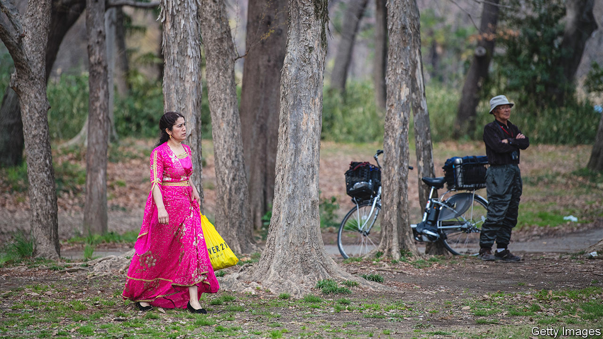

###### Warabistan

# Meet the Japanese Kurds 

##### A Kurdish community illustrates the senselessness of Japan’s immigration regime 

 

> Oct 26th 2023 

In a classroom in Warabi, north of Tokyo, an 11-year-old boy chatters in Japanese as he practises writing the characters for “river” and “tree”. The scene is unremarkable, save for the fact that the boy, Boran, is not Japanese but Kurdish. Warabi and the surrounding area are home to around 2,000 Turkish Kurds, a number that has quadrupled in a decade. Kebab shops line the streets and instructions on sorting rubbish are written in Turkish. The area is known locally as “Warabistan”.

The community illustrates one of the biggest social changes in Japan in decades. The country’s ageing and shrinking labour force sorely needs fresh blood. Yet Japanese policymakers remain deeply averse to immigration. The result is a largely unacknowledged policy of letting in increasing numbers of immigrants through the back door. Japan’s foreign-born population has tripled since 1990, reaching a record 3m, or 2.4% of the population, in 2022. 

Warabi and its environs illustrate the trend. The 40,000 foreign-born residents of Kawaguchi, a neighbouring city, represent 6.8% of its population, a level that would have been unimaginable a decade or two ago. These migrants are essential to the local economy. Yet many are in Japan illegally or on sufferance, as longtime asylum-seekers without work permits. 

Kawaguchi city is known for its metal-casting industry. Most of its factories now depend on migrants from the Philippines and Vietnam. Kurds first came to the area in the 1990s, looking for economic opportunity and fleeing oppression in Turkey. Many married local women and had children. They have also helped create a hub for demolition firms. “I bet the industry wouldn’t survive without us,” said Ali, a Kurdish asylum-seeker, who worked for a local demolition company for 25 years, rising at 4am to work six days a week. JICA, a government agency, estimates that to meet its growth targets, Japan needs to quadruple its number of foreign workers by 2040. 

Most asylum-seekers live precariously. Only one Kurd has been granted formal refugee status. Thousands do not have valid visas or work permits, and are often detained for overstaying their visas or working illegally. Since arriving in Japan three decades ago, and applying for asylum, Ali has been detained for four years in total. “How are we supposed to survive if we don’t have any income?” he asks.

Migrant children suffer the consequences. According to the education ministry, in 2022 around 10,000 of those of school age in Japan were not at school. Komuro Takako, who runs the weekend Japanese classes that Boran was attending, says many schools in Kawaguchi used to reject children who could not write Japanese. Since she started holding the classes seven years ago, things have improved. Yet private schools and colleges still often refuse children of parents without a visa; only a handful of Kurds make it to university. Zehra, a 30-year-old Kurd, shows off her daughter’s excellent elementary-school grades, then adds: “I hope our status as refugees doesn’t get in the way of her future.”

Kurds no way

Local Japanese rarely welcome the migrants. “I don’t know much about the foreigners,” says a Japanese man who has lived in Kawaguchi for 50 years. “There’s no reason for us to interact.” Some Kurds have tried to reach out. One recent morning Vakkas Balibay joined his Japanese neighbours to clean Warabi city park, sweeping the pavement for hours. “I feel like there’s a thick wall between us and the Japanese people,” says Mr Balibay, who has lived in Warabistan for 22 years. 

Right-wingers are trying to mobilise people against Japan’s stealthy diversification. Outside Kawaguchi station, Nakamura Kazuhiro of the ultra-right Japan First Party stood on the roof of a van beside the imperial Japanese flag. “Japan must stop accepting migrants,” he roared through a speaker. Kawaguchi’s migrant population, he claimed, is “causing terrible harm to the lives of Japanese people”.

In recent months, right-wingers like Mr Nakamura have targeted Warabistan. The trigger was a brawl among some Kurds in July, which allegedly caused a hospital emergency ward to shut down for five hours. Conservative media dug up more allegations of bad manners or disturbances on Kurdish-run demolition sites. In June a branch of the ruling Liberal Democratic Party (LDP) proposed that Kawaguchi’s city council should take steps to crack down on criminal foreigners. “Some local residents feel like they can’t even walk outside because it’s dangerous out there,” says Okutomi Seiichi, who instigated the proposal. 

Such controversies are a distraction from the central problem. Politicians have not accepted the reality of an economy increasingly reliant on immigrants. This makes immigrant life precarious, leading to some of the frictions right-wingers cite. “It’s one-sided to blame the Kurds,” says Nukui Tatsuhiro of Together with Kurds in Japan, a non-profit. Even Mr Okutomi of the ldp puts some of the blame for rowdy Kurds on the government. It only “thinks about filling in labour shortages”, not “foreign migrants’ day-to-day lives”, he says.

Opinion polls suggest younger Japanese are more welcoming, a disparity that is likely to increase with the migrant population. Growing up with classmates who look or sound foreign is routine for Japanese children in and around Warabistan. At some schools in Kawaguchi, 30% of pupils are from migrant families. “I can also speak Turkish and Kurdish,” says Boran, the eager weekend student, speaking in his native Japanese. “But I’m Japanese.”■

